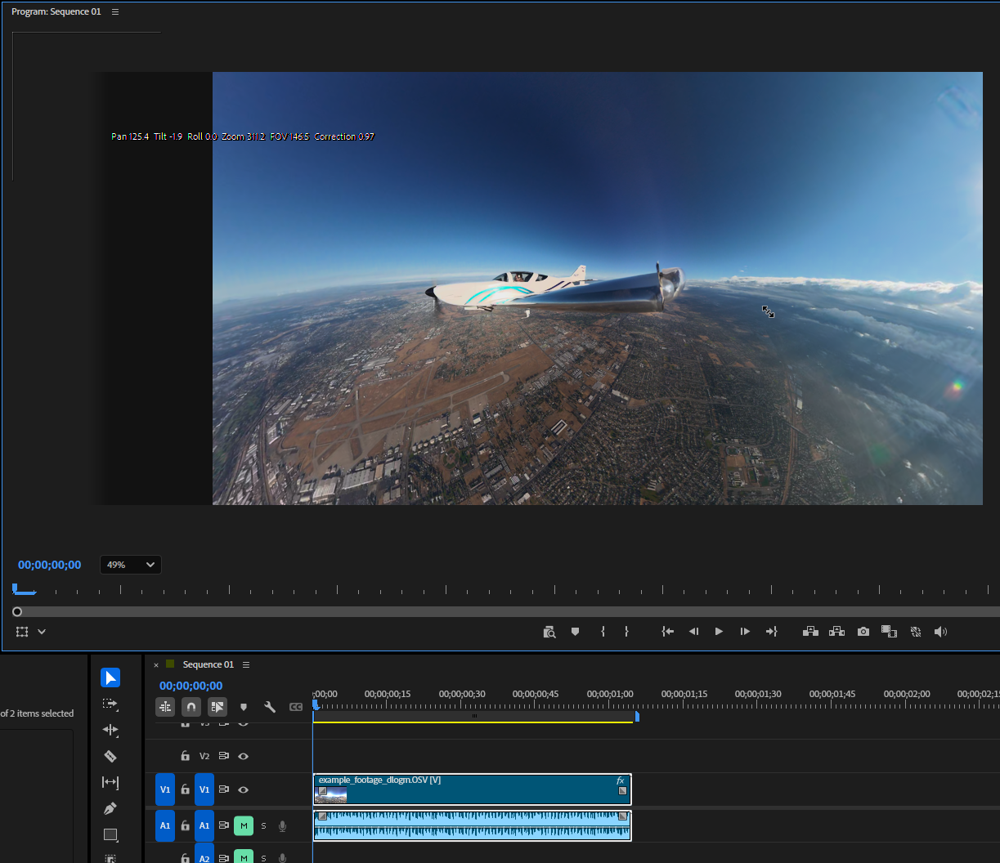
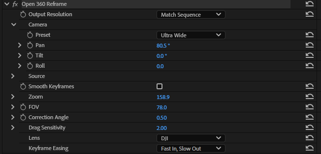
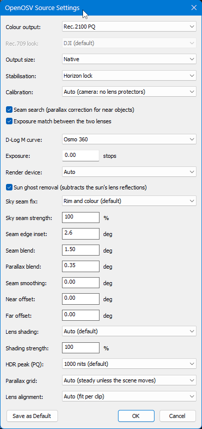
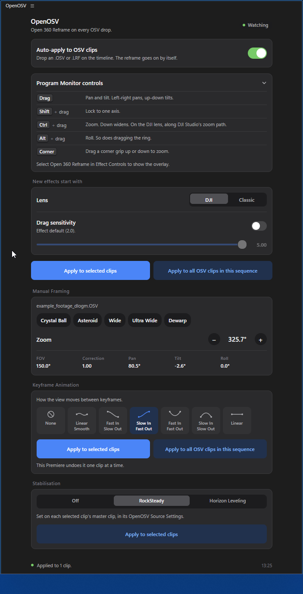
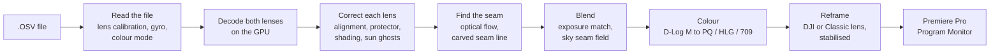

<div align="center">

# OpenOSV

### DJI Osmo 360 footage, straight into Premiere Pro on Windows, with a better stitch and real HDR.

Free and open source. Drop an `.OSV` on your timeline and it's stitched,
converted to HDR and ready to reframe. No export step, no transcode, no Mac.

[](LICENSE)




<sub>An `.OSV` straight on a Premiere timeline, reframed by dragging the picture. Stitched, converted to HDR and rendered on the GPU as you drag.</sub>

</div>

---

## What it is

The Osmo 360 records two fisheye videos, one per lens, into a single `.OSV`
file. To get a normal video out of it, something has to **stitch** the two
halves into a sphere, **convert the colour** out of D-Log M, and **aim a
virtual camera** at the part you want to show. That's called reframing.

OpenOSV does all three inside Adobe Premiere Pro, on your graphics card, while
you edit:

* **An importer** that teaches Premiere to open `.OSV` files like any other clip.
* **A reframe effect with on-screen controls.** Grab the picture in the
  Program Monitor and drag. No sliders, no number typing, no round trip to
  another app:
  * **Drag** to pan and tilt;
  * **`Shift`** + drag to lock one axis;
  * **`Ctrl`** + drag to zoom;
  * **`Alt`** + drag, or the ring, to roll;
  * a **corner grip** to zoom.

  Keyframe it like any other effect.
* **Blazing fast, way faster than DJI Studio, because it's CUDA all the way
  down.** Each view renders straight from the two fisheyes into Premiere's
  frame in **about a quarter of a millisecond** at 1440p. The picture keeps up
  with your mouse at full quality: no preview mode, no proxy, no waiting for
  an export.
* **The OpenOSV window.** Keep it open and **every `.OSV` you drop on the
  timeline gets the effect automatically**. DJI Studio's framing presets,
  easing presets and stabilisation are one click away.

Under all of that is a stitcher built to beat the stock one: it measures each
clip, works out where the lenses disagree, and fixes it.

## OpenOSV vs DJI's tools

| | DJI's tools | **OpenOSV** |
|---|---|---|
| **Premiere Pro on Windows** | Reframe plug-in is macOS-only | **Native importer and GPU reframe effect** |
| **Getting footage into your edit** | Export a flat video from DJI Studio first, then import it | **Drop the `.OSV` on the timeline.** The original 10-bit video is decoded directly. |
| **Output** | SDR (Rec.709) | **Rec.2100 PQ HDR** (default), HLG, Rec.709, or untouched D-Log M, at 16-bit or 32-bit float |
| **D-Log M conversion** | Built-in SDR look | **Automatic D-Log M → Rec.2100 PQ.** DJI's Rec.709 look is matched too, if you want SDR. `.cube` LUTs included. |
| **Seam** | Automatic, no controls | **Parallax-aware carved seam**, held steady for the whole clip, **16 stitching controls** to tune it |
| **Framing** | DJI Studio's viewer | **Drag in Premiere's Program Monitor, way faster.** CUDA renders each view in about a quarter of a millisecond. |
| **Applying it** | — | **Automatic.** Every `.OSV` dropped on the timeline gets the effect while the OpenOSV window is open. |
| **Lens alignment** | Factory calibration, plus a Lens Protector option | Factory calibration, a Lens Protector / ND correction, **plus the alignment measured from each clip's own footage** |
| **Banding in the sky** | — | **Lens shading measured per lens and removed** |
| **Sky seam colour and brightness** | — | **A per-seam brightness and colour field** so the two lenses meet cleanly |
| **Sun reflections (lens ghosts)** | — | **Detected, fitted and subtracted** |
| **Stabilisation from the gyro** | RockSteady, Horizon Leveling | RockSteady, Horizon Leveling, full lock |
| **Keyframes** | DJI Studio's own timeline | **Premiere's keyframes and graph editor**, plus DJI Studio's seven easing presets |
| **Save your settings as defaults** | — | **Yes**, for every new clip |
| **Source code** | Closed | **Open (Apache-2.0)** |
| **Price** | Free | **Free** |

<sub>DJI column: DJI Studio and DJI's Premiere plug-in as shipped when this was
written (September 2026). "—" means the app has no such option.</sub>

## Why the stitch is better

A 360 camera's seam is where two separate lenses have to agree about the
world. They never quite do. OpenOSV works out **why** they disagree on each
clip and fixes each cause on its own, instead of blurring over all of them at
once.

<!-- SCREENSHOT docs/images/seam-comparison.png: the same frame's seam, DJI Studio on the left, OpenOSV on the right (the wing or a near object crossing the seam is the best example). -->

### 1. Lens alignment, measured per clip

**The problem.** The factory calibration says exactly where each lens points,
but only for the camera as it left the factory. An ND filter, a lens
protector, a knock or heat can turn one lens by a fraction of a degree. Where
the halves meet, the ground then slides apart.

**The fix.** OpenOSV measures the rotation between the two lenses from three
frames of the clip itself, checks that all three agree, and corrects it before
anything else happens. On the test clip, shot with ND filters, it found
**0.36°**. Correcting it took how well the ground lines up across the seam
from **0.37 to 0.88**, where 1.0 is a perfect match, before any other
correction ran. A clip that's already aligned is left alone, and each result is
cached, so reopening costs nothing.

### 2. A seam that goes around things

**The problem.** Something close to the camera, like a wing, a hand or the
stick, sits in a slightly different place in each lens. That's parallax, the
same reason your thumb jumps when you blink one eye and then the other. Blend
the lenses 50/50 and you get two ghostly copies of it.

**The fix.** OpenOSV measures how far each part of the seam is displaced
between the lenses (optical flow), then **carves the seam line through the
places where both lenses agree**, like cutting fabric along a pattern. It
feathers that line softly where the lenses match and keeps it sharp where they
don't. The doubled wing fin on the test clip is gone: ghosting went from
**76 to 6**.

### 3. No rippling

**The problem.** Measure the seam fresh every few frames and the corrections
shift a little each time. On a still subject, that reads as a seam that
shimmers or crawls.

**The fix.** OpenOSV measures the seam corrections on nine frames spread over
the whole clip and holds their median still for every frame. Frame-to-frame
movement caused by the corrections went from **up to 3.3 px to exactly 0**.
If a near object really does move past the seam, Auto notices and lets the
seam follow the scene instead.

### 4. No banding in the sky

**The problem.** Every lens is a little darker toward its edge (lens shading),
and the lens facing the sun also picks up a soft glare ring. In a clear sky,
that shows as a faint dark band along the seam, even when everything else is
perfect.

**The fix.** OpenOSV measures each lens's own falloff from the sky in the clip
and adds the missing light back before the lenses are blended. The band's dip
went from **158 to 21 thousandths of a stop**, smaller than the open sky's
own natural variation (57–67). You can't point at it any more.

<!-- SCREENSHOT docs/images/sky-banding.png: a clear sky across the seam with Lens Shading Off, then Auto. -->

### 5. A clean sky seam

**The problem.** At the very edge of each lens, brightness and colour drift a
little differently in each one, depending on where the sun is. The two halves
then meet with a faint line or a colour step.

**The fix.** The sky seam fix trusts only the pixels where the lenses are
reliable, and builds a smooth brightness and colour field along the whole seam
so the two sides meet. The seam's light line shrank to **0.71×** and its
colour step to **0.34×**.

### 6. Sun ghosts removed

**The problem.** Light bouncing around inside the lens leaves faint shapes of
the sun elsewhere in the picture.

**The fix.** OpenOSV finds the reflection, fits its shape and brightness, and
subtracts it in linear light before the blend. The test clip's pill-shaped
ghost went from **+23.6% brighter than its surroundings to +0.2%**, and not
one pixel elsewhere was touched.

### 7. And then you can tune it

The automatic stitch is the headline. The controls are the bonus.
**Sixteen stitching controls**, per clip, right in Effect Controls:

* **Seam Blend** and **Parallax Blend**: how soft the seam is where the lenses
  agree, and where they don't.
* **Near Offset** and **Far Offset**: nudge near and far objects up or down
  across the seam by hand, for the one shot where a wingtip needs half a
  degree.
* **Seam Edge Inset** and **Seam Smoothing**.
* **Strengths** for the sky seam fix and the lens-shading correction.
* **Switches** for every stage: seam search, exposure match, sun ghost
  removal, parallax grid, lens alignment.
* **The calibration**: as recorded, lens protectors / ND filters, underwater,
  or bare lenses.

Everything can be saved as your default for new clips. The built-in defaults
are the good ones, so you never *have* to touch any of it. See
[the full list](#openosv-source-settings-the-master-clip-one-setting-per-clip).

## Colour: D-Log M in, HDR out, automatically

* **It reads the clip.** The importer reads the colour mode the camera
  recorded and picks the right decoding. No guessing, no LUT hunting.
* **Rec.2100 PQ by default.** Also HLG, Rec.709, or the untouched D-Log M if
  you'd rather grade it yourself.
* **DJI's look, matched.** The Rec.709 output reproduces DJI Studio's D-Log M
  look to a mean **dE2000 of 0.50** on the test clip. About 1.0 is the
  smallest difference the eye can see. OpenOSV's own neutral rendering is one
  click away.
* **HDR Peak Brightness.** Tone-maps PQ to 1000, 600, 400 or 203 nits
  (BT.2390), so highlights roll off like a real HDR master instead of
  clipping.
* **Exposure Match** evens out the two lenses. **Exposure** shifts the whole
  clip in stops.
* **16-bit and 32-bit float.** HDR is never squeezed through 8 bits.
* **LUTs included.** D-Log M → Rec.2100 PQ, → HLG and → Rec.709 `.cube` files
  for other editors, installed next to the plug-ins. All the colour maths is
  open and documented in [`docs/COLOR.md`](docs/COLOR.md).

---

## Tutorial 1: shooting with the Osmo 360

> **Record in D-Log M. Always.** This tool is built around it.

D-Log M stores the sensor's full brightness range in 10 bits instead of baking
in a finished look. That range is exactly what HDR output needs: skies keep
their colour, highlights roll off instead of clipping, shadows keep detail.
OpenOSV reads the clip's colour mode and converts D-Log M to Rec.2100 PQ for
you, so the flat grey footage never shows up on your timeline.

| Camera setting | Use | Why |
|---|---|---|
| **Colour** | **D-Log M** | Full dynamic range for the HDR conversion. Normal and HLG clips also work, but with less room. |
| **Bit depth** | **10-bit** | D-Log M needs it; 8-bit bands in skies. |
| **Resolution** | **6K** | The mode OpenOSV is verified on. 8K and 4K clips open too. |
| **Lens protectors / ND filters** | Turn on the camera's **Lens Protector** setting when shooting through them | The clip records it, and OpenOSV applies the correction automatically. Forgot? Set **Calibration → Lens Protectors / ND Filters** in Source Settings. Lens Alignment corrects the rest per clip either way. |
| **Colour Recovery** | Either | It only changes the camera's live preview. The recorded file is the same. |

**Blown highlights in PQ?** D-Log M keeps them in the file. Lower **HDR Peak**
to 600 or 400 nits for a gentler roll-off, or pull **Exposure** down a stop in
Source Settings.

## Tutorial 2: editing in Premiere Pro

<!-- SCREENSHOT docs/images/new-sequence.png: File > New > Sequence with the OpenOSV preset group open. -->

1. **Install** (see [Install](#install)). Launch Premiere holding `Shift`, so it
   rescans its plug-ins.
2. **New sequence.** `File > New > Sequence`, group **OpenOSV**, pick
   **OpenOSV 2560x1440 59.94** for a 16:9 edit. For HDR delivery, set the
   sequence's working colour space to Rec. 2100 PQ in Sequence Settings.
3. **Open the OpenOSV window** (`Window > Extensions > OpenOSV`, or
   `Window > UXP Plugins`) and dock it. While it's open, it watches your
   sequences.
4. **Drop your `.OSV`** on the timeline. **Open 360 Reframe goes on by
   itself.** For clips that were already there, press **Apply to all OSV clips
   in this sequence**.
5. **Select the clip**, then click **Open 360 Reframe** in Effect Controls.
   The Program Monitor overlay only appears while the effect is selected.
6. **Drag the picture** to aim the camera (see [Controls](#controls)).
7. **Animate.** Arm the stopwatch, drag at two points in time, and Premiere
   builds the camera move. Pick an easing preset (DJI Studio's seven are in
   the OpenOSV window) or shape it in Premiere's graph editor.
8. **Stabilise and tune the stitch** in the master clip's **OpenOSV Source
   Settings**, or set RockSteady and Horizon Leveling in the OpenOSV window.
9. **Export** as usual. For HDR, pick an HDR format (HEVC, for example) with
   Rec. 2100 PQ.

---

## Controls

### Program Monitor: drag the picture

| Gesture | What it does |
|---|---|
| **Drag** | Pan and tilt. Left-right pans, up-down tilts, and what you grab stays under the pointer. |
| `Shift` + drag | Lock to one axis. |
| `Ctrl` + drag | Zoom. Down widens. On the DJI lens it follows DJI Studio's zoom path. |
| `Alt` + drag, or drag the ring | Roll. |
| Drag a **corner grip** up or down | Zoom. |

### Open 360 Reframe (Effect Controls, per clip, keyframable)



| Control | What it does |
|---|---|
| **Lens** | **DJI** (default) renders with DJI Studio's camera, so the same numbers give the same framing. **Classic** is a simple FOV and distortion camera. Only the chosen lens's controls are shown. |
| **Preset** | Crystal Ball, Asteroid, Wide, Ultra Wide, Dewarping. |
| **Pan / Tilt / Roll** | Where the camera looks. |
| **Zoom, FOV, Correction Angle** | DJI lens: DJI Studio's own three numbers. Correction Angle bends from rectilinear (0) through stereographic (1) to crystal ball (above 1). |
| **FOV, Distortion** | Classic lens. |
| **Source Pan / Tilt / Roll** | Re-orient the sphere itself, for example to fix a tilted mount. |
| **Output Resolution** | Match Sequence, 4K, 1440p, 1080p or 720p. |
| **Keyframe Easing** | How the camera moves between keyframes: DJI Studio's seven presets. |
| **Smooth Keyframes** | Smooths the keyframed path. |
| **Drag Sensitivity** | How fast the Program Monitor drag turns the camera. Never rendered. |

### OpenOSV Source Settings (the master clip, one setting per clip)

Premiere attaches this effect to every OSV **master clip** by itself. It
decides how the sphere is built and coloured, so it has no keyframes. The
same settings are in the right-click **Source Settings** dialog.



| Group | Control | What it does |
|---|---|---|
| Colour | **Colour Output** | Rec.2100 PQ (default), HLG, Rec.709, or D-Log M untouched. |
| | **Look** | Rec.709 only: DJI Studio's look (default) or OpenOSV standard. |
| | **HDR Peak** | PQ only: 1000 (default), 600, 400 or 203 nits. |
| | **Output Size** | Native, 4K, 2560 × 1280 or 2K sphere. |
| Motion | **Stabilisation** | From the camera's gyro: Off, Horizon Lock, Full, Smooth (RockSteady). |
| Stitching | **Seam Search** | The parallax-aware carved seam. |
| | **Exposure Match** | Evens out the two lenses' brightness. |
| | **Calibration** | Auto (as recorded), Lens Protectors / ND Filters, Underwater, Native. |
| | **Sun Ghost Removal** | Subtracts the sun's lens reflections. |
| | **Sky Seam Fix**, **Strength** | The seam's brightness and colour field. |
| | **Seam Edge Inset** | How far from each lens's rim the picture stops. |
| | **Seam Blend** | Feather width where the lenses agree. |
| | **Parallax Blend** | Feather width where they don't (0 = hard cut). |
| | **Seam Smoothing** | Smooths the seam line itself. |
| | **Near Offset**, **Far Offset** | Nudge near and far objects up or down across the seam by hand. |
| | **Lens Shading**, **Strength** | The sky banding correction. |
| | **Parallax Grid** | Auto, Steady (measured once per clip, no ripple) or Follows scene. |
| | **Lens Alignment** | Auto (measured per clip) or Off (factory calibration only). |
| Advanced | **D-Log M Curve**, **Exposure**, **Render Device**, **Program Monitor Colour** | For the curious. |
| Defaults | **Save as Default for New Clips**, **Restore Built-in Defaults** | Your settings, on every clip you import from now on. |

### The OpenOSV panel



| Card | What it does |
|---|---|
| **Auto-apply to OSV clips** | Puts Open 360 Reframe on every OSV or LRF clip you drop on a timeline, once. It never touches clips that were already there, and a removed effect stays removed. |
| **New effects start with** | The Lens and Drag Sensitivity for effects the panel adds. |
| **Apply to selected / all** | For clips that were on the timeline before the panel. |
| **Program Monitor controls** | Every gesture, one line each. |
| **Manual Framing** | DJI Studio's looks, a Zoom stepper along its zoom path, and live FOV, Correction, Pan, Tilt and Roll at the playhead. |
| **Keyframe Animation** | DJI Studio's seven easing presets, for selected clips or the whole sequence. One `Ctrl+Z` undoes it. |
| **Stabilisation** | RockSteady and Horizon Leveling, set on the clips' Source Settings. |

It works in both panel systems Premiere has: **UXP** (Premiere 25.6+) and
**CEP** (Premiere 22+). Details in [`docs/PANEL.md`](docs/PANEL.md).

---

## How it works



1. **Read.** An `.OSV` is an MP4 with two HEVC video tracks and a metadata
   track. OpenOSV parses the container and decodes that metadata itself: the
   factory calibration for each lens, the gyro at about 1000 samples a second,
   and the colour mode.
2. **Decode** both lenses on the graphics card (NVDEC or D3D11VA). Frames stay
   in video memory.
3. **Correct and stitch** once per clip or once per eight frames: lens
   alignment, lens shading, sun ghosts, the parallax flow, the carved seam and
   the seam's brightness field. Results are cached.
4. **Render.** One GPU kernel goes straight from the two fisheyes to
   Premiere's output frame. It doesn't build a full sphere first and then crop
   it, which is why a 1440p frame renders in about a quarter of a millisecond.

## Performance

Measured on an RTX 5090 with the 6K test clip.

| Step | Time |
|---|---|
| Decode both lenses (NVDEC) | **2.1 ms** per frame pair (467 pairs/s) |
| Render the reframed view, 2560 × 1440 | **0.26–0.29 ms** |
| Render the reframed view, 3840 × 2160 | **0.65–0.76 ms** |
| Parallax optical flow across the seam | **2.1–2.7 ms** on the GPU (21–23 ms on 32 CPU threads) |
| Lens alignment | **0.16–0.33 s**, once per clip, then cached on disk |

---

## Install

The plug-ins build from source today. You need Windows 10/11, Visual Studio
2022, CMake 3.28+, vcpkg and, for the GPU paths, CUDA 12.9. Premiere's SDKs
are not redistributable, so they are never committed.
[`docs/BUILDING.md`](docs/BUILDING.md) says where to put them.

```powershell
$env:VCPKG_ROOT = "C:\vcpkg"
cmake --preset windows-msvc-premiere-release
cmake --build --preset windows-msvc-premiere-release
ctest --preset premiere
scripts\install_plugins.ps1        # plug-ins, LUTs, sequence presets and the OpenOSV panel
```

`install_plugins.ps1` copies the plug-ins to
`C:\Program Files\Adobe\Common\Plug-ins\7.0\MediaCore\OpenOSV\`, so Premiere,
Media Encoder and After Effects all see them. It asks for admin rights once.
`-PanelOnly` installs just the panel, `-NoPanel` and `-NoPresets` skip parts,
and `-Uninstall` removes everything it added.

### Sequence presets

An equirectangular sphere is always 2:1, so a sequence made from an `.OSV`
clip is 2:1 too. That's right for working on the sphere and wrong for 16:9
delivery. Three presets appear under **File > New > Sequence > OpenOSV**:

| Preset | Size | For |
|---|---|---|
| **OpenOSV 2560x1440 59.94** | 2560 × 1440 | Reframed 16:9 delivery. The one you usually want. |
| **OpenOSV 3840x2160 59.94** | 3840 × 2160 | 4K delivery. Set Output Size to Native or 4K first. |
| **OpenOSV 360 equirect 2560x1280 59.94** | 2560 × 1280 | The sphere itself, or a 360 VR export. Premiere's VR view works. |

All three are 59.94 fps exactly. 60 fps would drift a frame every thousand
against the footage.

## The command-line tool

`osvtool` does everything without Premiere: inspect a clip, render stills or
HDR video, export LUTs.

```powershell
# What's in this clip? (camera, mode, colour, calibration, gyro)
osvtool probe CAM_XXXX.OSV --json probe.json

# A reframed, horizon-levelled Rec.2100 PQ video, rendered on the GPU
osvtool render CAM_XXXX.OSV --all --preset wide --stab horizon --color pq --device cuda --out out.mp4

# A D-Log M -> Rec.2100 PQ LUT for any editor
osvtool lut --fit dji --out-transfer pq --size 65 dlogm_to_pq.cube
```

Exit codes: `0` ok, `1` usage error, `2` input error, `3` runtime error.

---

## Under the hood

For the engineers: what went into this, and where to read about it.

* **About 87,000 lines of C++20**, with 69,000 more lines of tests: 900+
  automated tests, many of them rendering the real 6K test clip end to end
  on the GPU. The panel has its own JavaScript test suite.
* **One pixel kernel, three backends.** The same C-subset shader compiles as
  C++, CUDA and OpenCL, and the three renderers are tested against each
  other. Strict floating-point flags keep them in agreement.
* **Everything parsed from scratch:** an ISO-BMFF (MP4) walker, a
  hand-written protobuf decoder for the camera's metadata, and the camera's
  own index and nested movie boxes. Every read is bounds-checked, and the
  parsers are fuzzed with truncated and garbage input.
* **Lens geometry:** a 5-term Kannala–Brandt fisheye model with Newton
  inversion, per-clip lens rotation fitting, and DJI Studio's camera model
  (a pinhole behind a unit sphere) for framing parity.
* **Stitching:** DIS optical flow (Kroeger et al., ECCV 2016) on the GPU,
  dynamic-programming seam carving (Avidan & Shamir), and multi-band style
  blending (Burt & Adelson). Also lens-shading estimation, flare-ghost
  fitting, and robust per-clip medians for a steady seam.
* **Stabilisation:** gyro attitude interpolation and Gaussian smoothing of the
  camera's rotation (on the rotation group, via the quaternion log map), plus
  horizon levelling.
* **Colour science:** BT.2100 PQ and HLG, the BT.2390 EETF for peak
  brightness, a D-Log M curve refit, and a fitted model of DJI's Rec.709 look
  that ships no DJI data.
* **Premiere integration:**
  * an importer (`.prm`);
  * a GPU filter effect sharing Premiere's own CUDA device;
  * a Program Monitor overlay with axis-locked sphere dragging;
  * a C-ABI stitch engine the importer and effect share, so the Program
    Monitor renders straight from the fisheyes;
  * a UXP and CEP companion panel.

| Module | What it does |
|---|---|
| `osv::core` | Error model, bounds-checked bytes, file mapping, maths, thread pool |
| `osv::container` | MP4 walker, sample tables, the camera's nested movie and index |
| `osv::meta` | Metadata decoder, format detection, calibration selection |
| `osv::geom` | Fisheye model, extrinsics, virtual cameras, gyro attitude, stabilisation, seam search |
| `osv::color` | D-Log M, BT.2100 PQ / HLG, looks, `.cube` export, colour-mode detection |
| `osv::video` | FFmpeg (LGPL) HEVC decoding, frame-accurate seek, NVDEC / D3D11VA |
| `osv::render` | The shared kernel and its CPU, CUDA and OpenCL renderers, plus the stitch analyses |
| `osv::io` | PNG / TIFF / EXR writers, MP4 through `ffmpeg.exe`, gyro CSV |

**Read more:**
* [`docs/PREMIERE.md`](docs/PREMIERE.md): the plug-ins, every control and what it measured.
* [`docs/PANEL.md`](docs/PANEL.md): the companion panel.
* [`docs/COLOR.md`](docs/COLOR.md): the colour pipeline.
* [`docs/GEOMETRY.md`](docs/GEOMETRY.md) and [`docs/FORMAT.md`](docs/FORMAT.md): the lens model and the `.OSV` format.
* [`docs/DIRECT_GPU.md`](docs/DIRECT_GPU.md): the GPU render path.
* [`docs/ARCHITECTURE.md`](docs/ARCHITECTURE.md): how the pieces fit together.
* [`docs/CITATIONS.md`](docs/CITATIONS.md): every paper and standard the project builds on.
* [`docs/ROADMAP.md`](docs/ROADMAP.md): what's next.

## Licence

Apache-2.0. See [`LICENSE`](LICENSE) and [`NOTICE`](NOTICE). FFmpeg is used
under the LGPL and linked dynamically; no GPL components are enabled.

## Legal

OpenOSV is an independent project. It is not affiliated with, endorsed by or
sponsored by DJI or Adobe. DJI, Osmo, Osmo 360, RockSteady and DJI Studio are
trademarks of SZ DJI Technology Co., Ltd.; Adobe, Premiere Pro and After
Effects are trademarks of Adobe Inc. The names are used only to say what
OpenOSV works with.

It contains no DJI code, binaries, neural-network models, LUT files or
artwork. DJI's publicly distributed software was studied for
interoperability, so OpenOSV can read the camera's files and render them the
way DJI's own tools do. The numbers and formulas taken from that study are
re-implemented in OpenOSV's own code and listed, with where each came from,
in [`docs/LEGAL.md`](docs/LEGAL.md). Third-party licences are in
[`NOTICE`](NOTICE); the papers and standards the project builds on are in
[`docs/CITATIONS.md`](docs/CITATIONS.md).

The comparison with DJI's tools describes publicly available product features
as of the date given. The measurements are OpenOSV's own, taken on the
project's test clip.
