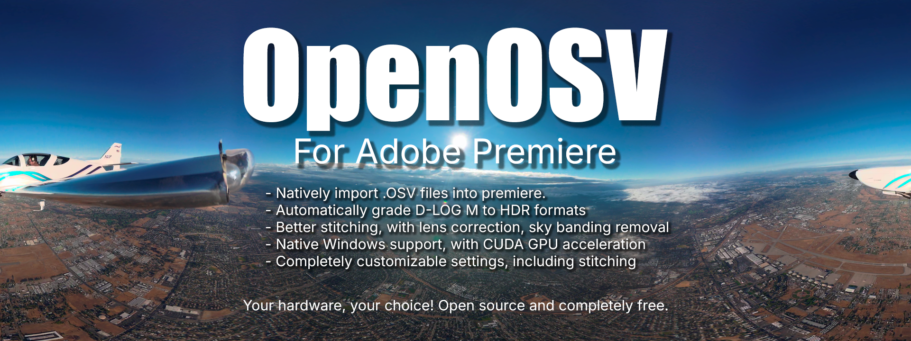
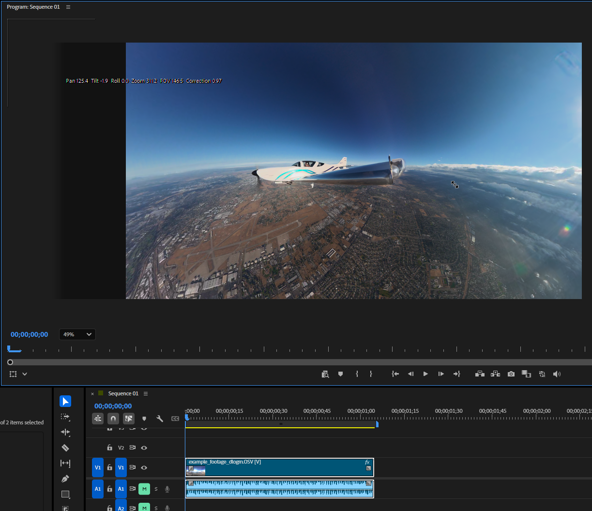
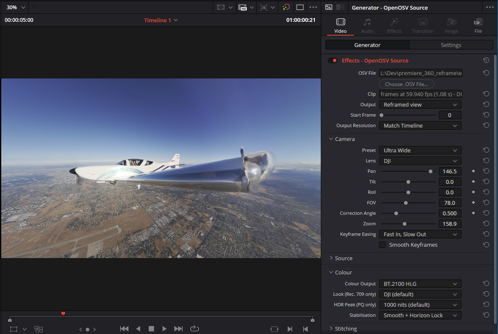
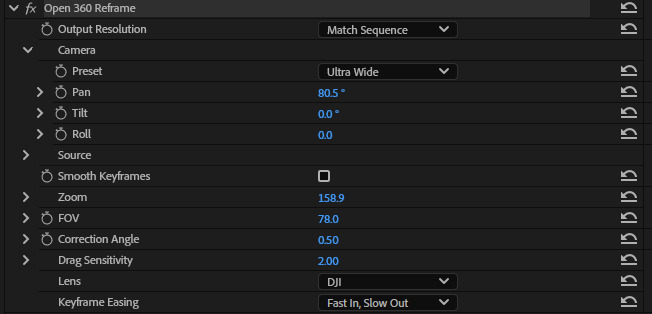
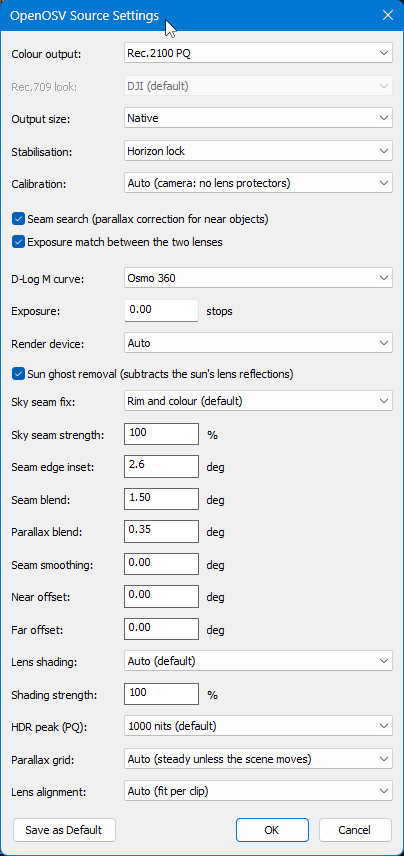
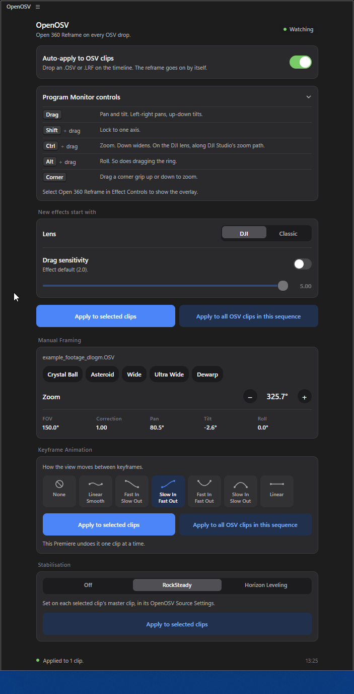
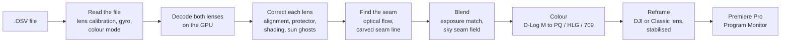
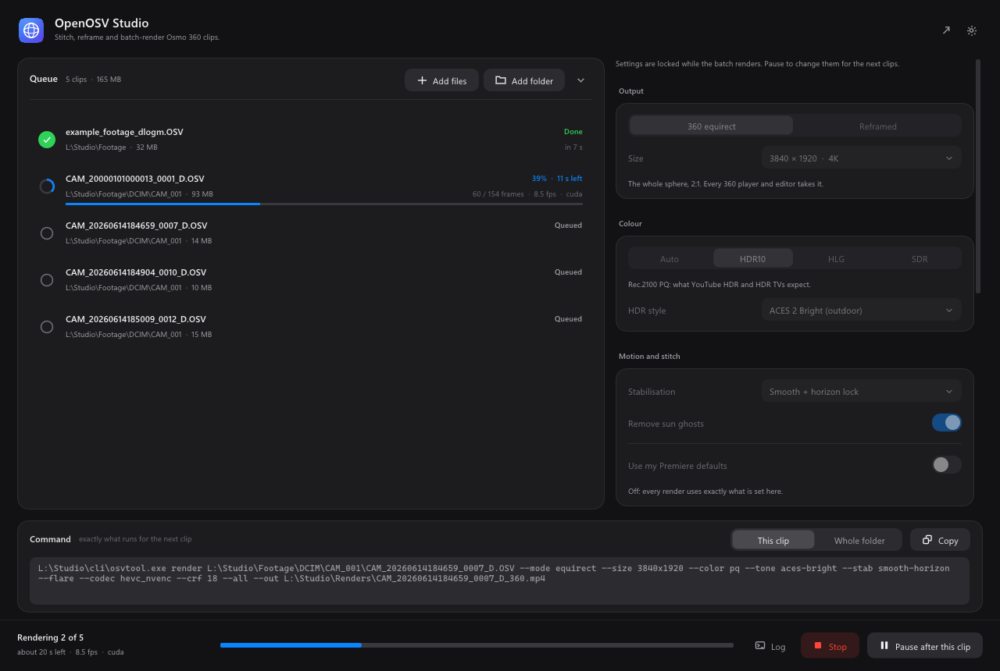

<div align="center">



### DJI Osmo 360 footage, straight into Premiere Pro, DaVinci Resolve or VEGAS Pro, with a better stitch and real HDR.

Free and open source. Drop an `.OSV` on your timeline and it's stitched,
converted to HDR and ready to reframe. No export step, no transcode.
DJI Avata 360 clips open too (new: not yet tested on Avata footage here).

[](LICENSE)




<sub>An `.OSV` straight on a Premiere timeline, reframed by dragging the picture. Stitched, converted to HDR and rendered on the GPU as you drag.</sub>



<sub>Same clip, DaVinci Resolve. **OpenOSV Source** stitches the `.OSV`; the camera, keyframes and colour live in the Inspector.</sub>

</div>

> **macOS is community-tested, and DaVinci Resolve is a preview.** Premiere
> Pro on Windows is what OpenOSV is built and tested on. The macOS build and
> the DaVinci Resolve plug-ins compile and pass their tests on CI. Resolve has
> had a first run on Windows (Resolve 21, free), and
> [@arkanos](https://github.com/arkanos) has it working on a MacBook Pro M4
> running macOS 26.6.1 ([issue #2](https://github.com/Kemerd/OpenOSV/issues/2),
> thank you!). Premiere Pro on a Mac is still untested. If you can,
> [build it](#build-from-source), try it, and
> [file a bug report or a pull request](https://github.com/Kemerd/OpenOSV/issues)
> for anything that goes wrong.
>
> **VEGAS Pro 17.0 is experimental.** Import, the camera and playback work
> in VEGAS Pro 17 ([how to use it](#tutorial-4-editing-in-vegas-pro-170-experimental)).
> HDR projects aren't verified yet, so stay on Rec. 709, and save your project
> before trying it. [`docs/VEGAS.md`](docs/VEGAS.md) has what's been checked
> and what hasn't.

---

## What it is

The Osmo 360 records two fisheye videos, one per lens, into a single `.OSV`
file. To get a normal video out of it, something has to **stitch** the two
halves into a sphere, **convert the colour** out of D-Log M, and **aim a
virtual camera** at the part you want to show. That's called reframing.

OpenOSV does all three inside Adobe Premiere Pro, on your graphics card, while
you edit:

* **An importer** that teaches Premiere to open `.OSV` files like any other clip.
* **A reframe effect with on-screen controls.** Grab the picture in the
  Program Monitor and drag. No sliders, no number typing, no round trip to
  another app:
  * **Drag** to pan and tilt;
  * **`Shift`** + drag to lock one axis;
  * **`Ctrl`** + drag to zoom;
  * **`Alt`** + drag, or the ring, to roll;
  * a **corner grip** to zoom.

  Keyframe it like any other effect.
* **Blazing fast, way faster than DJI Studio, because it's CUDA all the way
  down.** Each view renders straight from the two fisheyes into Premiere's
  frame in **about a quarter of a millisecond** at 1440p. The picture keeps up
  with your mouse at full quality: no preview mode, no proxy, no waiting for
  an export.
* **The OpenOSV window.** Keep it open and **every `.OSV` you drop on the
  timeline gets the effect automatically**. DJI Studio's framing presets,
  easing presets and stabilisation are one click away.
* **DaVinci Resolve too (preview, free or Studio).** Same stitch, same
  camera, same controls, as two OpenFX effects: **OpenOSV Source** opens an
  `.OSV` and stitches it with the importer's own engine, and **OpenOSV 360
  Reframe** reframes any 360 clip, with CUDA on NVIDIA. See
  [`docs/RESOLVE.md`](docs/RESOLVE.md).
* **VEGAS Pro 17.0 too (experimental).** The same two effects, plus an extension that
  does what an OpenFX generator can't: **Tools > Extensions > OpenOSV > Import OSV...**
  puts a clip on the timeline at its exact length and size, audio included.
  See [`docs/VEGAS.md`](docs/VEGAS.md).

Under all of that is a stitcher built to beat the stock one: it measures each
clip, works out where the lenses disagree, and fixes it.

## OpenOSV vs DJI's tools

| | DJI's tools | **OpenOSV** |
|---|---|---|
| **Premiere Pro on Windows** | Reframe plug-in is macOS-only | **Native importer and GPU reframe effect** |
| **Getting footage into your edit** | Export a flat video from DJI Studio first, then import it | **Drop the `.OSV` on the timeline.** The original 10-bit video is decoded directly. |
| **Output** | SDR (Rec.709) | **Rec.2100 PQ HDR** (default), HLG, Rec.709, or untouched D-Log M, at 16-bit or 32-bit float |
| **D-Log M conversion** | Built-in SDR look | **Automatic D-Log M → Rec.2100 PQ.** DJI's Rec.709 look is matched too, if you want SDR. `.cube` LUTs included. |
| **Seam** | Automatic, no controls | **Parallax-aware carved seam**, held steady for the whole clip, **16 stitching controls** to tune it |
| **Framing** | DJI Studio's viewer | **Drag in Premiere's Program Monitor, way faster.** CUDA renders each view in about a quarter of a millisecond. |
| **Applying it** | — | **Automatic.** Every `.OSV` dropped on the timeline gets the effect while the OpenOSV window is open. |
| **Lens alignment** | Factory calibration, plus a Lens Protector option | Factory calibration, a Lens Protector / ND correction, **plus the alignment measured from each clip's own footage** |
| **Banding in the sky** | — | **Lens shading measured per lens and removed** |
| **Sky seam colour and brightness** | — | **A per-seam brightness and colour field** so the two lenses meet cleanly |
| **Sun reflections (lens ghosts)** | — | **Detected, fitted and subtracted** |
| **Stabilisation from the gyro** | RockSteady, Horizon Leveling | RockSteady and Horizon Leveling, together by default, plus full lock |
| **Keyframes** | DJI Studio's own timeline | **Premiere's keyframes and graph editor**, plus DJI Studio's seven easing presets |
| **Save your settings as defaults** | — | **Yes**, for every new clip |
| **Source code** | Closed | **Open (Apache-2.0)** |
| **Price** | Free | **Free** |

<sub>DJI column: DJI Studio and DJI's Premiere plug-in as shipped when this was
written (September 2026). "—" means the app has no such option.</sub>

## Why the stitch is better

A 360 camera's seam is where two separate lenses have to agree about the
world. They never quite do. OpenOSV works out **why** they disagree on each
clip and fixes each cause on its own, instead of blurring over all of them at
once.

<!-- SCREENSHOT docs/images/seam-comparison.png: the same frame's seam, DJI Studio on the left, OpenOSV on the right (the wing or a near object crossing the seam is the best example). -->

### 1. Lens alignment, measured per clip

**The problem.** The factory calibration says exactly where each lens points,
but only for the camera as it left the factory. An ND filter, a lens
protector, a knock or heat can turn one lens by a fraction of a degree. Where
the halves meet, the ground then slides apart.

**The fix.** OpenOSV measures the rotation between the two lenses from three
frames of the clip itself, checks that all three agree, and corrects it before
anything else happens. On the test clip, shot with ND filters, it found
**0.36°**. Correcting it took how well the ground lines up across the seam
from **0.37 to 0.88**, where 1.0 is a perfect match, before any other
correction ran. A clip that's already aligned is left alone, and each result is
cached, so reopening costs nothing.

### 2. A seam that goes around things

**The problem.** Something close to the camera, like a wing, a hand or the
stick, sits in a slightly different place in each lens. That's parallax, the
same reason your thumb jumps when you blink one eye and then the other. Blend
the lenses 50/50 and you get two ghostly copies of it.

**The fix.** OpenOSV measures how far each part of the seam is displaced
between the lenses (optical flow), then **carves the seam line through the
places where both lenses agree**, like cutting fabric along a pattern. It
feathers that line softly where the lenses match and keeps it sharp where they
don't. The doubled wing fin on the test clip is gone: ghosting went from
**76 to 6**.

### 3. No rippling

**The problem.** Measure the seam fresh every few frames and the corrections
shift a little each time. On a still subject, that reads as a seam that
shimmers or crawls.

**The fix.** OpenOSV measures the seam corrections on nine frames spread over
the whole clip and holds their median still for every frame. Frame-to-frame
movement caused by the corrections went from **up to 3.3 px to exactly 0**.
If a near object really does move past the seam, Auto notices and lets the
seam follow the scene instead.

### 4. No banding in the sky

**The problem.** Every lens is a little darker toward its edge (lens shading),
and the lens facing the sun also picks up a soft glare ring. In a clear sky,
that shows as a faint dark band along the seam, even when everything else is
perfect.

**The fix.** OpenOSV measures each lens's own falloff from the sky in the clip
and adds the missing light back before the lenses are blended. The band's dip
went from **158 to 21 thousandths of a stop**, smaller than the open sky's
own natural variation (57–67). You can't point at it any more.

<!-- SCREENSHOT docs/images/sky-banding.png: a clear sky across the seam with Lens Shading Off, then Auto. -->

### 5. A clean sky seam

**The problem.** At the very edge of each lens, brightness and colour drift a
little differently in each one, depending on where the sun is. The two halves
then meet with a faint line or a colour step.

**The fix.** The sky seam fix trusts only the pixels where the lenses are
reliable, and builds a smooth brightness and colour field along the whole seam
so the two sides meet. The seam's light line shrank to **0.71×** and its
colour step to **0.34×**.

### 6. Sun ghosts removed

**The problem.** Light bouncing around inside the lens leaves faint shapes of
the sun elsewhere in the picture.

**The fix.** OpenOSV finds the reflection, fits its shape and brightness, and
subtracts it in linear light before the blend. The test clip's pill-shaped
ghost went from **+23.6% brighter than its surroundings to +0.2%**, and not
one pixel elsewhere was touched.

### 7. And then you can tune it

The automatic stitch is the headline. The controls are the bonus.
**Sixteen stitching controls**, per clip, right in Effect Controls:

* **Seam Blend** and **Parallax Blend**: how soft the seam is where the lenses
  agree, and where they don't.
* **Near Offset** and **Far Offset**: nudge near and far objects up or down
  across the seam by hand, for the one shot where a wingtip needs half a
  degree.
* **Seam Edge Inset** and **Seam Smoothing**.
* **Strengths** for the sky seam fix and the lens-shading correction.
* **Switches** for every stage: seam search, exposure match, sun ghost
  removal, parallax grid, lens alignment.
* **The calibration**: as recorded, lens protectors / ND filters, underwater,
  or bare lenses.

Everything can be saved as your default for new clips. The built-in defaults
are the good ones, so you never *have* to touch any of it. See
[the full list](#openosv-source-settings-the-master-clip-one-setting-per-clip).

## Colour: D-Log M in, HDR out, automatically

* **It reads the clip.** The importer reads the colour mode the camera
  recorded and picks the right decoding. No guessing, no LUT hunting.
* **Rec.2100 PQ by default.** Also HLG, Rec.709, or the untouched D-Log M if
  you'd rather grade it yourself.
* **DJI's look, matched.** The Rec.709 output reproduces DJI Studio's D-Log M
  look to a mean **dE2000 of 0.50** on the test clip. About 1.0 is the
  smallest difference the eye can see. OpenOSV's own neutral rendering is one
  click away.
* **Transfer Function (HDR).** Five ways to turn D-Log M into PQ or HLG:
  two tone scales based on the ACES 2.0 tonescale and fitted to DJI's own
  rendering (**Bright**, the default, is good for outdoor; **Detailed** for
  indoor), two BT.2408 styles with deep blacks (**Natural** and **Punchy**),
  and the plain BT.2408 rendering of 0.2.0 (**Neutral**).
* **HDR Peak Brightness.** Tone-maps PQ to 1000, 600, 400 or 203 nits
  (BT.2390), so highlights roll off like a real HDR master instead of
  clipping.
* **Exposure Match** evens out the two lenses. **Exposure** shifts the whole
  clip in stops.
* **16-bit and 32-bit float.** HDR is never squeezed through 8 bits.
* **LUTs included.** A `LUTs` folder of D-Log M `.cube` files for other
  editors: Rec.2100 PQ and HLG in all five HDR styles, and Rec.709 with DJI's
  look or OpenOSV's. One set fits the Osmo 360 and the Pocket 3, which share
  DJI's D-Log M LUT, and one the Avata 360, which has its own; the
  `README.txt` says which file to use. Installed next
  to the plug-ins. All the colour maths is open and documented in
  [`docs/COLOR.md`](docs/COLOR.md).

---

## Tutorial 1: shooting with the Osmo 360

> **Record in D-Log M. Always.** This tool is built around it.

D-Log M stores the sensor's full brightness range in 10 bits instead of baking
in a finished look. That range is exactly what HDR output needs: skies keep
their colour, highlights roll off instead of clipping, shadows keep detail.
OpenOSV reads the clip's colour mode and converts D-Log M to Rec.2100 PQ for
you, so the flat grey footage never shows up on your timeline.

| Camera setting | Use | Why |
|---|---|---|
| **Colour** | **D-Log M** | Full dynamic range for the HDR conversion. Normal and HLG clips also work, but with less room. |
| **Bit depth** | **10-bit** | D-Log M needs it; 8-bit bands in skies. |
| **Resolution** | **6K** | The mode OpenOSV is verified on. 8K and 4K clips open too. |
| **Lens protectors / ND filters** | Turn on the camera's **Lens Protector** setting when shooting through them | The clip records it, and OpenOSV applies the correction automatically. Forgot? Set **Calibration → Lens Protectors / ND Filters** in Source Settings. Lens Alignment corrects the rest per clip either way. |
| **Colour Recovery** | Either | It only changes the camera's live preview. The recorded file is the same. |

**Blown highlights in PQ?** D-Log M keeps them in the file. Lower **HDR Peak**
to 600 or 400 nits for a gentler roll-off, or pull **Exposure** down a stop in
Source Settings.

## Tutorial 2: editing in Premiere Pro

<!-- SCREENSHOT docs/images/new-sequence.png: File > New > Sequence with the OpenOSV preset group open. -->

1. **Install** (see [Install](#install)). Launch Premiere holding `Shift`, so it
   rescans its plug-ins.
2. **New sequence.** `File > New > Sequence`, group **OpenOSV**, pick
   **OpenOSV 2560x1440 59.94** for a 16:9 edit. For HDR delivery, set the
   sequence's working colour space to Rec. 2100 PQ in Sequence Settings.
3. **Open the OpenOSV window** (`Window > Extensions > OpenOSV`, or
   `Window > UXP Plugins`) and dock it. While it's open, it watches your
   sequences.
4. **Drop your `.OSV`** on the timeline. **Open 360 Reframe goes on by
   itself.** For clips that were already there, press **Apply to all OSV clips
   in this sequence**.
5. **Select the clip**, then click **Open 360 Reframe** in Effect Controls.
   The Program Monitor overlay only appears while the effect is selected.
6. **Drag the picture** to aim the camera (see [Controls](#controls)).
7. **Animate.** Arm the stopwatch, drag at two points in time, and Premiere
   builds the camera move. Pick an easing preset (DJI Studio's seven are in
   the OpenOSV window) or shape it in Premiere's graph editor.
8. **Stabilise and tune the stitch** in the master clip's **OpenOSV Source
   Settings**, or set RockSteady and Horizon Leveling in the OpenOSV window.
9. **Export** as usual. For HDR, pick an HDR format (HEVC, for example) with
   Rec. 2100 PQ.

---

## Tutorial 3: editing in DaVinci Resolve

Resolve can't open an `.OSV` on its own, so the clip comes in through a
generator. It's a preview; [`docs/RESOLVE.md`](docs/RESOLVE.md) has the
details and what's been checked.

1. **Install** the Resolve zip (see [Download](#download)), then start
   Resolve. It only looks for plug-ins when it starts.
2. **Find the effects.** On the Edit page, open **Effects**, select
   **Open FX** and search for **OpenOSV**. The search only looks inside the
   category selected on the left, so select Open FX first.
3. **Drop OpenOSV Source** (Open FX > Generators) onto a video track.
4. **Pick the clip.** Select the generator, then click **Choose .OSV File...**
   in the Inspector, or paste the path into **OSV File**. The **Clip** line
   shows how long it is.
5. **Trim the generator** to that length. OpenFX gives a generator no way to
   tell Resolve how long it is; past the end it renders transparent.
6. **Aim the camera** with **Preset**, **Pan / Tilt / Roll** and **Zoom**.
   Every control keyframes with the Inspector's diamonds, and **Keyframe
   Easing** gives you DJI Studio's curves. **Output: 360 equirect** hands you
   the whole sphere instead.
7. **Colour.** **Colour Output** starts at Rec. 709, which suits a new
   project. Pick **BT.2100 PQ** or **HLG** for an HDR timeline (then
   **Transfer Function (HDR)**: Bright for outdoor, Detailed for indoor), or
   **D-Log M** to grade it yourself with the LUTs in the zip's `LUTs` folder.
8. **Audio.** A generator has none. `cli\osvtool.exe extract CAM_0001.OSV
   --audio CAM_0001.wav` pulls the clip's track out, lined up with the first
   frame; put it under the generator.
9. **Any other 360 clip**, like an exported equirect: drop **OpenOSV 360
   Reframe** (Open FX > Filters) on it, and set the clip's **Scaling** to
   **Stretch** (Inspector > Retime and Scaling) so the sphere fills the frame.

---

## Tutorial 4: editing in VEGAS Pro 17.0 (experimental)

VEGAS gets the same two OpenFX effects as Resolve, plus an extension that does
the setup an OpenFX generator can't: the clip's length, its size and its
audio. Tested in VEGAS Pro 17.0; 14 to 16 and 2026 are best effort.
[`docs/VEGAS.md`](docs/VEGAS.md) has the details and what's been checked.
**Save your project before you start.**

1. **Install.** Close VEGAS, unzip the VEGAS zip (see [Download](#download))
   and double-click **`Install.cmd`**. The first start afterwards is slower:
   VEGAS rescans its plug-ins.
2. **Set up the project** as usual (**File > Properties**): the frame size and
   rate you want to deliver. For 8-bit, leave it on 8-bit; OpenOSV matches its
   levels to the project.
3. **Import.** **Tools > Extensions > OpenOSV > Import OSV...** and pick one
   clip or several. Each lands at the cursor at its exact length and at the
   project's size, with its audio grouped to it. Or open the dock panel,
   **View > Extensions > OpenOSV**, and drop `.OSV` files from Explorer on it.
4. **Aim the camera.** Click the **Generated Media** button on the event to
   open OpenOSV Source's controls: **Preset**, **Lens**, **Pan / Tilt / Roll**,
   **FOV** and **Zoom**. Each one keyframes like any VEGAS effect parameter,
   and **Keyframe Easing** gives you DJI Studio's curves. **Output: 360
   equirect** hands you the whole sphere instead.
5. **Colour.** **Colour Output** starts at Rec. 709 with DJI's look. Stay on
   it for now: HDR and ACES projects in VEGAS aren't verified yet. **D-Log M**
   gives you the log picture to grade with the LUTs in the zip's `LUTs` folder.
6. **Cut faster.** It's on already: at the Preview window's **Draft** and
   **Preview** quality, OpenOSV Source plays the camera's small `.LRF` from
   beside the `.OSV` (**Playback Proxy**, under Advanced). **Good** and
   **Best**, and every file render, stitch the `.OSV` in full. To keep the
   `.LRF` at every quality, the dock panel's **LRF proxy** switch swaps every
   clip to it and back, cuts untouched.
7. **Two framings of one clip?** Every event cut from one import shares one
   camera. **Tools > Extensions > OpenOSV > Make framing unique** gives the
   selected events their own copy.
8. **Any other 360 clip**, like an exported equirect: select it and run
   **Apply 360 Reframe to selected events**, or drop **OpenOSV 360 Reframe**
   (Video FX) on it yourself, after Pan/Crop with **Maintain aspect ratio**
   off.
9. **Render** as usual (**File > Render As**).

Something off? `%LOCALAPPDATA%\OpenOSV\OpenOSVOfx.log` and
`OpenOSVVegas.log` say what happened; attach them to an
[issue](https://github.com/Kemerd/OpenOSV/issues).

---

## Controls

### Program Monitor: drag the picture

| Gesture | What it does |
|---|---|
| **Drag** | Pan and tilt. Left-right pans, up-down tilts, and what you grab stays under the pointer. |
| `Shift` + drag | Lock to one axis. |
| `Ctrl` + drag | Zoom. Down widens. On the DJI lens it follows DJI Studio's zoom path. |
| `Alt` + drag, or drag the ring | Roll. |
| Drag a **corner grip** up or down | Zoom. |

### Open 360 Reframe (Effect Controls, per clip, keyframable)



| Control | What it does |
|---|---|
| **Lens** | **DJI** (default) renders with DJI Studio's camera, so the same numbers give the same framing. **Classic** is a simple FOV and distortion camera. Only the chosen lens's controls are shown. |
| **Preset** | Crystal Ball, Asteroid, Wide, Ultra Wide, Dewarping. |
| **Pan / Tilt / Roll** | Where the camera looks. |
| **Zoom, FOV, Correction Angle** | DJI lens: DJI Studio's own three numbers. Correction Angle bends from rectilinear (0) through stereographic (1) to crystal ball (above 1). |
| **FOV, Distortion** | Classic lens. |
| **Source Pan / Tilt / Roll** | Re-orient the sphere itself, for example to fix a tilted mount. |
| **Output Resolution** | Match Sequence, 4K, 1440p, 1080p or 720p. |
| **Keyframe Easing** | How the camera moves between keyframes: DJI Studio's seven presets. |
| **Smooth Keyframes** | Smooths the keyframed path. |
| **Drag Sensitivity** | How fast the Program Monitor drag turns the camera. Never rendered. |

### OpenOSV Source Settings (the master clip, one setting per clip)

Premiere attaches this effect to every OSV **master clip** by itself. It
decides how the sphere is built and coloured, so it has no keyframes. The
same settings are in the right-click **Source Settings** dialog.



| Group | Control | What it does |
|---|---|---|
| Colour | **Colour Output** | Rec.2100 PQ (default), HLG, Rec.709, or D-Log M untouched. |
| | **Look** | Rec.709 only: DJI Studio's look (default) or OpenOSV standard. |
| | **HDR Peak** | PQ only: 1000 (default), 600, 400 or 203 nits. |
| | **Output Size** | Native, 4K, 2560 × 1280 or 2K sphere. |
| Motion | **Stabilisation** | From the camera's gyro: Off, Horizon Lock, Full, Smooth (RockSteady), or Smooth + Horizon Lock (both; default). |
| Stitching | **Seam Search** | The parallax-aware carved seam. |
| | **Exposure Match** | Evens out the two lenses' brightness. |
| | **Calibration** | Auto (as recorded), Lens Protectors / ND Filters, Underwater, Native. |
| | **Sun Ghost Removal** | Subtracts the sun's lens reflections. |
| | **Sky Seam Fix**, **Strength** | The seam's brightness and colour field. |
| | **Seam Edge Inset** | How far from each lens's rim the picture stops. |
| | **Seam Blend** | Feather width where the lenses agree. |
| | **Parallax Blend** | Feather width where they don't (0 = hard cut). |
| | **Seam Smoothing** | Smooths the seam line itself. |
| | **Near Offset**, **Far Offset** | Nudge near and far objects up or down across the seam by hand. |
| | **Lens Shading**, **Strength** | The sky banding correction. |
| | **Parallax Grid** | Auto, Steady (measured once per clip, no ripple) or Follows scene. |
| | **Lens Alignment** | Auto (measured per clip) or Off (factory calibration only). |
| Advanced | **D-Log M Curve**, **Exposure**, **Render Device**, **Program Monitor Colour** | For the curious. |
| Defaults | **Save as Default for New Clips**, **Restore Built-in Defaults** | Your settings, on every clip you import from now on. |

### The OpenOSV panel



| Card | What it does |
|---|---|
| **Auto-apply to OSV clips** | Puts Open 360 Reframe on every OSV or LRF clip you drop on a timeline, once. It never touches clips that were already there, and a removed effect stays removed. |
| **New effects start with** | The Lens and Drag Sensitivity for effects the panel adds. |
| **Apply to selected / all** | For clips that were on the timeline before the panel. |
| **Program Monitor controls** | Every gesture, one line each. |
| **Manual Framing** | DJI Studio's looks, a Zoom stepper along its zoom path, and live FOV, Correction, Pan, Tilt and Roll at the playhead. |
| **Keyframe Animation** | DJI Studio's seven easing presets, for selected clips or the whole sequence. One `Ctrl+Z` undoes it. |
| **Stabilisation** | RockSteady and Horizon Leveling as two switches, both on by default, set on the clips' Source Settings. |

It works in both panel systems Premiere has: **UXP** (Premiere 25.6+) and
**CEP** (Premiere 22+). Details in [`docs/PANEL.md`](docs/PANEL.md).

---

## How it works


```mermaid
flowchart LR
    A[".OSV file"] --> B["Read the file<br/>lens calibration, gyro,<br/>colour mode"]
    B --> C["Decode both lenses<br/>on the GPU"]
    C --> D["Correct each lens<br/>alignment, protector,<br/>shading, sun ghosts"]
    D --> E["Find the seam<br/>optical flow,<br/>carved seam line"]
    E --> F["Blend<br/>exposure match,<br/>sky seam field"]
    F --> G["Colour<br/>D-Log M to PQ / HLG / 709"]
    G --> H["Reframe<br/>DJI or Classic lens,<br/>stabilised"]
    H --> I["Premiere Pro<br/>Program Monitor"]
```

1. **Read.** An `.OSV` is an MP4 with two HEVC video tracks and a metadata
   track. OpenOSV parses the container and decodes that metadata itself: the
   factory calibration for each lens, the gyro at about 1000 samples a second,
   and the colour mode.
2. **Decode** both lenses on the graphics card (NVDEC or D3D11VA). Frames stay
   in video memory.
3. **Correct and stitch** once per clip or once per eight frames: lens
   alignment, lens shading, sun ghosts, the parallax flow, the carved seam and
   the seam's brightness field. Results are cached.
4. **Render.** One GPU kernel goes straight from the two fisheyes to
   Premiere's output frame. It doesn't build a full sphere first and then crop
   it, which is why a 1440p frame renders in about a quarter of a millisecond.

## Performance

Measured on an RTX 5090 with the 6K test clip.

| Step | Time |
|---|---|
| Decode both lenses (NVDEC) | **2.1 ms** per frame pair (467 pairs/s) |
| Render the reframed view, 2560 × 1440 | **0.26–0.29 ms** |
| Render the reframed view, 3840 × 2160 | **0.65–0.76 ms** |
| Parallax optical flow across the seam | **2.1–2.7 ms** on the GPU (21–23 ms on 32 CPU threads) |
| Lens alignment | **0.16–0.33 s**, once per clip, then cached on disk |

---

## Install

### Download

One download per editor, on the
[latest release](https://github.com/Kemerd/OpenOSV/releases/latest). Each has
its own `Install.cmd`. The files aren't code-signed, so SmartScreen may step
in: **More info → Run anyway**. Either installer asks for admin rights once.

**Premiere Pro:** `OpenOSV-x.y.z-premiere-windows-x64.zip`

1. Unzip it, close Premiere and double-click **`Install.cmd`**.
2. Launch Premiere **holding `Shift`**, so it rescans its plug-ins.
3. Open **Window > Extensions > OpenOSV** (or **Window > UXP Plugins >
   OpenOSV**; the installer says which).

**DaVinci Resolve (preview):** `OpenOSV-x.y.z-resolve-windows-x64.zip`

1. Unzip it, close Resolve and double-click **`Install.cmd`**.
2. Start Resolve. In the Edit page's Effects panel, select **Open FX** and
   search for **OpenOSV**.
3. Drag **OpenOSV Source** onto the timeline and click **Choose .OSV File...**
   in the Inspector. [`docs/RESOLVE.md`](docs/RESOLVE.md) has the rest.

**VEGAS Pro 17.0 (experimental):** `OpenOSV-x.y.z-vegas-windows-x64.zip`

1. Unzip it, close VEGAS and double-click **`Install.cmd`**. It installs the
   OpenFX bundle (Resolve shares it) and the VEGAS extension, and clears
   VEGAS's plug-in cache.
2. Start VEGAS. **Tools > Extensions > OpenOSV > Import OSV...** brings a clip in.
   [Tutorial 4](#tutorial-4-editing-in-vegas-pro-170-experimental) has the
   rest.

`Uninstall.cmd`, in the same zip, takes it all back out.

All three zips also carry **`cli\osvgui.exe`, OpenOSV Studio**: drop clips on it
and batch-render them without an editor
([below](#openosv-studio-the-batch-app)).

**Needs** Windows 10/11 x64, and Premiere Pro 2022 or later (tested on 2026)
DaVinci Resolve, free or Studio (first run on 21), or VEGAS Pro 17.0 or later
(tested on 17.0; 14 to 16 best effort; NVIDIA GPU recommended).
**GPU:** CUDA on NVIDIA GTX 16 / RTX 20 and newer (Turing, Ampere, Ada,
Blackwell); OpenCL on AMD and Intel; the CPU when there's nothing else. On an
older NVIDIA card, set **Render Device** to OpenCL (Source Settings in
Premiere, OpenOSV Source > Advanced in Resolve and VEGAS).

### Build from source

One CMake project builds everything. You pick a preset for the platform, and
the Premiere plug-ins come along when Adobe's SDKs are there:

| | Windows | macOS, Apple Silicon |
|---|---|---|
| **Premiere Pro** | needs the Adobe SDKs | needs the Adobe SDKs (untested in Premiere) |
| **DaVinci Resolve** (preview) | no Adobe SDK needed | no Adobe SDK needed (working on an M4, [#2](https://github.com/Kemerd/OpenOSV/issues/2)) |
| **VEGAS Pro** (experimental) | no Adobe SDK; the extension needs a VEGAS Pro install | not available |

Adobe's SDKs may not be redistributed, so they are never committed:
[`docs/BUILDING.md`](docs/BUILDING.md) (Windows) and
[`docs/BUILDING_MAC.md`](docs/BUILDING_MAC.md) (macOS) say where to put them.

**Premiere Pro on Windows.** You need Windows 10/11, Visual Studio 2022,
CMake 3.28+, vcpkg and, for the GPU paths, CUDA 12.9:

```powershell
$env:VCPKG_ROOT = "C:\vcpkg"
cmake --preset windows-msvc-premiere-release
cmake --build --preset windows-msvc-premiere-release
ctest --preset premiere
scripts\install_plugins.ps1        # plug-ins, LUTs, sequence presets and the OpenOSV panel
```

`install_plugins.ps1` copies the plug-ins to
`C:\Program Files\Adobe\Common\Plug-ins\7.0\MediaCore\OpenOSV\`, so Premiere,
Media Encoder and After Effects all see them. It asks for admin rights once.
`-PanelOnly` installs just the panel, `-NoPanel` and `-NoPresets` skip parts,
and `-Uninstall` removes everything it added. Cutting a release zip:
[`docs/RELEASING.md`](docs/RELEASING.md).

**DaVinci Resolve on Windows.** Same tools, no Adobe SDK. Every preset builds
the Resolve bundle, the Premiere one above included:

```powershell
$env:VCPKG_ROOT = "C:\vcpkg"
cmake --preset windows-msvc-cuda-release
cmake --build --preset windows-msvc-cuda-release
scripts\install_ofx.ps1            # into C:\Program Files\Common Files\OFX\Plugins
```

**VEGAS Pro on Windows.** The OpenFX bundle is the Resolve one, so any build
above makes it. The extension (C#) compiles against `ScriptPortal.Vegas.dll`
from a VEGAS Pro install on your machine, and is built and staged with the
bundle when VEGAS is there. `install_vegas.ps1` installs both, clears VEGAS's
plug-in cache, and takes them out again with `-Uninstall`
([`docs/VEGAS.md`](docs/VEGAS.md)):

```powershell
scripts\install_vegas.ps1          # bundle, extension and a fresh plug-in scan
```

**DaVinci Resolve on macOS.** You need macOS 13.3+ on Apple Silicon, the
Xcode command line tools and [Homebrew](https://brew.sh). One script does
the lot: it installs CMake, Ninja and pkg-config with brew, clones vcpkg
into `~/vcpkg` (unless `VCPKG_ROOT` points at one), builds, and installs the
bundle into `/Library/OFX/Plugins`:

```sh
scripts/build_mac.sh --install-ofx
```

Or by hand, the steps [@arkanos](https://github.com/arkanos) confirmed on an
M4 ([issue #2](https://github.com/Kemerd/OpenOSV/issues/2)):

```sh
brew install cmake ninja pkg-config    # vcpkg's FFmpeg needs pkg-config
git clone https://github.com/microsoft/vcpkg "$HOME/vcpkg"
"$HOME/vcpkg/bootstrap-vcpkg.sh" -disableMetrics
export VCPKG_ROOT="$HOME/vcpkg"
cmake --preset macos-release
cmake --build --preset macos-release
scripts/install_ofx.sh                 # into /Library/OFX/Plugins
```

**Premiere Pro on macOS (untested).** Same tools, plus the Adobe SDKs:

```sh
export VCPKG_ROOT="$HOME/vcpkg"
cmake --preset macos-premiere-release
cmake --build --preset macos-premiere-release
ctest --preset macos-premiere
scripts/install_plugins.sh         # plug-ins, LUTs, sequence presets and the OpenOSV panel
```

On a Mac, Metal replaces CUDA. How to use the Resolve plug-ins, and exactly
what has been checked on each platform:
[`docs/RESOLVE.md`](docs/RESOLVE.md) and
[`docs/BUILDING_MAC.md`](docs/BUILDING_MAC.md). **If something breaks on a Mac
or in Resolve, please
[file a bug report or a pull request](https://github.com/Kemerd/OpenOSV/issues).**

### Sequence presets

An equirectangular sphere is always 2:1, so a sequence made from an `.OSV`
clip is 2:1 too. That's right for working on the sphere and wrong for 16:9
delivery. Three presets appear under **File > New > Sequence > OpenOSV**:

| Preset | Size | For |
|---|---|---|
| **OpenOSV 2560x1440 59.94** | 2560 × 1440 | Reframed 16:9 delivery. The one you usually want. |
| **OpenOSV 3840x2160 59.94** | 3840 × 2160 | 4K delivery. Set Output Size to Native or 4K first. |
| **OpenOSV 360 equirect 2560x1280 59.94** | 2560 × 1280 | The sphere itself, or a 360 VR export. Premiere's VR view works. |

All three are 59.94 fps exactly. 60 fps would drift a frame every thousand
against the footage.

## OpenOSV Studio: the batch app



A small window in front of `osvtool`: drop clips or whole folders on it,
pick the output, press **Start**. It renders the queue one clip at a time
with the plug-ins' own engine. It's `cli\osvgui.exe` in either release zip,
and it runs the `osvtool.exe` beside it (or the one on your `PATH`).

1. **Queue clips.** Drag `.OSV` files or folders onto the window, or use
   **Add files** / **Add folder**. Folders are searched all the way down;
   `.LRF` proxies and empty files are skipped.
2. **Pick the output.** A 360 equirect, tagged as 360 video for YouTube and
   VR players, or a reframed flat view: a DJI preset or your own field of
   view, with pan, tilt and roll. Then size, colour, stabilisation, sun ghost
   removal, encoder and quality. Colour **Auto** turns D-Log M into HDR10
   and keeps SDR clips SDR. **Use my Premiere defaults** takes colour,
   stabilisation and sun ghosts from the Source Settings you saved there.
3. **Check the command.** The **Command** box shows exactly what runs for
   the next clip; **Whole folder** turns it into a loop you can script.
   **Extra arguments** (under Advanced) go on the end of every command:
   `--range 0-299` renders the first five seconds.
4. **Start.** Every clip shows its progress and time left, the footer the
   whole batch. **Pause after this clip** stops when the current one is done;
   **Stop** ends it now and deletes the unfinished file. **Log** shows
   osvtool's own output.

Video needs FFmpeg, as below. The app finds it, links to a download when
it's missing, and picks the fastest HEVC encoder that works on your machine
(NVENC, AMF, Quick Sync, else x265). It remembers every setting and the
window in `%APPDATA%\OpenOSV\osvgui.json` (macOS: `~/Library/Application
Support/OpenOSV/osvgui.json`). The details, and which option each control
sets: [`docs/STUDIO.md`](docs/STUDIO.md).

## The command-line tool

`osvtool` renders without an editor: 360 videos ready for YouTube, reframed
flat videos, stills, LUTs. It runs the Premiere and Resolve plug-ins' own
engine, so a render is the frame Premiere shows. Rather click than type?
[OpenOSV Studio](#openosv-studio-the-batch-app), above, runs the same renders.

### Set it up once

1. **Get it.** It's the `cli` folder of either release zip:
   `cli\osvtool.exe`. Unzip it somewhere permanent, like `C:\OpenOSV`.
2. **Install FFmpeg** for video output. Stills need nothing extra.

   ```powershell
   winget install Gyan.FFmpeg
   ```

   Open a new terminal afterwards so it's on your `PATH`, or point
   `--ffmpeg` at any `ffmpeg.exe`.
3. **Open a terminal in your footage folder.** In Explorer, right-click the
   folder and choose **Open in Terminal**. The examples below write
   `osvtool`; type the full path the first time
   (`C:\OpenOSV\cli\osvtool.exe`), or add the `cli` folder to your `PATH`.

It needs the Microsoft Visual C++ 2015-2022 Redistributable (x64), which
Premiere Pro and Resolve already install.

### Recipes

**What's in this clip?** Camera, resolution, frame rate, colour mode,
calibration, gyro:

```powershell
osvtool probe CAM_0001.OSV
```

For scripts, `--json -` prints it as JSON on stdout instead (the stable keys
are listed at the top of `tools/osvtool/CmdProbe.cpp`; `--json file.json`
writes the full document to a file).

**A 360 video for YouTube or a VR headset.** The whole clip, stitched,
horizon-levelled, in Rec.709, tagged as 360 so YouTube shows it as a sphere:

```powershell
osvtool render CAM_0001.OSV --all --mode equirect --size 3840x1920 --stab horizon --color 709 --out CAM_0001_360.mp4
```

Use `--size 7680x3840` to keep all of an 8K clip.

**The same in HDR.** Swap `--color 709` for `--color pq` (Rec.2100 PQ) or
`--color hlg`.

**A flat, reframed video.** Aim a virtual camera into the sphere. `--yaw`
turns it left and right, `--pitch` tilts it up and down, `--fov` zooms
(degrees):

```powershell
osvtool render CAM_0001.OSV --all --yaw 90 --pitch -10 --fov 100 --size 1920x1080 --stab full --color 709 --out CAM_0001_side.mp4
```

Or start from a look with `--preset wide | ultra-wide | asteroid |
crystal-ball | dewarping`.

**Try the settings on a few seconds first.** `--range 0-299` renders the
first 300 frames (five seconds at 59.94 fps). `--frame 120 --out test.png`
renders a single still.

**A whole folder.** In PowerShell:

```powershell
Get-ChildItem *.OSV | ForEach-Object { osvtool render $_.FullName --all --mode equirect --size 3840x1920 --stab horizon --color 709 --out "$($_.BaseName)_360.mp4" }
```

In `cmd`:

```bat
for %f in (*.OSV) do osvtool render "%f" --all --mode equirect --size 3840x1920 --stab horizon --color 709 --out "%~nf_360.mp4"
```

**Tag an export as 360 video.** Rendered the sphere from Premiere or
Resolve? This makes YouTube and VR players see it as 360, in place:

```powershell
osvtool spherical my_export_360.mp4
```

**Pull out the audio**, for a Resolve or VEGAS generator, which has none (the
VEGAS extension does it for you). A `.wav` is decoded to 32-bit float with the
encoder's priming removed, so it lines up with frame 0 exactly as Premiere
plays it; a `.aac` is the camera's own track, untouched:

```powershell
osvtool extract CAM_0001.OSV --audio CAM_0001.wav
osvtool extract CAM_0001.OSV --audio CAM_0001.aac
```

**A D-Log M to Rec.2100 PQ LUT** for any editor:

```powershell
osvtool lut --fit dji --out-transfer pq --size 65 dlogm_to_pq.cube
```

### The options you'll actually use

| Option | What it does |
|---|---|
| `--all`, `--range a-b`, `--frame N` | Every frame, a frame range, or one frame |
| `--mode equirect` | The whole sphere (2:1). The default, `reframe`, is a flat view |
| `--size WxH` | Output size, e.g. `3840x1920` for 360, `1920x1080` for flat |
| `--color 709 \| pq \| hlg \| dlogm` | Rec.709 SDR, Rec.2100 PQ or HLG HDR, or the untouched D-Log M to grade yourself |
| `--stab off \| horizon \| full \| smooth \| smooth-horizon` | Stabilisation. `horizon` levels it, `full` is DJI Studio's direction lock (the view keeps the first frame's heading) |
| `--yaw`, `--pitch`, `--roll`, `--fov` | Aim and zoom a reframe, in degrees |
| `--codec` | The encoder for your GPU: `hevc_nvenc` (NVIDIA, the default), `hevc_amf` (AMD), `hevc_qsv` (Intel), `libx265` (any CPU) |
| `--crf N` | Quality; lower is better and bigger (default 18) |
| `--exposure N` | Exposure offset in stops |
| `--fit avata360` | Colour for DJI Avata 360 clips |
| `--no-audio` | Leave the audio out |
| `--no-spherical-metadata` | Don't tag an equirect video as 360 |
| `--use-user-defaults` | Start from the Source Settings you saved in Premiere |
| `--device cpu \| cuda \| opencl` | Force a renderer (default: the best GPU there is) |

`osvtool --help` lists the commands, and `osvtool render --help` every
render option.

### What else to know

* **Same engine as the plug-ins.** `render` runs the plug-ins' own clip
  engine: parallax correction, carved seam, sky seam fix, lens shading, sun
  ghost removal, stabilisation. Anything you don't set starts at the Source
  Settings defaults. It uses the GPU when there is one: NVDEC and CUDA on
  NVIDIA, hardware decoding and OpenCL on AMD and Intel.
* **360 metadata.** An `--mode equirect` `.mp4` / `.mov` comes out tagged as
  360 video (Spherical Video V1 and V2), so YouTube, VR players and 360
  editors open it as a sphere. No Spatial Media Metadata Injector needed.
  Reframes stay flat.
* **Not in the CLI yet:** animated reframes (a render uses one fixed angle).
* `--engine classic` is the older research pipeline, with the
  geometry-convention and blend options the plug-ins take from the clip.

Exit codes: `0` ok, `1` usage error, `2` input error, `3` runtime error.

---

## Under the hood

For the engineers: what went into this, and where to read about it.

* **About 87,000 lines of C++20**, with 69,000 more lines of tests: 900+
  automated tests, many of them rendering the real 6K test clip end to end
  on the GPU. The panel has its own JavaScript test suite.
* **One pixel kernel, three backends.** The same C-subset shader compiles as
  C++, CUDA and OpenCL, and the three renderers are tested against each
  other. Strict floating-point flags keep them in agreement.
* **Everything parsed from scratch:** an ISO-BMFF (MP4) walker, a
  hand-written protobuf decoder for the camera's metadata, and the camera's
  own index and nested movie boxes. Every read is bounds-checked, and the
  parsers are fuzzed with truncated and garbage input.
* **Lens geometry:** a 5-term Kannala–Brandt fisheye model with Newton
  inversion, per-clip lens rotation fitting, and DJI Studio's camera model
  (a pinhole behind a unit sphere) for framing parity.
* **Stitching:** DIS optical flow (Kroeger et al., ECCV 2016) on the GPU,
  dynamic-programming seam carving (Avidan & Shamir), and multi-band style
  blending (Burt & Adelson). Also lens-shading estimation, flare-ghost
  fitting, and robust per-clip medians for a steady seam.
* **Stabilisation:** gyro attitude interpolation and Gaussian smoothing of the
  camera's rotation (on the rotation group, via the quaternion log map), plus
  horizon levelling.
* **Colour science:** BT.2100 PQ and HLG, the BT.2390 EETF for peak
  brightness, a D-Log M curve refit, and a fitted model of DJI's Rec.709 look
  that ships no DJI data.
* **Premiere integration:**
  * an importer (`.prm`);
  * a GPU filter effect sharing Premiere's own CUDA device;
  * a Program Monitor overlay with axis-locked sphere dragging;
  * a C-ABI stitch engine the importer and effect share, so the Program
    Monitor renders straight from the fisheyes;
  * a UXP and CEP companion panel.

| Module | What it does |
|---|---|
| `osv::core` | Error model, bounds-checked bytes, file mapping, maths, thread pool |
| `osv::container` | MP4 walker, sample tables, the camera's nested movie and index |
| `osv::meta` | Metadata decoder, format detection, calibration selection |
| `osv::geom` | Fisheye model, extrinsics, virtual cameras, gyro attitude, stabilisation, seam search |
| `osv::color` | D-Log M, BT.2100 PQ / HLG, looks, `.cube` export, colour-mode detection |
| `osv::video` | FFmpeg (LGPL) HEVC decoding, frame-accurate seek, NVDEC / D3D11VA |
| `osv::render` | The shared kernel and its CPU, CUDA and OpenCL renderers, plus the stitch analyses |
| `osv::io` | PNG / TIFF / EXR writers, MP4 through `ffmpeg.exe`, gyro CSV |

**Read more:**
* [`docs/PREMIERE.md`](docs/PREMIERE.md): the plug-ins, every control and what it measured.
* [`docs/PANEL.md`](docs/PANEL.md): the companion panel.
* [`docs/COLOR.md`](docs/COLOR.md): the colour pipeline.
* [`docs/GEOMETRY.md`](docs/GEOMETRY.md) and [`docs/FORMAT.md`](docs/FORMAT.md): the lens model and the `.OSV` format.
* [`docs/DIRECT_GPU.md`](docs/DIRECT_GPU.md): the GPU render path.
* [`docs/ARCHITECTURE.md`](docs/ARCHITECTURE.md): how the pieces fit together.
* [`docs/CITATIONS.md`](docs/CITATIONS.md): every paper and standard the project builds on.
* [`docs/ROADMAP.md`](docs/ROADMAP.md): what's next.

## Licence

Apache-2.0. See [`LICENSE`](LICENSE) and [`NOTICE`](NOTICE). FFmpeg is used
under the LGPL and linked dynamically; no GPL components are enabled.

## Legal

OpenOSV is an independent project. It is not affiliated with, endorsed by or
sponsored by DJI, Adobe, Blackmagic Design or the owners of VEGAS Pro. DJI, Osmo, Osmo 360, RockSteady
and DJI Studio are trademarks of SZ DJI Technology Co., Ltd.; Adobe, Premiere
Pro and After Effects are trademarks of Adobe Inc.; DaVinci Resolve is a
trademark of Blackmagic Design Pty. Ltd.; VEGAS and VEGAS Pro are trademarks of
their respective owners; NVIDIA and CUDA are trademarks of
NVIDIA Corporation; Apple, macOS and Metal are trademarks of Apple Inc.;
Windows is a trademark of Microsoft Corporation; OpenCL is a trademark of
Apple Inc. used by permission by Khronos. All other trademarks belong to
their owners. The names are used only to say what OpenOSV works with.

It contains no DJI code, binaries, neural-network models, LUT files or
artwork. DJI's publicly distributed software was studied for
interoperability, so OpenOSV can read the camera's files and render them the
way DJI's own tools do. The numbers and formulas taken from that study are
re-implemented in OpenOSV's own code and listed, with where each came from,
in [`docs/LEGAL.md`](docs/LEGAL.md). Third-party licences are in
[`NOTICE`](NOTICE); the papers and standards the project builds on are in
[`docs/CITATIONS.md`](docs/CITATIONS.md).

The comparison with DJI's tools describes publicly available product features
as of the date given. The measurements are OpenOSV's own, taken on the
project's test clip.
