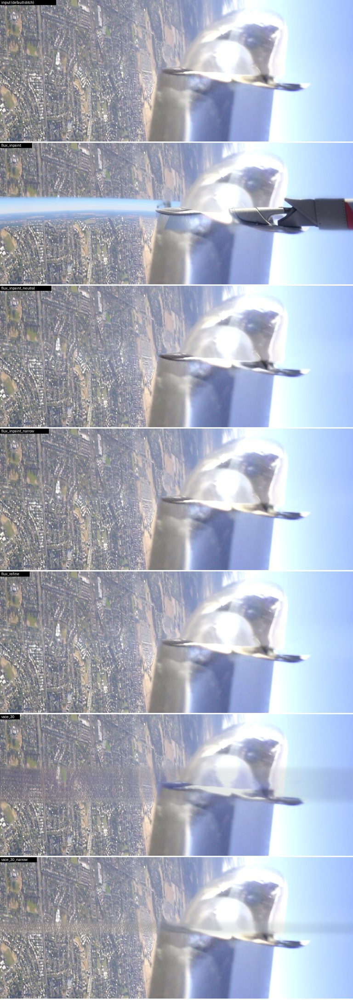
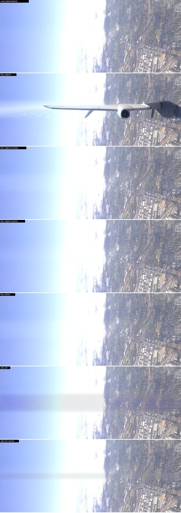
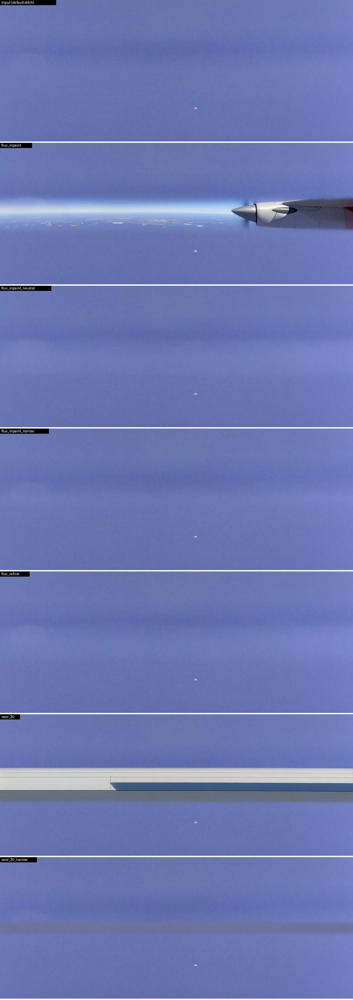
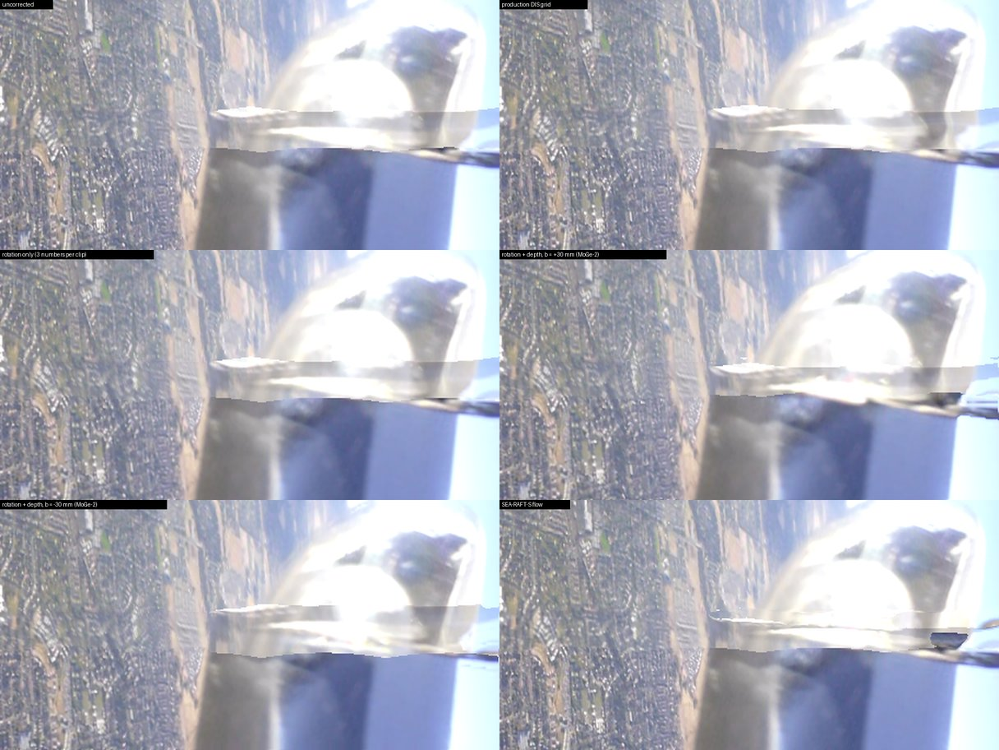
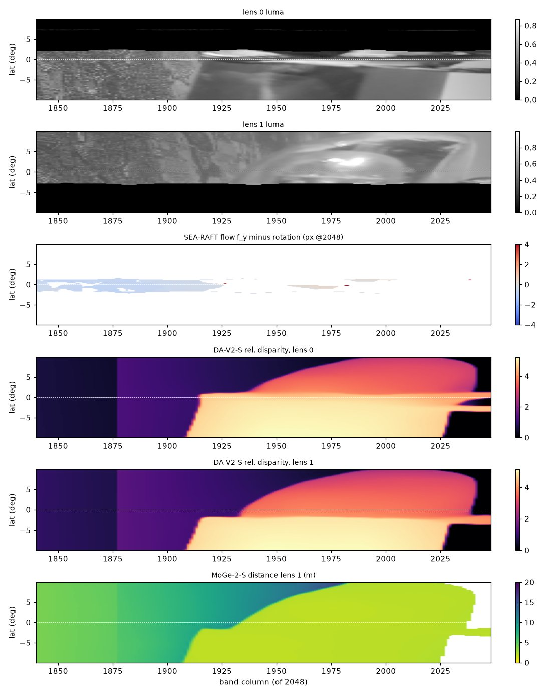

# AI-assisted stitching: diffusion, newer flow, depth, splats

Status: research (WP-AISTITCH), 2026-09-23. No product code changes.
Builds on [NEURAL_STITCHING.md](NEURAL_STITCHING.md) and does not repeat what
it measured. Every number here comes from the sample clip
(`example_footage_dlogm.OSV`, 65 frames, dual 3000 x 3000 10-bit HEVC, D-Log M,
an aircraft wing with a reflective nacelle in the overlap, sky and ground far
away). It is reproducible with the scripts in `research/aistitch/` (see
"Reproducing" at the end).

**Timing caveat.** The RTX 5090 and the 32-core CPU were shared with other
agents' builds and jobs during every measurement. Treat absolute times as
ranges; ratios measured back to back in one process are more reliable.

**Licence rule.** Only Apache-2.0 / MIT / BSD code AND weights may ship.
Everything else in this document is marked research-only.

## TL;DR

**1. Diffusion "to make the stitches perfect": no. Measured, not argued.**

* **What was run.** Two commercially licensed generators on the importer's
  default stitch, frames 28-36:
  * FLUX.2 [klein] 4B, Apache-2.0: inpaint and refine;
  * Wan2.1-VACE 1.3B, Apache-2.0: masked video-to-video, all 9 frames in one
    job.
* **What they did.** They either copy the seam band back, defect included
  (PSNR 30-41 dB against the input, nacelle step 1.23-1.33 against 1.29), or
  invent things neither lens saw. With a descriptive prompt FLUX.2 drew an
  airliner wing across the sky and VACE a white structure in open sky: 14-66 %
  of repainted patches match neither lens.
* **Flicker.** Every variant adds frame-to-frame change: 0.02-0.11 stops at
  best, 0.13-0.58 stops when it invents. VACE's temporal attention did not
  help; its band is blurred and does not follow the ground's motion.
* **Cost.** 4.0-7.4 s per 6K frame (FLUX.2) or 12-25 s (VACE, below native
  resolution). That is 4-25 hours for one minute of 60 fps footage, plus
  19-23 GB of weights per model.
* **There is nothing for it to fix.** After WP-PHOTO the sky seam is already
  invisible. The only visible seam is at the nacelle, where the lenses saw
  different faces of the object and nothing, human or model, knows the
  missing surface.
* **Licences.** Clean today:
  * FLUX.2 klein 4B, FLUX.1-schnell, Z-Image-Turbo, Qwen-Image, Chroma;
  * Wan 2.1 / 2.2, VACE, ROSE, CogVideoX-2B, Mochi.

  Not clean:
  * SD 1.5 (OpenRAIL-M use restrictions);
  * SD2 (withdrawn: HTTP 401);
  * SD3.5 and the Turbos (US$1 M revenue cap);
  * SANA (Gemma encoder);
  * PixArt (openrail++);
  * LTX (US$10 M cap);
  * HunyuanVideo (territory exclusions);
  * CogVideoX-5B.

**2. Newer flow models (FlowSeek, WAFT, FlowFormer / ++, GMA, UniMatch, RAFT): none beats what we have.**

* **Ground.** Every competent model saturates at NCC ~0.92-0.93, DIS
  included; there is nothing left to find on far-field texture. FlowSeek T/S
  only match SEA-RAFT-S (0.924) with 2x upsampled input.
* **Sky.** Learned models return ~0 flow (right); DIS relies on the existing
  benefit gate for that.
* **Wing.** No model aligns the nacelle's visible edges: edge NCC 0.07-0.21,
  chamfer 4.4-6.2 px at 2048 columns. FlowSeek's reflective-surface gain
  (paper: EPE 3.59 -> 1.79) does not appear: here the two views see different
  faces, not the same mirror twice.
* **FlowSeek.**
  * Code: Apache-2.0.
  * Weights: T and M only, S = T at 12 iterations, **no weight licence**.
    M/L use Depth Anything V2 Base, CC-BY-NC.
  * Cost: 131-204 ms per band, 4.7x SEA-RAFT-S.
* **WAFT** fails on these bands via ptlflow (ground 0.47-0.89). DPFlow and
  UniMatch are below the rest.
* **Only NeuFlow v2 (Apache/Apache, 14 ms)** is worth keeping on file.

**3. Depth-aware stitching: right physics, no measurable gain here, but it
exposed the biggest cheap win of the study.**

* **The calibration stores no translation**, only rotations and intrinsics
  (all 24 slots dumped). DJI's "far_XX" distance presets change the focal
  length linearly with XX (not with 1/distance), so they do not give the
  baseline either.
* **The parallax model** (b cos(lat) / D along the meridian, plus a rotation)
  was fitted with Depth Anything V2 Small (Apache), MoGe-2 (MIT) and DA-V2
  Metric. It does not align the nacelle: wing NCC 0.20-0.24, none better
  than 0.244. Neither do one global offset or a near/far offset pair (0.242).
  The two lenses see different surfaces.
* **Monocular metric depth puts the km-distant ground at 6-13 m.** With a
  30 mm baseline that alone drops the ground NCC from 0.89 to 0.70. The
  baseline cannot be measured from this clip; physically 2-4 cm.
* **The big win is the rotation.** The fit exposed a constant 0.36-0.38 deg
  relative rotation between the lenses:
  * the same from three different flows (0.353-0.377 deg) and on three
    frames (within 0.008 deg per flow);
  * three numbers per clip take the ground NCC from 0.37 to 0.89, 97 % of what
    the per-bucket DIS grid achieves;
  * it fixes the sky and far field everywhere, and cannot flicker.
* **Runtime.** DA-V2-S 2.3 ms per 518^2 crop, ~56 ms per bucket.
* **The "slight movement" the user sees is the warp, not the seam.**
  * The carved seam line moves <= 0.036 deg per frame on the importer's
    schedule.
  * A depth-placed seam would move more (up to 2.3 deg per frame where the
    scene is far) and cut through twice the lens disagreement at the wing.
  * What moves is the parallax grid gliding between buckets: up to 2 px per
    frame at 6K at the nacelle, in 24 of 64 frames above 1 px.
  * One grid per clip (median over buckets) removes that motion with
    unchanged alignment (ground 0.9036 vs 0.9045, wing 0.313 vs 0.314).

**4. A Gaussian splat of this clip: no.**

* The wing and nacelle are bolted to the camera. 28 % of the wing columns'
  pixels move < 0.5 deg over the clip while the ground moves 3 deg: zero
  multi-view where the stitch fails.
* The prop spins, the nacelle is specular, and the sky has no geometry.
* The ground does have parallax (0.5-1.5 deg per second after removing
  rotation), but it already stitches.
* Splats (gsplat, nerfstudio, 3DGRUT, Brush: Apache; COLMAP: BSD; the original
  3DGS is non-commercial) are an offline "parallax-free re-render" option for
  handheld or walking footage of static scenes, hours per clip, not a
  stitcher.

**Build next** (section 5):

1. **Per-clip lens rotation refinement** (3 numbers, from the DIS grid we
   already compute, folded into the rig, no kernel change).
2. **Hold the parallax grid still on rigid mounts** (clip median / EMA): kills
   the "slight movement".
3. Keep DIS; no new flow model.
4. Depth-aware parallax only after a clip with an opaque near object
   validates it.
5. A baseline calibration shot.
6. Generative fill only as an offline, user-invoked clean-plate tool.

---

## 0. Common method

### 0.1 Data

| Source | What | Used for |
|---|---|---|
| `osvtool seam --dump-bands` (`dump_flow_bands.ps1`) | each lens's code-space luma and coverage on the 2048-column polar-axis band, +-6 deg (the band production DIS sees) and +-10 deg | flow scoring (section 2), depth scoring (section 3) |
| `bandprobe` (`research/neural/bandprobe.cpp`, built by `build_probe.cmd`) | each lens ALONE in scene-linear RGB, 4096 columns x +-45 deg (frames 0/32/64) and 6144 columns x +-16 deg (frames 28-36) | flow-model input, depth crops, "does the generator invent content" |
| `osvtool render --mode equirect-polar --parallax --flow-backend classical --seam-carve --photo full --color linear` | the importer's default stitch, 6144 x 3072, frames 28-36 | diffusion input (section 1) |
| `seamprobe` (`research/aistitch/seamprobe.cpp`) | the release build's parallax grid (classical DIS) and carved seam on all 65 frames, on the importer's bucket schedule and per frame, plus the bands the carve sees | seam steadiness (section 3.6) |
| `bandprobe` at 2048 columns x +-45 deg | each lens alone, all 65 frames | per-frame depth for the depth-placed seam (3.6) |

Polar-axis layout: the lens axes are the poles, the seam is the equator,
+latitude is towards the master lens (lens 1). Regions of the 2048-column
band, as in NEURAL_STITCHING.md section 1.6: open sky 410-900, ground
1110-1700, near-field wing 1880-2040.

### 0.2 The flow / warp metric, and why it needed one fix

`flow_eval.py` reproduces `osvtool seam --region` exactly: global NCC of the
two lenses' code luma over co-visible pixels, rows |lat| <= 4 deg. With no
correction it returns 0.9759 / 0.3730 / 0.2255 (sky / ground / wing, frame
0), the production values to four decimals.

A warp is applied the way the kernel applies the parallax grid: lens 0 is
sampled at x - f/2 and lens 1 at x + f/2 (`ParallaxWarp.h`: the grid moves
the master by +g and the slave by -g). Warping only one lens would blur one
side and not the other and cost every flow about 0.02 NCC on the ground.

Two checks tie the harness to production:

* the production DIS grid (dumped by `osvtool`) pushed through this warp
  scores ground 0.901-0.910; rendered by the kernel, which samples the
  fisheye directly instead of a resampled band, it scores 0.922-0.932. So this
  harness costs every method about 0.02 on the ground. Compare rows with each
  other, not with the kernel numbers;
* the sign and scale of the grid conversion are right: ground NCC goes from
  0.37 to 0.90, not down.

Two traps found on the way, which any learned-flow integration must also
avoid:

* **Black out-of-field areas.** Past +-7.6 deg one lens sees nothing. Every
  network matched lens 0's field edge (+7.6 deg) to lens 1's (-7.6 deg) and
  returned 5-14 deg of "sky flow". The fix: where a lens sees nothing, show
  the other lens's pixels (`fill_outside`), so that region carries no motion.
  The production band (+-6 deg) mostly avoids the issue; a wider analysis band
  would not.
* **Sky NCC rewards wrong warps.** Classical DIS on the textureless sky
  drifts by 2-4 deg and RAISES the sky NCC (0.976 -> 0.988): it lines up the
  two lenses' brightness gradients, i.e. fixes photometry with geometry. The
  production benefit gate already refuses this. The tables therefore also
  report the median flow in the sky, which should be about 0.

---

## 1. "Stable diffusion pre-processing to make the stitches perfect" (question 1)

### 1.1 Which generators are commercially licensed today

Verified 2026-09-23 by reading each model card's `license` field, the LICENSE
file in the repository, and the Hugging Face API (HTTP status, gating).

**Image models that pass the Apache / MIT / BSD rule (code and weights):**

| Model (HF id) | Size | Licence | Masked editing in diffusers | Notes |
|---|---|---|---|---|
| **FLUX.2 [klein] 4B** (`black-forest-labs/FLUX.2-klein-4B`) | 4 B + Qwen3-4B text encoder (Apache-2.0) | **Apache-2.0**, not gated | `Flux2KleinInpaintPipeline`, `Flux2KleinPipeline` (reference editing) | released 2026-01-15; "<0.5 s" per edit at 1024^2, 4 steps, GB200 (BFL blog); ~13 GB VRAM. **Prototyped below.** The 9B klein and FLUX.2 [dev] are FLUX Non-Commercial |
| FLUX.1-schnell | 12 B + T5-XXL | Apache-2.0, gated click-through | `FluxInpaintPipeline` / `FluxImg2ImgPipeline` | FLUX.1 dev / Fill / Kontext are non-commercial |
| Z-Image-Turbo (`Tongyi-MAI/Z-Image-Turbo`) | 6 B + Qwen3-4B | Apache-2.0 | `ZImageInpaintPipeline` | FLUX.1 VAE (Apache) |
| Qwen-Image / -Edit | 20 B + Qwen2.5-VL-7B | Apache-2.0 | inpaint and edit-inpaint pipelines | too large to be practical |
| Chroma1-HD | ~8.9 B + T5-XXL | Apache-2.0 | `ChromaInpaintPipeline` | FLUX.1-schnell derivative |
| Kandinsky 2.2 inpaint | ~1.2 B | Apache-2.0 | `KandinskyV22InpaintPipeline` | old; low quality |
| MI-GAN (not diffusion) | 5.9 M | MIT code and weights | ONNX | the "tiny inpainter" of NEURAL_STITCHING 5 |
| LaMa / big-lama (not diffusion) | 51 M | Apache-2.0 | ONNX | Places2 training data terms are a small open question |

**Image models that do NOT pass:**

* **SANA 1.0 / 1.5 / Sprint.** The weights were relicensed to Apache-2.0 on
  2026-07-31 (HF commit). The text encoder is Gemma-2-2B (Gemma Terms of Use,
  gated), and the cards still say "research purposes only". Shippable only if
  Gemma is not redistributed.
* **PixArt-alpha / -Sigma.** Code Apache-2.0; weights openrail++, which has
  use restrictions.
* **SD 1.5 (CreativeML OpenRAIL-M).** Commercial use is allowed, but the
  Attachment A use restrictions must be passed on to every user, and the
  licensor may restrict use remotely. That is not Apache/MIT/BSD. The official
  `runwayml` repository is gone; the mirror is
  `stable-diffusion-v1-5/stable-diffusion-inpainting`.
* **SD 2.x.** Every `stabilityai/stable-diffusion-2*` repository returns HTTP
  401 today, including the inpainting model that both published diffusion
  stitchers (SRStitcher, RDIStitcher) are built on.
* **SDXL inpainting 0.1:** openrail++.
* **SD3.5, SD-Turbo, SDXL-Turbo:** Stability Community Licence. Free below
  US$1 M annual revenue; above that the licence terminates. Registration and
  "Powered by Stability AI" are required.
* **Lumina-Image 2:** Gemma encoder.
* **HiDream-I1:** Llama-3.1 encoder.
* **CogView4:** GLM-4 encoder.
* **OmniGen2:** qwen-research encoder.
* **Stable Cascade:** non-commercial.

**Video models** (temporal attention is the only generative route to
consistency):

| Model | Licence | Masked video editing | Notes |
|---|---|---|---|
| **Wan2.1-VACE 1.3B** (`Wan-AI/Wan2.1-VACE-1.3B-diffusers`) | **Apache-2.0** (umT5-XXL encoder Apache-2.0) | `WanVACEPipeline`: masked video-to-video inpainting / outpainting | 480p class; the authors quote ~4 min for 5 s at 480p (T2V-1.3B, RTX 4090, 8.2 GB). **Prototyped below.** VACE-14B: Apache, 720p |
| Wan2.2 TI2V-5B, A14B; Wan2.1-Fun-InP 1.3B; ROSE (Wan-based object removal) | Apache-2.0 | ROSE: mask-based removal; Fun-InP: first/last-frame inpainting | ROSE is the best-licensed video inpainter found |
| CogVideoX-2B | Apache-2.0 | video-to-video, no mask | 720 x 480 only. CogVideoX-5B / 1.5: CogVideoX licence, capped at 1 M visits/month |
| SeedVR2-3B / 7B (restoration, not generation) | Apache-2.0 | one-step video restoration | the authors warn it "can oversharpen or hallucinate on lightly degraded input" |
| LTX-Video 0.9.6+, LTX-2.x | LTXV Open Weights / LTX-2 Community: US$10 M revenue threshold plus use restrictions | | not shippable (0.9-0.9.5 were RAIL-M) |
| HunyuanVideo | Tencent licence, excludes the EU, UK and South Korea | | not shippable |
| Mochi-1 | Apache-2.0 | no masking | 10 B, 22+ GB |
| Open-Sora 2.0 | card Apache, but bundles FLUX.1-dev (non-commercial) | | not shippable |
| DiffuEraser | Apache code and weights, but needs SD1.5 (OpenRAIL-M) and the ProPainter prior (S-Lab non-commercial) | | not shippable as a whole |
| ProPainter, E2FGVI, MiniMax-Remover, VideoPainter, FloED, CoCoCo | non-commercial or no licence | | not shippable |

**Diffusion stitching papers:**

* **SRStitcher** (NeurIPS 2024, MIT code) and **RDIStitcher** (Apache code)
  are both built on SD2-inpainting, now withdrawn. They would need re-basing
  onto FLUX.2 klein or Z-Image.
* **Seam360GS** (ICCV 2025) is a 3DGS method with a dual-fisheye calibration
  model, not diffusion, and has no code.
* No 2025-26 video-diffusion seam-repair paper with code was found.

### 1.2 The prototype

`gen_seam.py` runs both prototyped models on the importer's default stitch
(parallax grid, carved seam, photometric field), not on the plain feather.
The input is 6144 x 3072 polar maps of frames 28-36, 9 consecutive frames.

**Tiles.** Four 1024 x 512 tiles (60 x 30 deg) centred on the seam:

| Tile | Centre longitude | Content |
|---|---|---|
| **wing** | 160 deg | the nacelle crossing |
| **skyground** | -2 deg | open sky meeting hazy ground |
| **sky** | -90 deg | open sky |
| **ground** | 60 deg | suburbs from altitude |

**Encoding.** Linear light goes to display sRGB with a soft shoulder, the same
exposure for every frame.

**Repainted band.** |lat| <= 3 deg (the overlap is +-7.6 deg), composited back
with a 6 px feather. "narrow" variants repaint only +-1 deg (the carve's mean
feather is 0.87 deg), which is the most favourable case: a thin hole with
everything around it as context.

**The variants:**

* **FLUX.2 [klein] 4B, `Flux2KleinInpaintPipeline`, 4 steps, one fixed seed
  for every frame** (the kindest case for flicker):
  * *inpaint*: strength 1.0 with a descriptive prompt ("aerial photograph
    from a small aircraft: suburban city far below, clear blue sky, part of
    the aircraft's metal wing and engine nacelle...");
  * *inpaint_neutral*: the same with the prompt "a photograph";
  * *inpaint_narrow*: neutral prompt, +-1 deg band;
  * *refine*: strength 0.35 (SDEdit: re-noise and denoise), descriptive
    prompt.
* **Wan2.1-VACE 1.3B, `WanVACEPipeline`:** the 9 frames as ONE masked video
  job (temporal attention across frames), 30 steps, guidance 5, 832 x 416
  (its 480p class; the output is scaled back to the tile):
  * *vace_30*: descriptive prompt, +-3 deg;
  * *vace_30_narrow*: neutral prompt, +-1 deg.

**Measured inside each variant's repainted band:**

| Metric | Definition |
|---|---|
| **fidelity** | PSNR (8-bit display) against the input stitch; "detail change" = RMS of the change in high-pass luma over the input's high-pass RMS (0 = same detail, ~1 = all replaced) |
| **invented content** | every textured 16 x 16 patch is matched (+-4 px search) against each lens rendered ALONE (bandprobe); "unsupported" = neither lens has it (NCC < 0.5). The input stitch itself scores 0-2 % |
| **seam visibility** | mean vertical log-luma gradient over |lat| < 2 deg divided by the same over 4-10 deg. 1.0 = the seam rows look like the rest; the input: wing 1.29 (a visible step at the nacelle), elsewhere 0.82-0.96 (the seam is already invisible) |
| **flicker** | the frame-to-frame change the generator ADDED: RMS over 8 consecutive pairs of (out[t+1] - out[t]) - (in[t+1] - in[t]), log2 luma, stops |
| **runtime** | RTX 5090, bf16, prompt encoded once per variant |

### 1.3 Results

Values are wing / skyground / sky / ground.

| Variant | PSNR vs input (dB) | Unsupported patches (wing / skyground / ground) | Seam visibility (input: 1.29 / 0.82 / 0.96 / 0.92) | Added flicker (stops) | Runtime |
|---|---|---|---|---|---|
| input (default stitch) | - | 2 % / 0 % / 0 % | 1.29 / 0.82 / 0.96 / 0.92 | 0 | - |
| FLUX.2 klein, inpaint, descriptive prompt | 10.5 / 16.4 / 14.0 / 12.3 | **55 % / 52 % / 65 %** | 1.45 / 2.14 / **11.6** / 0.50 | **0.58 / 0.36 / 0.40 / 0.44** | 1.18 s per tile |
| FLUX.2 klein, inpaint, neutral prompt | 30.4 / 36.7 / 33.8 / 32.5 | 2 % / 0 % / 0 % | 1.33 / 0.80 / 1.21 / 0.90 | 0.10 / 0.04 / 0.02 / 0.11 | 1.22 s |
| FLUX.2 klein, inpaint, neutral, +-1 deg | 36.9 / 39.4 / 40.6 / 34.7 | 5 % / 0 % / 0 % | 1.27 / 0.81 / 1.18 / 0.91 | 0.06 / 0.03 / 0.02 / 0.09 | 1.23 s |
| FLUX.2 klein, refine (strength 0.35) | 33.9 / 36.3 / 35.4 / 31.2 | 2 % / 0 % / 0 % | **1.23** / 0.80 / 1.24 / 0.88 | 0.07 / 0.04 / 0.02 / 0.11 | 0.67 s |
| Wan2.1-VACE 1.3B, video, +-3 deg | 21.6 / 23.8 / 12.4 / 21.3 | 20 % / 14 % / 18 % | **0.92** / 0.78 / **18.5** / 0.61 | 0.30 / 0.14 / 0.13 / 0.48 | 22-58 s per 9-frame tile (median 37 s; GPU shared) |
| Wan2.1-VACE 1.3B, video, neutral, +-1 deg | 21.5 / 25.5 / 25.8 / 19.7 | 53 % / 58 % / 66 % | 1.05 / 0.89 / 1.23 / 0.78 | 0.30 / 0.14 / 0.07 / 0.48 | 17.4-17.8 s per 9-frame tile (GPU quiet) |





Each figure shows, top to bottom: input, then FLUX.2 inpaint (descriptive),
inpaint neutral, inpaint narrow, refine, then VACE and VACE narrow;
|lat| <= 12 deg of each tile.

**What happened:**

* **Given a descriptive prompt, both generators invent objects.** FLUX.2 drew
  an airliner wing with an engine across the sky/ground tile, and a horizon
  plus a grey wing across the nacelle tile. VACE drew a long white structure
  through the open sky.
  * 52-65 % of the repainted textured patches match neither lens.
  * The fixed seed does not keep them still: 0.36-0.58 stops of added
    frame-to-frame change, i.e. the invented content boils.
* **Given a neutral prompt, FLUX.2 [klein] mostly copies the input.** Its
  inpainting conditions on the source image as a reference, so the band comes
  back nearly as it went in: PSNR 30-41 dB, unsupported patches back at the
  input's 0-5 %. **The seam comes back with it:**
  * the nacelle step is unchanged or slightly worse (1.27-1.33 against 1.29);
  * the open sky gets structure it did not have (1.18-1.24 against 0.96:
    diffusion texture in a gradient);
  * a quarter of the fine detail is re-drawn (detail change 0.24-0.29 on the
    ground and the wing);
  * the band shimmers by 0.06-0.11 stops per frame on the textured ground
    (the seed is fixed; the ground under it moves 3 deg per second).
* **The refine pass is the best of the image variants and it still does not
  fix anything.**
  * It softens the nacelle step a little (1.23 against 1.29).
  * It adds 0.07-0.11 stops of flicker on texture.
  * It alters 27 % of the detail.
  * It puts diffusion grain into the sky band.
* **VACE's temporal attention does not buy stability here.** Its added
  change is the largest of the neutral variants (0.13-0.48 stops). The
  repainted band does not follow the real motion of the ground under it,
  because it is generated at 480p-class resolution and pasted in:
  * the ground band is visibly blurred (visibility 0.61-0.78: fewer gradients
    than the real ground);
  * detail change is ~1.0, i.e. all of it replaced;
  * its narrow neutral variant draws a dark stripe through the open sky.

  It "improves" the nacelle step (0.92) only by blurring the whole band.

### 1.4 Offline, export-quality pass

The best available offline route was also measured: VACE is the only
commercially licensed model with masked video editing and temporal
attention, run with 30 steps and whole 9-frame windows. It scores below the
neutral FLUX.2 variants on fidelity (PSNR 12-26 dB) and blurs the band. The
larger options are all heavier and not measured here:

* VACE-14B (Apache, 720p): about 10x the compute;
* ROSE (Apache): object removal, not seam repair;
* FLUX.2 klein base 4B (Apache, undistilled, 25-50 steps).

None of them changes the two structural problems:

* the generator has no better information than the two lenses (NEURAL_STITCHING 5);
* whatever it adds is either a copy of the defect or content no lens saw.

**Cost per 6K frame** (the 360 deg seam strip = 6 tiles of 1024 x 512 at
the 6144-column map):

| Pass | Per 6K frame | One minute of 60 fps footage (3600 frames) |
|---|---|---|
| FLUX.2 klein 4B inpaint, 4 steps | 6 x 1.2 s = **7.1-7.4 s** | **7.1-7.4 h** |
| FLUX.2 klein 4B refine | 6 x 0.67 s = **4.0 s** | **4.0 h** |
| Wan2.1-VACE 1.3B, 30 steps (at 480p-class, i.e. BELOW native resolution) | 6 x 17.6-37 s / 9 = **11.7-25 s** | **12-25 h**; at native resolution ~1.5x more pixels |
| today's analyses + kernel (for scale) | milliseconds | seconds |

Other costs:

* 19-23 GB of weights to install per model: FLUX.2 klein 4B with its
  Qwen3-4B text encoder is 23 GB on disk, VACE 1.3B with umT5-XXL 19 GB.
* VRAM (vendor figures, not measured here): ~13 GB for FLUX.2 klein 4B,
  ~8 GB for Wan 1.3B at 480p.
* A second diffusion runtime in the plug-in.

### 1.5 Verdict: can diffusion make the stitches "perfect"?

**No.** Measured on the sample, it does one of two things in the seam band:

* **It copies the band, defect included** (FLUX.2 klein with a neutral
  prompt, PSNR 30-41 dB against the input). The nacelle step stays (1.27-1.33
  against 1.29). The pass adds 0.02-0.11 stops of frame-to-frame shimmer and
  diffusion grain in the open sky.
* **It replaces the band with something neither lens saw.** An airliner wing
  in the sky, a horizon across the nacelle, a white structure in open sky,
  blurred stripes. 14-66 % of the repainted patches are unsupported by either
  lens, with 0.13-0.58 stops of boiling.

**Why:**

* **The sky seam is already invisible** after WP-PHOTO (visibility
  0.82-0.96).
* **The only visible seam is at the nacelle**, where the two lenses saw
  different faces of the object. A generator does not know what the true
  surface between them looks like any more than we do. The honest fixes
  there are seam placement (the carve) and, for pixels no lens saw, an
  explicitly labelled fill.

**The one place a generator earns its keep** is unchanged from
NEURAL_STITCHING 5: an offline, user-invoked "clean plate" (remove the wing
root, inpaint the nadir or tripod, a still), where inventing plausible
content is the goal and flicker does not matter or is handled by generating
once and propagating with flow.

* **Licence-clean options for that job:** FLUX.2 [klein] 4B (Apache-2.0,
  1.2 s per 1024 x 512 region) for stills; LaMa / MI-GAN (Apache / MIT, tiny)
  for thin masks.
* **For video object removal:** ROSE / Wan2.1-VACE (Apache-2.0).

---

## 2. Better optical flow than SEA-RAFT (question 2)

### 2.1 Licences (verified 2026-09-23 from the LICENSE files, README licence sections and Hugging Face cards)

| Model | Code | Weights | Ship? | Notes |
|---|---|---|---|---|
| **FlowSeek** (Poggi & Tosi, ICCV 2025, [arXiv 2509.05297](https://arxiv.org/abs/2509.05297), [mattpoggi/flowseek](https://github.com/mattpoggi/flowseek)) | Apache-2.0 (`LICENSE.md`; `NOTICE.md` credits SEA-RAFT BSD-3 and DA-V2 Apache-2.0) | Google Drive links in `scripts/get_weights.sh`, **no licence stated** | **code only** | Released weights: **T and M only** (CT, TartanCT, TartanCT_TSKH). **S = T weights at 12 iterations, L = M at 12** (the authors' `eval.sh`). T/S use ResNet-18 + **DA-V2 Small (Apache-2.0)**; M/L use ResNet-34 + **DA-V2 Base (CC-BY-NC-4.0)**, so M/L can never ship. DA-V2 is frozen inside FlowSeek, so a self-trained T/S could ship |
| WAFT ([princeton-vl/WAFT](https://github.com/princeton-vl/WAFT)) | BSD-3 | Google Drive, licence not stated | code only | a1 = DA-V2-S + ViT-S; a2 variants: DA-V2-S, Twins-SVT-L, DINOv3 ViT-S (DINOv3 licence, not permissive) |
| FlowFormer ([drinkingcoder/FlowFormer-Official](https://github.com/drinkingcoder/FlowFormer-Official)) | Apache-2.0 | not stated | code only | Twins-SVT-L |
| FlowFormer++ ([XiaoyuShi97/FlowFormerPlusPlus](https://github.com/XiaoyuShi97/FlowFormerPlusPlus)) | no LICENSE file; README says Apache | not stated | code only (weak) | |
| GMA ([zacjiang/GMA](https://github.com/zacjiang/GMA)) | WTFPL | in the repo (WTFPL presumably) | policy call: WTFPL is not on the list | |
| UniMatch / GMFlow ([autonomousvision/unimatch](https://github.com/autonomousvision/unimatch)) | MIT | S3 zip, no separate statement | code yes, weights ambiguous | |
| RAFT ([princeton-vl/RAFT](https://github.com/princeton-vl/RAFT)) | BSD-3 | not stated | code yes, weights ambiguous | |
| **SEA-RAFT** (already integrated) | BSD-3 | **BSD-3** (HF `MemorySlices/*`) | **yes** | |
| **NeuFlow v2** | Apache-2.0 | **Apache-2.0** (HF `Study-is-happy/neuflow-v2`) | **yes** | |
| **MEMFOF** | BSD-3 | **BSD-3** (HF `egorchistov/optical-flow-MEMFOF-*`) | **yes** | needs three frames; not run (the harness is two-frame) |
| DPFlow | Apache-2.0 | "academic and research purposes only" | research | |
| ptlflow ([hmorimitsu/ptlflow](https://github.com/hmorimitsu/ptlflow)), the harness used here | Apache-2.0 | its converted checkpoints: "Not specified" per model; its own trained weights CC BY-NC-SA 4.0 | never ship weights from ptlflow's release page | ptlflow 0.4.2 has FlowSeek and WAFT; its `FlowSeek.create_bases` builds its grid on the CPU and fails on CUDA, patched in `flow_eval.py` |

### 2.2 How it was run

Every model ran through ptlflow 0.4.2 on the 4096-column, +-10 deg band
(each lens gain-matched, sRGB-encoded, blind areas filled), cut into 12
overlapping 456 x 228 tiles with circular longitude wrap. The tile aspect
(2:1) is the one FlowSeek's and WAFT's depth branch is trained with; both
squash every input to 518 x 518 for Depth Anything. Flows were resampled to
the 2048 scoring grid. "x2" rows upsample each tile by 2 first, for models
trained at 432 x 960 or more; FlowFormer and FlowFormer++ refuse inputs
smaller than their training crop and only run that way. Checkpoints:
zero-shot `things` / `tar-c-t` where they exist, plus the fine-tuned ones
production uses (SEA-RAFT `spring`) and the ones the FlowSeek paper's
LayeredFlow table uses (`tar-c-t-tskh`).

### 2.3 Results (mean of frames 0 / 32 / 64)

NCC after the symmetric warp; "sky flow" is the median flow magnitude in the
open sky (should be ~0); wing edge NCC is the NCC of Sobel gradient magnitude
in the wing columns, and wing chamfer is the mean distance (2048 px, capped
at 8) from lens 0's strongest 5 % of edges to lens 1's. Those two say
whether the nacelle's VISIBLE edges line up.

| Model (checkpoint) | ground | wing | whole band | sky flow (deg) | wing edge NCC | wing chamfer (px) | ship? |
|---|---|---|---|---|---|---|---|
| no correction | 0.366 | 0.236 | 0.824 | 0 | 0.017 | 5.51 | |
| **production DIS grid, this warp** (kernel render: ground 0.929) | 0.904 | 0.314 | 0.917 | 0 | 0.001 | 6.27 | in the product |
| DIS per pixel, OpenCV medium | 0.924 | 0.303 | 0.918 | **2.07** (drifts) | 0.094 | 4.93 | yes |
| **SEA-RAFT-S (spring)** | **0.924** | 0.513 | 0.953 | 0.01 | 0.150 | 4.37 | yes |
| SEA-RAFT-S (things, zero-shot) | 0.896 | 0.270 | 0.943 | 0.03 | 0.212 | 4.75 | yes |
| SEA-RAFT-M (spring) | 0.924 | 0.348 | 0.941 | 0.01 | 0.115 | 4.51 | yes |
| NeuFlow v2 (things) | 0.915 | 0.319 | 0.955 | 0.07 | 0.113 | 6.08 | yes |
| RAFT (things) | 0.907 | 0.479 | 0.945 | 0.01 | 0.076 | 6.16 | weights unclear |
| GMA (things) | 0.909 | **0.576** | 0.952 | 0.03 | 0.143 | 4.93 | WTFPL |
| FlowFormer (things), x2 | 0.921 | 0.305 | 0.927 | 0.03 | 0.042 | 5.85 | code only |
| FlowFormer++ (things), x2 | 0.921 | 0.372 | 0.933 | 0.02 | 0.124 | 5.19 | code only |
| UniMatch (things) | 0.871 | 0.354 | 0.931 | 0.09 | 0.089 | 4.43 | MIT code |
| **FlowSeek T** (tar-c-t, zero-shot) | 0.904 | 0.205 | 0.939 | 0.02 | 0.120 | 5.01 | code only |
| **FlowSeek T** (tar-c-t-tskh) | 0.913 | 0.397 | 0.938 | 0.01 | **0.161** | 5.38 | code only |
| **FlowSeek S** (= T tskh, 12 iterations) | 0.911 | 0.408 | 0.938 | 0.01 | 0.093 | 5.49 | code only |
| **FlowSeek T** (tskh), x2 | **0.924** | 0.334 | 0.941 | 0.01 | 0.143 | 4.86 | code only |
| **FlowSeek S** (tskh), x2 | **0.924** | 0.366 | 0.943 | 0.00 | 0.150 | 5.21 | code only |
| FlowSeek M (tskh), DA-V2-Base | 0.922 | 0.425 | 0.946 | 0.01 | 0.088 | 5.48 | **no** (CC-BY-NC) |
| FlowSeek L (= M, 12 iterations) | 0.922 | 0.440 | 0.948 | 0.00 | 0.067 | 5.46 | **no** |
| WAFT DAv2-a1 (tar-c-t) | 0.888 | 0.245 | 0.896 | 2.66 | 0.013 | 5.44 | code only |
| WAFT Twins-a2 (zero_shot) | 0.483 | 0.292 | 0.860 | 8.57 | 0.079 | 5.51 | code only |
| WAFT DAv2-a2 (zero_shot) | 0.737 | 0.415 | 0.907 | 8.35 | 0.136 | 5.02 | code only |
| DPFlow (things), x2 | 0.899 | 0.441 | 0.944 | 0.01 | 0.098 | 5.32 | research |

(`python research/aistitch/flow_table.py` prints the full table, including
the x1/x2 pairs not shown.)

What the table says:

* **The ground saturates at ~0.92-0.93 for every competent method,** DIS
  included. On far-field texture the two lenses differ only by a smooth
  calibration residual, so there is nothing left for a better network to
  find. FlowSeek T/S reach SEA-RAFT-S's 0.924 only with 2x upsampled tiles,
  and at scale 1 they are 0.01 below it.
* **In the sky, every network returns ~0 flow** (0.00-0.03 deg), which is the
  right answer. Classical DIS needs production's benefit gate to get there.
  That is a real but small advantage of learned flow; the gate already
  delivers the same result.
* **At the wing, no model aligns the nacelle.** The wing NCC varies from 0.20
  to 0.58 between models and between upsampling factors of the SAME model
  (SEA-RAFT-S 0.513 at x1, 0.428 at x2), which is what a metric looks like
  when it is rewarding texture being stretched rather than surfaces being
  aligned. The visible-edge measures stay poor for everyone: edge NCC 0.07-0.21
  and chamfer 4.4-6.2 px (2048 scale; about 12-17 px at 6K). The picture in
  section 3.3 shows why: the two lenses see different faces of the object.
* **FlowSeek's reflective-surface advantage does not show here.** The paper's
  LayeredFlow numbers are real (reflective EPE, SEA-RAFT S 3.59 vs FlowSeek S
  1.79), but they measure one camera looking at a mirror twice. Here the two
  views are 180 deg apart and see different surfaces, so there is no
  correspondence for a better prior to recover. FlowSeek T's wing edge NCC
  (0.161) is marginally above SEA-RAFT-S's (0.150), its chamfer is worse
  (5.38 vs 4.37 px), and the S variant is worse than T on both.
* **WAFT fails on this band** through ptlflow: its a2 checkpoints find only
  0.02-0.08 deg of the 0.33 deg ground motion and drift 6-9 deg in the sky;
  a1 is 0.03-0.04 below SEA-RAFT on the ground. This may partly be the port or
  the thin 228-row band, but it is what the published weights do here.
* **DPFlow and UniMatch** are below the others on the ground; DPFlow needs x2.

### 2.4 FlowSeek's motion bases and our rig

FlowSeek adds 8 "motion bases" computed from a monocular inverse-depth map
(Heeger & Jepson 1992): 3 translations scaled by inverse depth, and rotations.
For a rigid camera motion the flow lies in their span. The motion between OUR
two lenses is exactly such a rigid motion, and a much simpler one: a fixed
translation along the lens axes (the polar axis) and a fixed small rotation,
with the same extrinsics every frame. In the polar band that flow is

    f_lon = r_lon(lon, lat)                     (rotation only)
    f_lat = r_lat(lon, lat) + b cos(lat) / D     (translation x inverse depth)

(derivation in 3.1). So the specialised variant the lead proposed, "fit the
rigid bases directly with our known extrinsics, only the depth scale unknown",
was tested directly in section 3, without FlowSeek's network. Its result: the
rotation part is the largest single win measured in this study, and the depth
part adds nothing measurable on this clip.

A FlowSeek retrained on our own bands would learn bases in the wrong frame.
Its bases assume a pinhole tile with the principal point at the tile centre.
That is a fair local approximation in the band, but the rotation part is
global and better fitted once per clip (section 3.3).

### 2.5 Runtime (RTX 5090, whole 4096 x +-10 deg band, 12 tiles in one batch)

`flow_timing.py`: median of 7 after 3 warm-ups, bf16 autocast / fp32.

| Model | Params | bf16 | fp32 | Compared with production DIS |
|---|---|---|---|---|
| NeuFlow v2 | 9.0 M | 13.8 ms | 15.3 ms | |
| SEA-RAFT-S | 8.9 M | 27.7 ms | 43.1 ms | production ONNX on the 2048 x 68 band: 81 ms steady state (NEURAL_STITCHING 1.6) |
| RAFT | 5.3 M | 95 ms | 125 ms | |
| GMA | 5.9 M | 110 ms | 153 ms | |
| **FlowSeek T** | 42.7 M (incl. DA-V2-S) | **131 ms** | 204 ms | |
| **FlowSeek S** (T, 12 iterations) | 42.7 M | **177 ms** | 279 ms | |
| FlowFormer / ++ (x2, per tile, unbatched) | | ~7-8 s | | |
| DIS (production) | - | 0.79 ms GPU / 17-20 ms CPU on the 2048 x 68 band | | |

FlowSeek T costs 4.7x SEA-RAFT-S here (paper: 695 vs 285 GMACs, 2.4x). The
difference is Depth Anything running on every tile at 518 x 518, whatever the
tile size. Once per 8-frame bucket it would be affordable (130-200 ms); it
simply buys nothing on this footage.

### 2.6 Verdict

* **No newer flow model is worth integrating for this footage.** Nothing
  beats SEA-RAFT-S (already integrated, BSD-3), and SEA-RAFT-S does not beat
  production DIS plus its benefit gate enough to justify 35-100x the cost
  (NEURAL_STITCHING 1.6).
* **FlowSeek** is the most interesting on paper, and its code and T/S
  backbone are licence-clean. But its weights carry no licence, it costs about
  5x SEA-RAFT-S, and on these bands it matches SEA-RAFT-S on the ground only
  when upsampled and does not align the nacelle. If a future clip shows DIS
  failing on a large co-visible reflective surface, the route is to ask the
  authors for a weight licence, or to retrain T (one RTX 3090 in the paper) on
  licence-clean data. Keep it on file.
* **If a learned backend is ever wanted for speed,** NeuFlow v2
  (Apache/Apache, 14 ms for the whole 4096 band) is the one to A/B, as
  NEURAL_STITCHING already suggested. It scored 0.915 on the ground, close to
  SEA-RAFT, and was quiet in the sky.

---

## 3. Depth-aware stitching (question 3)

### 3.1 The geometry

Put the rig centre between the two lens centres, with each centre a distance
a = b/2 along its own axis. Those axes are the polar axis of the band (body Y).

A point at distance D in band direction (lon, lat):

* **master lens** sees it at latitude lat - (a / D) cos(lat) + O(a^2/D^2);
* **slave lens** sees it at lat + (a / D) cos(lat);
* **longitude** is the same for both, because the translation lies along the
  polar axis.

So the lens 0 -> lens 1 flow over the band has two parts:

* along the meridian, parallax (b / D) cos(lat), which is +4.9 px at 2048
  columns (14 px at 6K) for b = 3 cm and D = 2 m;
* a small constant rotation w between the lenses, which is the calibration
  residual. Its flow is (w x d) projected on the lon / lat axes: three numbers
  for the whole clip.

A lateral offset of the lens centres would add a longitude term. The data
below do not need one.

### 3.2 What the calibration records

* **No translation anywhere.** The recovered schema
  (`proto/dvtm_osmo360.proto`, `DewarpParams`) has fx, fy, cx, cy, k1-k9, xi,
  p, the extrinsic quaternion `cam_extri_q`, informational yaw / pitch / roll,
  the occlusion polygon and temperature fields. There is no position field.
  `calib_slots.py` dumps all 24 slots of the sample from the raw protobuf
  tree. Every present field is one of those, and `presentFields` of the
  selected slots is `[1-8, 10-15, 20-25, 27, 28]`: no unknown field numbers.
* **The "far_XX" stitching-distance presets encode distance as FOCAL LENGTH.**
  The presets are far_07 / 09 / 11 / 12_5 / 14 / 16, i.e. "0.7 m .. 1.6 m" in
  the proto comments. Each differs from native_refine by:
  * a focal change of -1.63 px (0.7) to -3.71 px (1.6) on the slave, -1.59 to
    -3.60 on the master;
  * a principal point moved by at most 0.21 px;
  * a rotation of at most 0.009 deg.

  At the seam (theta = 90 deg) that is an angular shift of 0.164 to 0.374 deg
  per lens.
* **The shift grows linearly with the preset number**: df / XX = -2.33 px
  per unit on the slave and -2.26 on the master, constant to 0.4 %, a
  straight line through zero. Parallax falls as 1/distance. A 1/d fit leaves
  0.025 deg residuals; the line through zero leaves 0.0005-0.0007 deg, 40x
  less. So the presets are not "distance in metres" under a pinhole parallax
  law, and the baseline cannot be read from them without knowing DJI's
  parameterisation.
  * **If** they are parallax corrections for a baseline b, then b = 30 mm puts
    far_07 at 5.2 m and far_16 at 2.3 m.
  * That is a statement about the presets, not a measurement.

### 3.3 Measurements

`depth_eval.py`, frames 0 / 32 / 64, the section 0.2 metric. Pipeline:

* **Depth.** Per-lens perspective crops (90 deg, 518 px, every 30 deg of
  longitude on the seam, blind areas filled from the other lens), each band
  pixel taken from its nearest crop. Three models on every crop:
  * Depth Anything V2 Small, relative inverse depth, Apache-2.0;
  * MoGe-2 ViT-S, metric, MIT;
  * DA-V2 Metric-Outdoor-Small, research.
* **Rotation.** Fitted robustly (least squares plus one Huber pass) to
  SEA-RAFT-S Spring flow on forward-backward-consistent pixels of the far-field
  columns 1110-1870.
* **Offsets.**
  * "Global offset" adds one meridian shift everywhere.
  * "Near/far" adds it only in the wing columns (the stand-in for
    WP-SEAMTOOLS's per-column disagreement mask), with far = 0.
  * Both were swept over -12..+12 px (2048 scale) in 0.5 px steps and scored
    at their best wing NCC.

| Correction (on top of nothing) | ground | wing | whole band | wing edge NCC | wing chamfer px | parameter |
|---|---|---|---|---|---|---|
| none | 0.366 | 0.236 | 0.824 | 0.017 | 5.51 | |
| production DIS grid (this warp) | 0.904 | 0.314 | 0.917 | 0.001 | 6.27 | |
| SEA-RAFT-S flow | 0.924 | 0.513 | 0.953 | 0.150 | 4.37 | |
| **rotation only (3 numbers per clip)** | **0.891** | 0.236 | 0.909 | 0.022 | 5.35 | w, below |
| rotation + one global meridian offset (best for the wing) | 0.826 | 0.242 | 0.900 | 0.018 | 5.61 | +0.5 / +1 / +0.5 px |
| rotation + near/far offsets (best near, far = 0) | 0.891 | 0.242 | 0.911 | 0.018 | 5.61 | near +0.5 / +1 / +0.5 px |
| rotation + depth, DA-V2-S relative, K fitted to confident flow | 0.885 | 0.203 | 0.904 | 0.043 | 5.69 | K = -0.48 / -0.39 / -0.16 |
| same, each lens reprojected with its own depth | 0.885 | 0.209 | 0.904 | 0.041 | 5.72 | |
| same, oracle K (best wing NCC over -3..+3) | 0.893 | 0.240 | 0.911 | 0.025 | 5.61 | K = +0.2 / +0.2 / +0.1 |
| rotation + metric depth (MoGe-2), best baseline | 0.883 | 0.244 | 0.908 | 0.026 | 5.54 | b = 5 mm |
| rotation + metric depth (MoGe-2), b = 30 mm | 0.695 | 0.127 | 0.882 | 0.019 | 4.86 | |
| same, pixels the relative model calls far set to infinity, b = 30 mm | 0.811 | 0.122 | 0.903 | 0.037 | 4.79 | |

**The rotation.** w = (+0.00146, +0.00035, -0.00634) rad on frame 0,
(+0.00157, +0.00043, -0.00637) on frame 32 and (+0.00148, +0.00037, -0.00640)
on frame 64: 0.373-0.377 deg, constant across the clip to 0.004 deg.
Fitted instead to per-pixel DIS or to the production grid it is 0.353-0.361
deg (`rotation_check.py`), ground NCC 0.880-0.894.
Residual 0.24-0.25 px RMS (2048 scale, 0.04 deg) on the far field. This is
the "0.66 deg cross-meridian error" NEURAL_STITCHING 1.6 attributed to
calibration, now measured as one rigid rotation. Three numbers take the ground
from 0.37 to 0.89 NCC, 97 % of what the per-bucket DIS grid achieves through
the same warp (0.904). Because it is global and constant, it also fixes the
sky and the rest of the far field, where no flow can measure anything, and it
cannot flicker.

**Depth does nothing measurable here, and metric depth does harm:**

* **No depth or offset aligns the nacelle.** The best any variant reaches is
  wing NCC 0.244 against 0.236 for the rotation alone. The near/far pair
  reaches 0.242; its best near offset is 0.5-1 px, a tenth of a degree.
* **The parallax the flow measures on the nacelle is not consistent with
  depth.** The K fitted to forward-backward-consistent flow on the object is
  NEGATIVE: -0.16 to -0.48, correlation 0.42-0.94 over 400-900 pixels.
  The K that maximises the wing NCC is slightly POSITIVE: +0.1 to +0.2, the
  physically expected sign. Consistent matches on a specular, see-through
  surface follow reflections and highlights, not the surface. That is the
  LayeredFlow problem, with no second view of the same face to resolve it.
* **Monocular metric depth gets the object roughly right and the far field
  badly wrong.**
  * Object: MoGe-2 1.9-2.6 m, DA-V2-Metric 2.7-2.8 m.
  * Ground: MoGe-2 9.6-13.2 m and DA-V2-Metric 6.4-6.6 m. The real ground is
    km away.
  * With a physical 30 mm baseline that error alone injects 0.7-1.0 px
    (MoGe-2; 1.5 px with DA-V2-Metric) of false parallax into the far field,
    and the ground NCC falls from 0.89 to 0.70.
  * Even with far pixels forced to infinity, b = 30 mm pulls the wing down to
    0.12, because the shift moves one lens's surface onto the other lens's
    different surface.
* **The sample prefers b = 5 mm,** which is not a physical baseline: 5 mm is
  simply the least harmful shift.



Frame 32, 50/50 blend of the two lenses after each correction, 4096-column
band x2. In every panel lens 0's dark cylinder with its bright lip and lens
1's transparent rounded dome overlap as two different objects. No meridian
shift turns one into the other. Only the ground (left) lines up: it does in
every corrected panel.



The same crossing at 2048 columns, +-10 deg, frame 32. From the top:

1. lens 0;
2. lens 1. The co-visible band there is only -2.9..+2.3 deg; the calibrated
   occlusion polygon blanks the rest;
3. the meridian flow minus the rotation, on forward-backward-consistent
   pixels only. Almost none survive on the object;
4. and 5. Depth Anything V2 Small relative inverse depth, each lens;
6. MoGe-2 metric distance: the object 1-2 m, the ground wrongly ~5-10 m.

### 3.4 The baseline

* **Not recorded** (3.2).
* **Not measurable from this clip:**
  * the only near object is specular and seen from two different sides;
  * everything else is at infinity;
  * the co-visible band at the wing columns is only -2.9..+2.3 deg tall,
    because the calibration occlusion polygon cuts in.
* **Physically:** the two entrance pupils are separated by the body thickness
  plus the two lens domes. The prompt's "a few cm" and the reported ~20 px
  step at 6K on a ~2 m object (1.2 deg, so b = 1.2 deg x 2 m = 42 mm)
  bracket it at roughly 2-4 cm. Treat it as an assumption until a calibration
  shot measures it.
* **How to measure it:** a clip with an opaque, textured object at a few known
  distances crossing the seam (a person walking past at 1, 2 and 4 m). Fit
  f_lat - r_lat = b cos(lat) / D with the object's true distance. One shot per
  camera model.

### 3.5 Runtime (RTX 5090, fp16, 518 x 518 crops, batched 12 per lens)

| Model | Licence | Per crop | Per 8-frame bucket (2 lenses x 12 crops) |
|---|---|---|---|
| Depth Anything V2 Small (relative) | Apache-2.0 | 2.3 ms | ~56 ms (+ crop rendering) |
| Depth Anything V2 Metric-Outdoor Small | card says Apache; trained on Virtual KITTI 2 (non-commercial data terms): research | 2.3 ms | ~56 ms |
| MoGe-2 ViT-S (metric, points, FOV) | MIT code and weights | 55 ms (unbatched) | ~1.3 s |

Other licence-clean depth options (licences checked 2026-09-23, not run):

* Depth Anything 3 Small / Base / Metric-Large / Mono-Large: Apache-2.0.
* Video Depth Anything Small: Apache-2.0.
* Depth Any Camera: MIT; zero-shot metric depth on fisheye and 360 input.
* MapAnything, the `apache` variant.

Research-only:

* UniDepth: CC BY-NC.
* UniK3D: fisheye / spherical, CC BY-NC-SA.
* Depth Pro: Apple research licence.
* Metric3D v2: weights unlicensed.
* DA-V2 Base / Large: CC-BY-NC.

### 3.6 Would a depth-placed seam be steadier than the carve? (the "slight movement")

The user sees "some slight movement" at the seam. `seamprobe.cpp` runs the
release build's own parallax grid (classical DIS) and carve on all 65 frames.
It uses two schedules:

* the importer's: one carve per 8-frame bucket, steered by the previous
  bucket, glided per frame with `parallaxCrossfadeWeight`;
* a carve on every frame, steered by the previous frame.

`seam_stability.py` builds the comparison: a **depth seam** carved by the same
DP rules (centre pull 0.15, step <= 2 rows, penalty 0.03, coverage terms). Its
only content cost is how near the content is: normalised Depth Anything V2
Small inverse depth, both lenses, 12 crops per lens per frame. It has no
temporal term of its own.

Motion of the seam line, degrees per frame, and what a cut there shows:

| Seam | wing: mean / p99 / max per frame | wing: columns moving > 0.05 deg per frame | elsewhere: p99 / max per frame | elsewhere: columns moving > 0.05 deg | wing: lens disagreement along the seam |
|---|---|---|---|---|---|
| **carve, importer schedule** (what users see) | 0.0014 / 0.017 / **0.036** | 0 % | 0.000 / 0.006 | 0 % | **0.092** |
| carve, every frame | 0.0082 / 0.115 / 0.347 | 5.0 % | 0.000 / 0.047 | 0 % | 0.091 |
| depth seam, every frame | 0.0149 / 0.168 / 0.341 | 9.4 % | **1.166 / 2.285** | 11.8 % | 0.189 |
| depth seam, importer schedule | 0.0018 / 0.021 / 0.022 | 0 % | 0.140 / 0.285 | 3.4 % | 0.189 |

(Disagreement: mean |lens 0 - lens 1| code luma within the narrow feather,
+-0.35 deg, of the seam; frames 0 / 16 / 32 / 48 / 64. Elsewhere, every
variant sits at 0.044.)

* **The seam LINE is already nearly still.** On the importer's schedule it
  moves at most 0.036 deg per frame at the wing (0.6 px at 6K), 0.06 deg over
  the whole clip, and not at all elsewhere.
* **A depth-placed seam would not be steadier.**
  * Where the scene is far, its cost is flat, so it follows the frame-to-frame
    flicker of monocular depth: up to 2.3 deg per frame.
  * At the wing it cuts through twice the disagreement (0.189 vs 0.092),
    because nearness says nothing about where the two lenses happen to agree.
* **The movement comes from the WARP, not the seam.** `grid_motion.py`
  replays the importer's grid glide on the same frames. Each lens's picture is
  moved by the change of the grid between frames:
  * **wing: mean 0.05 px, p99 0.88 px, max 2.0 px per frame (6K); 24 of 64
    frames have a cell moving more than 1 px.** Bucket-to-bucket changes of
    the wing grid reach 13-16 px, which the glide spreads over 8 frames;
  * ground: p99 0.06 px; sky: p99 0.10 px.

  A local warp that breathes by 1-2 px per frame at the nacelle is "slight
  movement". It sits at the one place where no warp aligns anything anyway
  (section 3.3).
* **Holding the grid still costs nothing on this footage.** The per-cell
  median of the nine bucket grids, applied to every frame, has zero motion by
  construction. It scores ground 0.9036, wing 0.3127 and band 0.9161 against
  each frame's own grid at 0.9045 / 0.3138 / 0.9170 (frames 0 / 32 / 64, the
  section 0.2 harness). The rig is rigid and the wing is bolted to it, so the
  near-field parallax is constant; re-measuring it every bucket adds only
  noise. An EMA over buckets (alpha 0.35) keeps the same alignment (0.9044 /
  0.3260 / 0.9176) and damps the motion instead of removing it. That is the
  fix to test (section 5, item 2), together with the per-clip rotation (item 1)
  that removes most of what the grid has to carry.

### 3.7 Verdict

* **Depth-aware parallax is the right model for opaque near objects that both
  lenses see:** a person walking past the seam, a handrail, a table edge. On
  those it would replace a noisy per-bucket flow with one scale per bucket
  and a smooth, temporally stable field.
* **This clip cannot show that benefit.** Its only near object is seen from
  different sides and is specular. There, no warp of any kind (flow, offset,
  depth) aligns it; only seam selection (WP-SEAM's carve) helps, as
  NEURAL_STITCHING found.
* **Monocular metric depth must never set the far field.** Anything the
  relative model calls far has to be clamped to infinity, or the ground is
  broken. The rotation fix makes that easy: far = rotation only.
* **The measurable win is the rotation.** Section 5, item 1.

---

## 4. Gaussian splats / NeRF from the video (question 4)

### 4.1 This clip, concretely

A radiance field learns geometry only from parallax: the same surface seen
from different positions. `splat_probe.py` measured what the clip offers in
the master lens between frame 0 and frame 64 (1.07 s):

| | Motion |
|---|---|
| ground, total | 3.06 deg median (3.68 p90) |
| ground, after removing the best-fit camera rotation (2.97 deg) | **0.53 deg median, 1.48 deg p90**: real translation parallax, the aircraft moving tens of metres over km-distant ground |
| wing columns | **28 % of the pixels move < 0.5 deg**: the wing and nacelle ride with the camera |

So:

* **The wing and nacelle have zero multi-view.** The camera is bolted to them,
  and every frame sees them from the same two positions 2-4 cm apart. A splat
  of the wing is exactly as informed as one stereo pair. It cannot see behind
  the part each lens misses, which is the whole seam problem there.
* **The prop spins** (blade-pass rates far above 60 fps plus rolling shutter).
  A static splat averages it into a disc or turns it into floaters; a
  dynamic 4DGS would need hundreds of views per blade phase.
* **The nacelle is specular and see-through.** 3DGS's view-dependent colour
  is low-order spherical harmonics, and it reconstructs a mirror as a hole with
  a painted world behind it (the standard failure). Fine for novel views near
  the training views, meaningless for the other lens's viewpoint.
* **The sky is at infinity**: no geometry, a background sphere at best.
* **The ground has real parallax** (0.5-1.5 deg over one second), so a splat
  could reconstruct it. But the ground is the one region that already
  stitches, because at km range the 2-4 cm lens baseline is about 0.002 deg
  of parallax. The rotation of section 3.3 fixes the rest.

A splat could not make this clip's stitch any better, and it would cost
minutes to hours per clip (SfM on a moving aircraft with a rigid foreground
is also degenerate: the wing features have zero motion and dominate the
matches unless masked).

### 4.2 Implementations and licences (verified 2026-09-23)

| Tool | Licence | 360 / fisheye | Ship? |
|---|---|---|---|
| original 3DGS (graphdeco-inria) | Inria / MPII, research and evaluation only | via forks | **no** |
| **gsplat** (nerfstudio-project) | Apache-2.0 | pinhole, fisheye, ftheta; 3DGUT (unscented transform) for distorted cameras; no equirect | yes |
| **nerfstudio** | Apache-2.0 | FISHEYE, FISHEYE624, EQUIRECTANGULAR camera types (splatfacto itself pinhole) | yes |
| **3DGRUT / 3DGUT** (nv-tlabs) | Apache-2.0 | distorted cameras, rolling shutter | yes |
| **Brush** | Apache-2.0 | COLMAP / nerfstudio input | yes |
| OpenSplat | AGPL-3.0 | | no |
| LichtFeld Studio | GPL-3.0 | 3DGUT | no |
| OmniGS | GPL-3.0 | omnidirectional | no |
| ODGS, 360-GS, Fisheye-GS | Inria rasterizer / no licence | 360 / fisheye | research |
| **COLMAP** (BSD-3), GLOMAP (BSD-3, now inside COLMAP) | | OPENCV_FISHEYE, RAD_TAN_THIN_PRISM_FISHEYE, EQUIRECTANGULAR (main) | yes |
| DUSt3R / MASt3R | CC BY-NC-SA | | no |
| VGGT | VGGT licence; -Commercial variant gated with an AUP | | no |
| **MapAnything** (`facebook/map-anything-apache`) | Apache-2.0 | feed-forward metric multi-view + poses | yes |
| PFGS360 (CVPR 2026, pose-free GS for 360 video) | no licence file | 360 video | ask |
| Seam360GS (ICCV 2025, arXiv 2508.20080) | no code | 3DGS with a dual-fisheye calibration model, i.e. a splat that fits the lens model while it reconstructs | watch |

### 4.3 Where splats could help

* **Handheld or walking footage, offline export.** A static scene, a camera
  that translates metres between frames, near objects seen from many
  positions:
  1. COLMAP (BSD) with the two lenses as a rig of OPENCV_FISHEYE cameras;
  2. gsplat or 3DGRUT (Apache) with the fisheye camera model;
  3. render each output frame from ONE virtual centre, the midpoint of the two
     lens centres.

  That gives parallax-free stitching of the static scene, plus the far side
  of objects each lens misses, from other frames.
* **Costs and limits:**
  * minutes of SfM plus 10-30 min of training per clip on the 5090 (typical
    3DGS figures at 1-2K);
  * dynamic content (people, water, trees in wind) needs masking or a 4D
    model;
  * the result is a re-rendering, not the recorded pixels.
* **As a product feature** it is an "export: parallax-free re-render"
  option, not a stitcher.
* **The cheaper lesson, and the one that transfers:** multi-frame geometry,
  i.e. the ground's 0.5-1.5 deg translation parallax measured above. For a
  walking clip, plane-sweep or MVS depth from neighbouring frames of the SAME
  lens gives near-field depth with a known metric baseline (the IMU and
  visual odometry). That is the depth-aware stitch of section 3 without a
  monocular model and without a splat. Research follow-up.

---

## 5. Build next (ranked)

### 5.1 Ranking

| # | What | Evidence | Gain on the sample | Cost | Licence |
|---|---|---|---|---|---|
| 1 | **Per-clip lens rotation refinement**: fit the 3-parameter relative rotation w between the lenses once per clip, from the flow the importer already measures, and fold it into the rig | measured, 3.3 and `rotation_check.py` | ground NCC 0.37 -> 0.88-0.89 on its own (97 % of the per-bucket DIS grid's gain through the same warp). w = 0.353-0.377 deg, the same from SEA-RAFT, per-pixel DIS and the production grid, and on frames 0, 32 and 64 to 0.008 deg within each source. Fixes the sky and the whole far field, where no flow can measure; cannot flicker | one 3-unknown least-squares solve per measured bucket (microseconds); zero per frame | none needed |
| 2 | **Hold the parallax grid still on rigid mounts**: a per-clip grid (per-cell median over fixed buckets) or an EMA across buckets, instead of re-measuring and gliding every 8 frames | measured, 3.6 (`seam_stability.py`, `grid_motion.py`) | removes the "slight movement": the wing warp moves up to 2.0 px per frame at 6K today (p99 0.88 px, 24 of 64 frames above 1 px) and 0 with a clip grid. Alignment unchanged: ground 0.9036 vs 0.9045, wing 0.313 vs 0.314. The seam LINE is already still (<= 0.036 deg per frame); a depth-placed seam would move more (up to 2.3 deg per frame where the scene is far) and cut through twice the lens disagreement at the wing | none (fewer measurements) | none needed |
| 3 | Keep DIS + benefit gate as the default flow; no new learned flow model | measured, 2.3 | FlowSeek, WAFT, FlowFormer(++), GMA, RAFT, UniMatch, DPFlow: none above SEA-RAFT-S on the ground (0.924), none aligns the nacelle | - | - |
| 4 | Depth-aware parallax for OPAQUE near objects both lenses see: rotation + K x relative inverse depth (DA-V2-S), far field clamped to infinity, K from the grid's near cells | model derived in 3.1; this clip cannot validate it (3.3) | not measurable on the sample; needs a clip with a person or object walking past the seam at 1-4 m | ~56 ms per bucket (24 DA-V2-S crops, fp16), second ORT model in Premiere | DA-V2-S Apache-2.0 |
| 5 | A baseline calibration shot: an opaque textured object at known distances crossing the seam | 3.4 | gives b for item 4 and a check of DJI's far_XX presets | one clip per camera model | - |
| 6 | Generative "clean plate" for pixels NO lens sees, offline, user-invoked | section 1 | see 1.3 | seconds per tile | FLUX.2 klein 4B / Wan2.1-VACE 1.3B Apache-2.0 |
| - | Not recommended: per-frame diffusion of the seam band, FlowSeek / WAFT backends, monocular METRIC depth anywhere near the far field, splats for this kind of footage | sections 1-4 | | | |

### 5.2 Integration plan for item 1 (rotation refinement)

**Estimation**

* A new pure function, `render::fitLensRotation(const ParallaxWarpGrid&,
  RotationFitParams)`, in a new `src/osv/render/RigRefine.cpp` and
  `include/osv/render/RigRefine.h`.
* **Inputs:** the measured (not gated, not decay-ring) cells of a grid. Each
  cell gives (dLon, dLat) at a known (lon, lat).
* **Fit:** a 3-unknown weighted least squares on the rotation design matrix
  (`research/aistitch/depth_eval.py: rotation_design / fit_rotation`), then
  2-3 Huber passes. Near-object cells are the outliers and drop out; nothing
  needs to know where the wing is.
* **Returns** w, the residual RMS and the inlier count; refuse when the
  inliers are < 20 % of the cells or the residual exceeds 0.1 deg.
* **Units:** the grid stores HALF the disparity, as the master's
  displacement (the slave takes the negation). Fit w to 2 x the grid, as
  `production_grid_flow` does.

**Schedule (determinism first)**

* WP-PHOTO and WP-FLARE both learned that a frame must render the same
  whatever was measured before it. So w must NOT come from "whichever buckets
  the user happened to visit".
* Estimate it once per clip from a FIXED set of frames: the first frame of
  the buckets at 10 %, 50 % and 90 % of the clip. Take the median of the
  three w, with an agreement check (< 0.05 deg apart, else refuse and log).
* Run it on the parallax worker thread at the clip's first non-draft analysis.
  * **Cost:** three decodes plus three band cuts plus three DIS solves:
    about 3 x (52 ms decode + ~1-20 ms band and flow) on the GPU path.
  * **Interactive frames** render with the unrefined rig until it lands and
    are marked non-exact.
  * **Exact frames** (export, the direct path) wait for it, exactly as
    WP-FLARE's first measurement waits.
* Cache per clip. Clear it when the rig changes: calibration slot, protector
  correction, `rebuildRig`.

**Application**

* In `ImporterInstance::rebuildRig` (WP-CALIB's function, so coordinate
  through the lead), after `LensRig::build`:
  * `bodyToLens[master] = R(+w/2) * bodyToLens[master]`;
  * `bodyToLens[slave] = R(-w/2) * bodyToLens[slave]`.
  * Splitting it half and half leaves the stitched world orientation, and so
    stabilisation and the horizon, where it was.
* **No kernel, ABI or `osv_kernel.h` change.** Every renderer (CPU, CUDA,
  OpenCL, the direct path) gets it through the rig.
* The parallax grid, photo field and carve are then measured on
  rotation-corrected bands, so the grid carries only real parallax. Its
  benefit gate can then be stricter; measure that as a follow-up.
* `osvtool seam|render --rig-refine` for measurement.

**Acceptance tests** (`[sample]`, through the real kernel, not this harness)

* **Rotation only** (parallax off): ground NCC >= 0.87 on frames 0 / 32 / 64
  (harness: 0.880-0.898), whole band >= 0.90.
* **Rotation + grid:** whole-band `nccAfter` >= today's 0.916-0.921.
  * Sky columns: line / band / dE unchanged within 2 % (WP-PHOTO's metrics).
  * Wing columns: NCC not below today's.
* **Determinism:** w bit-identical across two instances with different visit
  orders (`test_reopen.cpp` pattern).
* **Stability:** w from the three fixed buckets agree within 0.02 deg.

### 5.3 Integration plan for item 2 (hold the grid still)

* **Where:** `ImporterInstance::applyAnalyses`, in the parallax block. Today
  it glides `m_parallaxGrids[bucket - 1]` into `m_parallaxGrids[bucket]` with
  `parallaxCrossfadeWeight`.
* **The clip grid.** A new pure function,
  `render::clipParallaxGrid(std::span<const ParallaxWarpGrid>)`, takes the
  per-cell median of the grids of a FIXED set of buckets (the same 10 / 50 /
  90 % buckets the rotation uses, plus any the importer already holds among
  them). Gated cells stay gated only if gated in the majority.
* **Determinism:** the frames it is built from are fixed, never "whatever was
  visited first" (WP-PHOTO's lesson).
* **Mode.** "Rigid mount" (camera on a vehicle, wing or helmet): the default
  when the clip-grid residual is small, i.e. when the median grid's per-bucket
  NCC stays within 0.005 of each bucket's own grid on the buckets measured.
  Otherwise keep per-bucket grids, with an EMA across buckets (alpha 0.35,
  WP-PHOTO's constant) in place of the plain glide, and a per-cell hysteresis
  that only accepts a new cell value when it improves that cell's NCC by more
  than the benefit gate's 20 %.
* **The carve** stays per bucket; its line is already steady (3.6). Once the
  grid is steady too, its temporal hold keeps it there.
* **No kernel or ABI change.** The grid is the grid.
* **Acceptance** (`[sample]`, kernel render):
  * the wing grid's frame-to-frame motion drops from p99 0.88 px / max 2.0 px
    at 6K to <= 0.1 px;
  * ground / wing / whole-band NCC within 0.003 of today on frames 0 / 32 / 64;
  * the direct path's Exact frames are identical regardless of request order.

### 5.4 Integration plan for item 4 (only after a clip validates it)

* **Where:** the analysis hook in `ImporterInstance::applyAnalyses`, beside
  the parallax grid.
* **Depth:** `render::measureDepthBands()` runs DA-V2-S on 12 seam-centred
  perspective crops per lens, shaded by the GPU band shader.
* **Runtime:** a second ONNX Runtime session through the existing
  `FlowBackendOnnx` plumbing; the Premiere ORT 1.23 / CUDA 12.8 conflict in
  the memory note applies.
* **Output:** a per-cell inverse-depth map on the parallax grid's lattice.
* **Model:** `parallaxFromBands` gains a "rigid" mode. Per bucket it fits one
  K to the DIS cells whose relative disparity is in the near tail, and fills
  every cell with K x (disparity - far reference) x cos(lat) along the
  meridian, plus the clip rotation. Far-field cells are exactly the rotation.
  The flow cells stay the benefit gate's judge.
* **Kernel:** no change (the grid is the grid).
* **Seam carve:** the same depth map as a `SeamPenaltySlot::Extra` cost (keep
  the carved seam off near surfaces that are textureless, where disagreement
  alone cannot see the parallax) is an idea, not measured.

### 5.5 What would change these conclusions

* **A clip with an opaque near object both lenses see** (a person, a railing
  at 1-3 m): depth-aware parallax (item 4) should then beat flow in
  stability, and FlowSeek-style priors might beat DIS where the object is
  textureless.
* **A clip where DIS fails on large co-visible displacements:** try NeuFlow v2
  first (Apache/Apache, 14 ms per band), then ask the FlowSeek authors for a
  weight licence.
* **A long handheld walking clip:** multi-frame same-lens depth (section 4.3)
  becomes the metric depth source for item 4.

---

## Reproducing

```
rem 0. environment (git-ignored): research\aistitch\.venv, torch cu128, ptlflow 0.4.2, diffusers (git main)
py -3.11 -m venv research\aistitch\.venv
research\aistitch\.venv\Scripts\python -m pip install torch torchvision --index-url https://download.pytorch.org/whl/cu128
research\aistitch\.venv\Scripts\python -m pip install ptlflow==0.4.2 git+https://github.com/huggingface/diffusers transformers accelerate hf_transfer
research\aistitch\.venv\Scripts\python -m pip install --no-deps git+https://github.com/microsoft/MoGe.git git+https://github.com/EasternJournalist/utils3d.git

rem 1. data (release build of the main checkout)
scripts\vsdev.cmd research\aistitch\build_probe.cmd
pwsh research\aistitch\dump_flow_bands.ps1
research\aistitch\bin\bandprobe.exe example_footage_dlogm.OSV research\aistitch\out\bands45 4096 45 0 32 64
research\aistitch\bin\bandprobe.exe example_footage_dlogm.OSV research\aistitch\out\bands6k 6144 16 28 29 30 31 32 33 34 35 36
osvtool render example_footage_dlogm.OSV --mode equirect-polar --size 6144x3072 --parallax --flow-backend classical --seam-carve --photo full --color linear --range 28-36 --out research\aistitch\out\stitch\f_%05d.exr
osvtool probe example_footage_dlogm.OSV --json probe.json --raw

rem 2. analyses
python research\aistitch\calib_slots.py probe.json          & rem 3.2
python research\aistitch\flow_eval.py                        & rem 2.3 (default model list)
python research\aistitch\flow_eval.py --models "flowformer:things@scale=2.1,..."   & rem x2 rows
python research\aistitch\flow_table.py
python research\aistitch\flow_timing.py                      & rem 2.5
python research\aistitch\depth_eval.py                       & rem 3.3
python research\aistitch\depth_table.py
python research\aistitch\depth_visual.py 32 fig.png
python research\aistitch\rotation_check.py                   & rem 3.3, the rotation from three flows
scripts\vsdev.cmd research\aistitch\build_probe.cmd seamprobe
research\aistitch\bin\seamprobe.exe example_footage_dlogm.OSV research\aistitch\out\seam 0 64
research\aistitch\bin\bandprobe.exe example_footage_dlogm.OSV research\aistitch\out\bands2k 2048 45 0 1 2 ... 64
python research\aistitch\seam_stability.py                   & rem 3.6, carve vs depth-placed seam
python research\aistitch\grid_motion.py                      & rem 3.6, where the movement comes from
python research\aistitch\splat_probe.py                      & rem 4.1
python research\aistitch\fetch_models.py gen                 & rem FLUX.2 klein 4B + Wan2.1-VACE 1.3B (~35 GB)
python research\aistitch\gen_seam.py flux
python research\aistitch\gen_seam.py vace
python research\aistitch\gen_seam.py score                   & rem 1.3
```

Downloaded (never committed; `research/aistitch/models/DOWNLOADED.txt` logs
source and licence):

* Depth Anything V2 Small (Apache-2.0) and Base (CC-BY-NC-4.0, FlowSeek M
  only);
* DA-V2-Small-hf and Metric-Outdoor-Small-hf;
* MoGe-2 ViT-S normal (MIT);
* ptlflow's converted checkpoints for every flow model in 2.3 (research
  only);
* FLUX.2 [klein] 4B (Apache-2.0);
* Wan2.1-VACE 1.3B diffusers (Apache-2.0).
