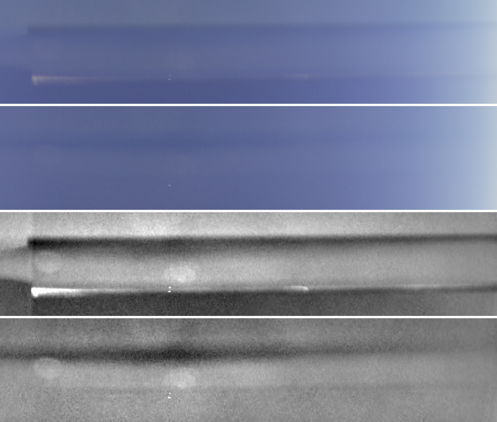

# Neural and learned stitching for OpenOSV: research, measurements, build plan

Status: research (WP-NEURAL phase 1), 2026-09-23. No production code changes.
Everything measured here is reproducible with the scripts in `research/neural/`
(see "Reproducing the measurements" at the end).

## TL;DR

* **The sky seam is not an optical-flow problem and not a missing-detail
  problem.** Measured on the sample clip, it has three photometric causes:
  1. **Lens 0's usable rim ends around 92.8 deg in the open-sky longitudes,
     not at the calibrated 97.59 deg.** Past 94 deg it falls -1 stop at 95 deg
     and -4 stops past 97 deg, yet the production feather still gives it 0.67
     weight at 95 deg. That is the dark line along the seam.
  2. **The two lenses disagree by a spatially varying gain.** Lens 1 reads
     +0.71 stops brighter than lens 0 in the sky but only +0.31 stops on the
     ground, with a strong colour component. One global gain per lens cannot
     remove that.
  3. **A tone step where lens 0's occlusion mask ends.** It disappears once
     (1) and (2) are fixed.
* **What fixes it (measured):** rim-aware blend weights plus a 2-D low-resolution
  log-gain field. The field is estimated from trusted co-visible pixels, split
  half and half between the lenses, and decayed over 20 deg outside the overlap.
  In the open sky this cuts:

  | Metric | Change |
  |---|---|
  | Thin-line artefacts | -53% |
  | Band-scale bumps | -50% |
  | Broad bands | -38% |
  | Lens-to-lens colour mismatch | -80% |

  It needs no model, no licence and no new runtime. The cost is a small table
  per 8-frame bucket plus one grid fetch per pixel.
* **DJI does the same thing** (section 2):
  * per-column multiplicative YCbCr gains;
  * per-column additive offsets carried across each whole hemisphere;
  * an SSIM-gated additive "sun glare" offset solve;
  * on the AI path, a learned model whose OUTPUT is exactly a low-resolution
    per-pixel multiply+add gain map for the seam strip.

  Our classical estimate produces that field directly from the overlap
  statistics.
* **Neural optical flow does not help here.** On the sample clip, SEA-RAFT-S
  (already integrated) is worse than our CUDA DIS on the ground and slightly
  harmful in the sky, and about 100x the cost of GPU DIS (81 ms vs 0.79 ms per
  band). Neither backend reconciles the
  near-field wing, because the lenses genuinely see different things there.
  That is a seam-selection problem (DP seam carving, WP-SEAM), not a warping one.
* **Per-frame diffusion inpainting of the seam band** (the user's question) is
  the wrong tool:
  * there is no detail missing in the sky to hallucinate;
  * per-frame generation flickers;
  * the fast few-step models are either too heavy or not commercially licensed;
  * none of them understands 10-bit D-Log M.

  See "Generative (diffusion) seam repair".
* **Build this now**, fully specified in section 8. Two stages:
  * **Stage 1, host-only, no kernel or ABI change.** The render blend ends at
    95 deg while the analyses keep the full FOV, and the gain is estimated from
    trusted pixels only. Measured: line -50%, band -45%, broad -34%,
    colour -42%. It is also the fallback.
  * **Stage 2, WP-PHOTO.** A per-longitude rim map plus a 2-D gain grid in the
    kernel. Measured: -53%, -50%, -38%, -80%.

---

## 1. Measurements on the sample clip

### 1.1 Method

`research/neural/bandprobe.cpp` is a disposable tool linked against the
release build's static libraries. It renders the polar-axis overlap band,
where the lens axes are the poles and the seam is the equator, three times per
frame:

* each lens **alone**, with alpha set to that lens's own production blend
  weight (FOV feather x occlusion ramp);
* the production two-lens blend.

All three are in scene-linear RGB. It also writes each pixel's angle from both
lens axes, and the kernel's lens intrinsics.

The Python scripts then do two things:

* compare the lenses at identical directions;
* re-blend them with exactly the production weights after each candidate
  correction. The harness check reproduces the shipping blend to 1.5e-3
  linear, max.

Setup details:

* **Clip:** `example_footage_dlogm.OSV`, frames 0/8/.../64, 4096-column band.
* **Camera:** on an aircraft wing. Longitudes -180..0 of the polar map are
  open sky; 0..180 are ground seen from altitude, with the wing at both ends.
* **Sky metrics** use longitude columns 0.20w-0.44w: open sky where both
  lenses are unoccluded, plus the edge of lens 0's occlusion mask.

### 1.2 Finding 1: the usable rim is not the calibrated FOV (`rim_profile.py`)

Median log2(lens0 / lens1), G channel, sky columns, frame 32, by lens 0's
angle from its own axis:

| theta0 (deg) | 88-90 | 91.1 | 92.1 | 93.1 | 94.1 | 95.1 | 96.1 | 97.1 |
|---|---|---|---|---|---|---|---|---|
| log2 ratio | -0.73 | -0.66 | -0.58 | -0.48 | -0.51 | -1.03 | -2.26 | -4.19 |
| production weight of lens 0 | 1.00 | 1.00 | 1.00 | 1.00 | 0.95 | 0.67 | 0.30 | 0.04 |

* **Lens 0 is fine to about 94 deg, then falls off a cliff** while still
  carrying most of the blend weight.
* **Lens 1's rim is milder and later.** It dips about 0.15 stop at 94.5 deg
  and loses about 1.4 stops only over the last 2 deg (95.6-97.6), where its
  weight falls from 0.5 to 0.
* **The cliff is in the raw fisheye itself, not a stitching artefact**
  (`fisheye_rim.py`). Lens 0's image-circle edge, where the log-coded luma
  halves, sits at 95.7-97.4 deg across the sky-side azimuths. On some
  ground-side azimuths it sits further out (97.3-97.9 deg, or beyond 99 deg).
  This probe is crude: halving a log code is several stops and depends on
  scene level.
* **The lens-ratio measurement agrees.** On the ground half, lens 0 at
  theta 95.5 is only 0.27 stop below lens 1, against 1.16 stops in the sky.
* **So the usable rim varies with azimuth.** It is most likely a static
  property of this unit's image circle (or its lens guard or mount) relative
  to the calibrated centre. That is inferred, not proven with other clips.
  If it holds, it is measurable once per clip.

The data-driven usable-rim estimate (`rim_limits()`: first 0.25 deg bin
deviating 0.25 stop from the lens's own core ratio) gives:

* **Lens 0:** median 92.8 deg (min 91.5 deg) over the sky columns.
* **Lens 1:** median 95.8 deg (min 95.0 deg).

On the ground half the same estimator is confused by texture misregistration.
It hits its floor of 91 deg on both lenses, so a production estimator must use
low-gradient pixels only, or the fisheye edge itself (see Build this now).

### 1.3 Finding 2: a spatially varying gain, not a global one (`measure_mismatch.py`)

Median log2(lens1 / lens0) over the core overlap (|lat| < 3 deg), frames 0-64.
The values are stable to +-0.02 across frames:

| Region | R | G | B |
|---|---|---|---|
| Sky | +0.60..+0.72 | +0.58..+0.70 | +0.16..+0.26 |
| Ground | +0.28..+0.34 | +0.30..+0.37 | +0.13..+0.23 |

* **Lens 1 is brighter everywhere, but by twice as much in the sky**, and
  mostly in R and G. A global per-lens gain (the existing `--gain`) is a
  compromise between the two, which is why it only partly helps (below).
* **Additive or multiplicative?** In the sky the lens-1-minus-lens-0
  difference is roughly equal across R, G and B (about 0.04-0.05 linear).
  That is the signature of an additive veil.
* **But multiplicative wins in practice.** Tested as a correction, a
  per-column additive offset scored worse than a per-column multiplicative
  (log) gain on every metric (table 1.4, `offset-d20` vs `col-d20`). A
  low-frequency multiplicative field is what to ship. An additive glare term
  is a possible second stage (DJI has one, section 2).

### 1.4 Candidate corrections, scored (`blend_experiments.py`, `rim_experiments.py`, `photo_grid_experiments.py`)

**Metrics.** All are in millistops (lower is better). Luma is log2, averaged
over 32-column blocks, in the open-sky columns.

| Metric | Measures | Definition |
|---|---|---|
| line | thin lines | RMS of the profile minus its 1.5 deg Gaussian, over |lat| <= 10 |
| band | band-scale bumps | RMS of the 0.5 deg minus 4 deg Gaussian, over |lat| <= 10 |
| broad | soft bands and decay ramps | RMS of the 2 deg minus 10 deg Gaussian, over |lat| <= 25 |
| dE | colour mismatch | RMS log2 chroma (R/G, B/G) difference between the two corrected lenses on trusted pixels |

**Results.** Frames 0/32/64, ±30 deg band:

| Variant | line | band | broad | dE |
|---|---|---|---|---|
| production blend | 53.5 | 105.7 | 80.6 | 309.8 |
| global gain (`--gain`), ±16 deg band | 47.5 | 81.0 | - | 161.9 |
| static inset: weight 0 at 95 deg, 3 deg feather, ±16 deg band | 38.1 | 81.5 | - | 309.8 |
| rim-aware weights only | 35.2 | 71.5 | 87.2 | 309.8 |
| rim-aware + per-column gain, decay 8.4 deg | 26.7 | 62.3 | 76.4 | 68.9 |
| rim-aware + per-column gain, decay 20 deg | 26.5 | 55.9 | 55.4 | 68.9 |
| rim-aware + per-column additive offset, decay 20 deg | 33.1 | 70.1 | 62.3 | 78.0 |
| rim-aware + per-column gain on lens 1 only (anchor lens 0) | 25.8 | 54.6 | 60.3 | 68.9 |
| **rim-aware + 2-D log-gain field, decay 20 deg** | **24.9** | **52.5** | **49.7** | **62.1** |
| fallback: blend weight ends at 95 deg (3 deg feather) + ONE global gain from trusted pixels | 27.0 | 58.4 | 52.8 | 180.1 |

The fallback row needs no kernel change: it only uses what `BlendParams` and
`estimateGain` can already express. It is nearly as good as the 2-D field on
luminance and half as good on colour.

It must narrow **only the render blend**. Narrowing `lensFovDeg` everywhere
also shrinks the geometric overlap the parallax analysis measures in. Measured
with `osvtool seam --lens-fov 190 --feather 3 --parallax`, frames 0/32/64:

| | Production (195.18 / 4) | Narrowed everywhere (190 / 3) |
|---|---|---|
| Ground NCC after correction | 0.92-0.93 | 0.75-0.86 |
| Flow consistency | 0.48 | 0.34 |
| Whole-band NCC after | 0.916-0.921 | 0.883-0.901 |

(`osvtool --lens-fov` also rebuilds the rig with the narrower FOV, so part of
that drop may come from the rig rather than from the blend limit.)

The kernel's `thetaMax` and `featherRad` come from `BlendParams`
(`RenderParamsBuilder.cpp`: `effectiveThetaMax(i, m_blend)`). So a
render-only `BlendParams` is enough to narrow the blend without touching the
rig or the analyses.



The figure shows frame 32, open sky, ±12 deg around the seam. From top to
bottom:

1. production;
2. recommended correction;
3. production, detrended x12;
4. recommended correction, detrended x12.

**Negative results worth keeping:**

* **A 2-D field estimated from ALL co-visible pixels made things much worse**
  (the first run's quadratic-residual 'bump' metric went 107 -> 326). It
  learns lens 0's dark rim as "lens 1 is too bright" and darkens lens 1 into a
  wide dark band. Rim contamination must be removed from the statistics before
  any gain is estimated. This is the single most important implementation
  detail.
* **A log-domain Poisson (gradient-domain) blend of the band**, solved exactly
  by FFT in longitude plus tridiagonal in latitude, removed the dark line.
  But it spread the rim and exposure differences into a brighter band and kept
  the occlusion-edge step. Its quadratic-residual score was 154 vs 107
  production. Gradient-domain blending inherits whatever the gradients carry;
  with contaminated rims it is not a fix on its own.
* **A guided-filter local affine transfer** (box covariances, slope
  regularised to 1) scored between production and the per-column gain, and
  took about 35x the per-column gain's time in the numpy prototype. Not worth
  it here.

**Limits of this evidence:**

* one clip, one scene type (aircraft: sky + distant ground), three frames;
* re-blends in Python with the occlusion factor recovered from the weights,
  not the real kernel.

The implementation must re-measure with the kernel (acceptance tests in
"Build this now").

### 1.5 What the overlap can never show: common-mode vignetting

A term both lenses share cancels in the lens-to-lens ratio. So a perfectly
matched seam can still sit in a band that is darker than the rest of the sky.
This point comes from the photometric literature survey (Goldman & Chen, ICCV
2005 / PAMI 2010): the overlap only constrains the odd part of v(theta) about
90 deg.

Fixing it needs one of:

* a flat-field / vignetting calibration of the lens model. Ho & Budagavi
  (ICASSP 2017) used a white-paper flat field for the Gear 360; a pan-head sky
  sweep fitted with Goldman-Chen works too.
* temporal self-calibration as the camera rotates. Bergmann, Wang & Cremers,
  RA-L 2018, code BSD-3 (verified from tum-vision/online_photometric_calibration).

**Open item:** DJI's metadata schema has the names
`OP_TYPE_FIX_VIGNETTE_RADIAL`, `OP_TYPE_GAIN_MAP`, `shading_calib_mode_num`
and `flat_res`. Whether the .OSV metadata actually carries a vignette opcode
has not been checked (WP-CALIB / WP-LOOK territory). If it does, that is the
common-mode term for free.

### 1.6 Flow backends on sky, ground and wing (`osvtool seam --parallax --region`)

Local NCC between the lenses before -> after the 2-D parallax grid, frames
0/32/64:

| Region (of 2048 band columns) | Classical DIS | SEA-RAFT-S (neural) |
|---|---|---|
| open sky 410-900 | 0.976 -> 0.976 (untouched: benefit gate) | 0.976 -> 0.971-0.972 (slightly worse) |
| ground 1110-1700 | 0.36-0.37 -> **0.92-0.93** | 0.36-0.37 -> 0.86-0.89 |
| near-field wing 1880-2040 | 0.23-0.25 -> 0.29-0.33 | 0.23-0.25 -> 0.23-0.25 |
| whole band (`nccAfter`) | 0.916-0.921 | 0.903-0.906 |
| mean correction | 0.09 deg | 0.31-0.56 deg |

* **Neural flow cost.** Per fresh process it was 850-2250 ms including
  session and cuDNN warm-up. The steady state recorded in
  `scripts/fetch_flow_model.py` is 81 ms for a 2048 x 68 band on the RTX 5090.
* **DIS cost:** 17-20 ms on 32 CPU threads, 0.79 ms on the GPU (DIRECT_GPU.md,
  WP-B).

What this shows:

* **In the sky, the right flow is zero.** DIS plus the existing benefit gate
  already delivers it; SEA-RAFT moves the sky slightly (NCC drops, corrections
  3-6x larger). A learned sky
  prior adds nothing on this clip.
* **On the ground, SEA-RAFT-S is worse than DIS** and about 100x more
  expensive at steady state.
* **At the wing, neither reconciles the lenses**, because each lens sees a
  different part of the object. That needs seam placement (choose one lens,
  route the seam around the object), which is WP-SEAM's DP seam carving. It is
  also how DJI handles it: a learned stick mask plus a DP seam finder.
* **The ground's raw NCC of 0.36 is itself informative.** Ground at this
  altitude has no parallax, so that misalignment is calibration: the ~0.66 deg
  cross-meridian error already noted in `ParallaxWarp.h`. A one-off rotation
  refinement per clip would fix it for all content, sky included, without
  per-bucket flow.

---

## 2. What DJI does (for understanding only)

How the stitching library in DJI's macOS Premiere importer treats the seam,
determined from DJI's publicly distributed software for interoperability.
Nothing here is copied into the product; the maths is restated in our own
words. Everything below is DJI's behaviour as determined, except where it is
marked **INFERRED** (our interpretation).

### Photometry: four layers, all per column, all split across both lenses

**1. Gain compensation: per-column multiplicative Y/Cr/Cb gains**

* **Statistics** come from co-valid overlap pixels: alpha >= 0.99, 4-row margins
  trimmed.
* **Gains** come from a joint 2x2 solve on L* means (Brown-Lowe-style), clamped
  (0.92-1.08 and similar).
* **Post-processing:** outlier removal, interpolation, and block plus temporal
  smoothing.
* **Row weighting:** a per-row weight profile with parameters 0.8, 2.7 and
  1/35.

**2. Edge (lens-shading) compensation: per-column additive Y/Cr/Cb offsets**

* **Statistics:** 8 latitude stripes across the overlap. They capture the
  intensity *gradient* across the overlap, the signature of a vignetting
  mismatch (INFERRED).
* **Application:** over the WHOLE hemisphere, with a weight that falls
  linearly from 1 at the seam to 0.15 or 0.3 at the pole, depending on a
  mode switch.
* **Dither:** about 1 LSB of hashed luma dither against banding in smooth sky.

**3. Sun-glare pass: a smooth additive RGB offset field, gamma**

* **Solve:** a coarse-to-fine weighted least-squares solve with box filters of
  255 -> 127 -> 63 -> 31 px.
* **What it pulls:** both lenses towards their mean in the seam band.
* **Damping:** by (1 - SSIM contrast-structure)^2, so structural disagreement
  (parallax, occluders) is left alone. Constants: eps = 1, c = 0.001.
* **Application:** as +-gamma/2.
* **Relation to published methods:** a guided-filter-style local model with
  slope fixed at 1 (He et al., ECCV 2010), with an SSIM gate (Wang et al., TIP
  2004).

**4. Learned colour stage (AI path only): the learned version of the above**

* **Input:** the seam strip reduced 10x, one input for each side of the seam
  (up and down), each 3 channels × 29 rows × 768 columns at the network.
* **Output:** per-pixel multiply maps and add maps (3 × 29 × 192) per lens.
* **Diffusion:** raised-cosine over 64 or 87 rows beyond the strip, with chroma
  ratios decaying twice as fast as luma.

Colour space: encoded BT.601 YCbCr for 1-3, RGB for 4. Only the RAW-footage
path works in linear light.

**DJI's stitcher has no devignetting map**, and no flare or ghost stage.

### Geometry and learned flow

* **Flow:** DIS (patch 8, stride 5, ±24 px) with a Kalman temporal filter; DP
  seam carving; 2-band blend.
* **A learned-flow fisheye stitcher** on the AI path:
  * a convolutional encoder;
  * a bidirectional, temporally recurrent flow transformer in the
    GMFlow/UniMatch style;
  * then fixed (untrained) half-way warps plus a linear feather of about
    6.75 deg. The warps have **no colour term**, so DJI's compensation runs
    between its two steps.
  * The band is 96 x 768 at the network, 36 deg of latitude, with a 3-frame
    window.
* **Stick mask:** a segmentation network run on each lens (RGB, 160 x 320)
  produces the seam and crop offsets.
* **Seam strip height:** 292 rows at 7680 wide, i.e. **13.7 deg** of latitude.

### Lessons we take

1. **Correct per column, never per lens.**
2. **Carry corrections far beyond the feather.**
3. **Decay chroma faster than luma.**
4. **Keep structural disagreement out of photometric statistics** (SSIM gate,
   alpha >= 0.99).
5. **Dither after compensation.**

DJI's learned colour model buys them nothing we cannot estimate directly. What
it predicts is the same low-resolution affine field.

---

## 3. Literature survey: photometry, sky, flare (licences verified where marked)

Full citations are in the table. "Verified" means the LICENSE file or README
was fetched.

| Method | Code licence | Weights / data | Runtime reported by authors | Role here | Ship? |
|---|---|---|---|---|---|
| Convolution pyramids, Farbman, Fattal, Lischinski, SIGGRAPH Asia 2011 | algorithm | n/a | 1.04 Mpix in 0.010 s, 1 CPU core (i7-2820QM) | fast Poisson-membrane approximation | yes |
| Mean-value coordinates cloning, Farbman et al., SIGGRAPH 2009 | algorithm | n/a | >90 updates/s after 0.3 s preprocessing (Athlon) | seam membrane | yes |
| Multi-band blending (Burt & Adelson 1983), OpenCV `MultiBandBlender` / `GainCompensator` | Apache-2.0 (verified) | n/a | - | blend / global gain | yes |
| Goldman & Chen, vignette + exposure from overlaps, ICCV 2005 / PAMI 2010 | algorithm | n/a | - | common-mode vignetting | yes |
| Bergmann, Wang, Cremers, online photometric calibration, RA-L 2018 | BSD-3 (verified) | n/a | - | temporal vignetting / exposure | yes |
| Ho & Budagavi, dual-fisheye stitching, ICASSP 2017 | MIT (reference code drNoob13/fisheyeStitcher, by the first author) | n/a | 70-90 ms per 3840x1920 on an i7-8750H CPU | flat-field fall-off | yes (idea; code optional) |
| Lo, Shih, Chen, dual 195 deg fisheye stitching with photometric compensation, TIP vol. 31, 2022 (early access 2021) | none found | - | "runs efficiently for 1920x960" | photometric + local colour transfer | idea (details unverified) |
| DoveNet, BargainNet, IntrinsicHarmony | MIT (verified) | iHarmony4: no stated terms; COCO/Flickr/FiveK sources | - | learned colour match | code yes, weights unclear |
| DCCF (ECCV 2022), PCT-Net (CVPR 2023) | MPL-2.0 (verified) | iHarmony4 (unclear) | - | per-pixel affine colour | code yes, weights unclear |
| INR-Harmonization (CVPR 2023) | Apache-2.0 (verified) | iHarmony4 (unclear) | - | arbitrary-resolution harmonisation | code yes, weights unclear |
| Harmonizer (Ke et al., ECCV 2022) | CC BY-NC-SA 4.0 (verified) | same | 56 fps at 1080p | colour | **no** |
| CDTNet, AICT, DiffHarmony | no licence file | - | CDTNet 11.5 ms at 2048^2 (GTX 1080 Ti) | colour | **no** |
| SkyAR (Zou) | CC BY-NC-SA 4.0 (verified) | ADE20K-derived | - | sky matte | **no** |
| SegFormer (NVIDIA) | NVIDIA source licence, non-commercial (verified) | ADE20K (non-commercial terms, verified) | - | segmentation | **no** |
| PP-LiteSeg | Apache-2.0 | Cityscapes weights, non-commercial | 273.6 FPS (GTX 1080 Ti) | segmentation | code only |
| Depth-Anything-V2-Small | Apache-2.0 (verified; Base/Large are CC-BY-NC) | Apache-2.0 | - | sky as far depth, 24.8 M params | yes |
| SAM 2 | Apache-2.0 (verified) | Apache-2.0 | tiny: 91.2 FPS on A100 (README) | prompted mask | yes |
| Wu et al., flare removal, ICCV 2021 (google-research/flare_removal) | Apache-2.0 (verified) | 5,001 flare images CC BY 4.0 (verified); **no pretrained model released** | - | train our own flare model | yes (data) |
| Flare7K / Flare7K++ (NeurIPS 2022 / TPAMI 2024), BracketFlare (CVPR 2023) | S-Lab License 1.0, non-commercial (verified) | same | - | flare / ghost | **no** |
| Zhou et al., multi-light-source flare, ICCV 2023 | no licence file | trained on Flare7K | - | flare | **no** |
| FlareReal600 / MIPI 2024 | CC BY-NC-SA 4.0 (verified) | same | - | data | **no** |
| Talvala et al., veiling glare in HDR, SIGGRAPH 2007 | algorithm | n/a | - | additive glare model | yes |

**Learned harmonisation** is not worth shipping for this problem:

* commercially clean weights do not exist;
* every checkpoint was trained on 8-bit sRGB object composites (iHarmony4)
  that never contain D-Log M or radiance above 1.0;
* what the best of them predict (PCT-Net: a low-resolution per-pixel affine
  transform) is the field we can estimate directly.

**Sun ghost, the dual-lens trick checked.** Ghosts in a rotationally symmetric
lens lie on the line through the light source and the optical centre (Hullin
et al., SIGGRAPH 2011; the symmetry is also stated by BracketFlare). Our two
lens axes are one line, so a point-symmetric ghost from each lens lands in the
same world direction. Consequences:

* a ghost falls in the overlap only when the sun does, and then the other lens
  usually has its own ghost there too;
* the dual-lens replacement works only when one lens's ghost is clearly weaker
  or displaced (per-lens calibration from a few sun shots). There, a
  contamination-weighted or min-biased blend, or routing the DP seam through
  the cleaner lens, suppresses it.

This belongs to WP-FLARE (`flareCost()` feeding the seam cost).

---

## 4. Literature survey: learned stitching and parallax

Code licences were checked on 2026-09-23 through the GitHub licence API or
the raw LICENSE file. "none" means no LICENSE file, which means all rights
reserved and not usable. Runtimes are the authors' own, with their GPU;
nobody publishes RTX 5090 numbers for these.

| Method | Code licence | Weights | Reported runtime | Sky | Near fin | Temporal |
|---|---|---|---|---|---|---|
| UDIS, Nie et al., TIP 2021 (arXiv 2106.12859) | none | none | 0.4 s at 512^2, RTX 2080 Ti | no | blurs parallax | no |
| **UDIS++**, Nie et al., "Parallax-Tolerant Unsupervised Deep Image Stitching", ICCV 2023 (arXiv 2302.08207, nie-lang/UDIS2) | **Apache-2.0** | no licence stated (Drive/Baidu) | warp 0.117 s at 490x653, 0.731 s at 1500x2000; composition 0.071 s at 718x1186 (RTX 3090 Ti); 50 test-time gradient steps on new data | no photometric term; photometric loss gets no signal on flat sky | TPS warp too smooth for a sharp depth step | no |
| StabStitch (ECCV 2024) / **StabStitch++** (TPAMI 2025, nie-lang/StabStitch2) | **Apache-2.0** | released, no separate licence | 28.2 / 35.3 ms per frame ("4090Ti"); smoothing net 1.4 ms | authors state alignment "may degrade ... (e.g., uniform walls or skies)" | TPS again | **yes** (online warp-trajectory smoothing, 1 frame latency) |
| UniStitch (ECCV 2026, arXiv 2603.10568) | Apache-2.0 | HF `Y5Y/UniStitch_model`, licence "other" | none | ? | no | no |
| RopStitch (TVCG 2026), DSFN (NeurIPS 2025, 67 ms at 512^2, RTX 3090), NIS / REwarp (WACV 2024), DSeam | none | - | - | - | - | - |
| Ho & Budagavi, dual-fisheye stitching, ICASSP / ICIP 2017; drNoob13/fisheyeStitcher | **MIT** (classical) | - | 70-90 ms per 3840x1920, i7-8750H CPU | fall-off compensation | rigid MLS | jitter control (not in the code) |
| Lo, Shih, Chen, dual-fisheye stitching, TIP vol. 31, 2022 | no code found | - | "efficient" at 1920x960 | local photometric model | mesh + adaptive seam | temporally stable seam |
| Dai et al., parallax-aware UAV fisheye platform, arXiv 2609.02319 | code link 404 | - | 19.99 fps, 1280x640, Jetson Orin NX | robust log-intensity gains, EMA every 10 frames | picks one of 5 sphere radii per overlap | hysteresis |
| Jin et al., dual-fisheye via unsupervised DL (MMM 2024); Zhu et al. dual-fisheye video (2023); OmniStitch (MM 2024) | none / none / none | - | - | - | - | - |
| PanoFlow (T-ITS 2023) | MIT | no separate licence | none | - | 360 flow | - |
| Lai et al., blind video temporal consistency, ECCV 2018 | MIT, plus a CC BY-NC section (needs review) | unstated | 418 fps at 1280x720, Titan X | - | - | yes (not for generated content) |

**Optical flow newer than SEA-RAFT.** Runtimes are the authors' own or from
the ptlflow benchmark (RTX 3090, 500x1000, fp16).

| Model | Code / weights | Params | Runtime reported |
|---|---|---|---|
| SEA-RAFT S / M (ECCV 2024), ours already | BSD-3 / BSD-3 | 8.9 M / 19.7 M | S 27.8 ms (ptlflow); ours 81 ms on the 2048x68 band (5090, steady state) |
| NeuFlow v2 (2024) | Apache-2.0 / Apache-2.0 (HF `Study-is-happy/neuflow-v2`) | 9.0 M | 15 ms at 1024x436 (RTX 2080); 12.1 ms (ptlflow) |
| MEMFOF (ICCV 2025) | BSD-3 / BSD-3 | 75.8 M | 472 ms at 1080p (RTX 3090); 3-frame |
| WAFT (ICLR 2026) | BSD-3 / weights licence unstated | 35-39 M | 240 ms at 540p |
| DPFlow (CVPR 2025) | Apache-2.0 / research-only weights | 10 M | 160 ms at 960x540 |
| UFM (NeurIPS 2025) | BSD-3 / CC BY-NC | 0.4 B | 33 ms on RTX 5090 (resolution not given) |

**Assessment**

* **No licence-clean learned stitcher fits this problem.** Every one of them
  is trained on 512-px perspective pairs (UDIS-D, StabStitch-D), where a
  homography or TPS explains the motion. Our rig's calibration already gives
  the exact rotation. What remains is baseline parallax, small far away and
  huge close up, and none of these warps can represent a sharp near-field step.
* **None of them has a photometric term** that would address the sky.
* **The survey agent argued DIS's ±24 px search is where the fin breaks.**
  The measurement in section 1.6 contradicts that as the limiting factor on
  this clip. SEA-RAFT has no search cap and did no better on the wing
  (NCC 0.23-0.25 unchanged); DIS did slightly better (0.29-0.33). The limit
  is that the lenses see different surfaces, so no flow exists to find.
* **NeuFlow v2 is the only candidate worth a quick A/B** if a clip shows DIS
  failing on large displacements. It is Apache/Apache, has an existing ONNX
  export, and is about 2x cheaper than SEA-RAFT-S per the ptlflow numbers. It
  plugs into the existing `FlowBackend` factory as another `FlowBackendKind`.
  Not recommended for tonight.
* **The idea worth re-implementing** (not the weights) is StabStitch++'s
  online warp-trajectory smoothing: a data term plus smoothness plus an online
  term, one frame of latency. It is a principled replacement for the
  bucket-crossfade in `ParallaxWarp.h`, alongside a Kalman filter like the
  one DJI uses.

---

## 5. Generative (diffusion) seam repair: the user's question

**The idea:** generate a smoothed, detail-hallucinated version of a thin slice
around the seam with a fast Stable-Diffusion-class model every frame, then
blend it in.

**What the measurements say:**

* **Nothing is missing in the sky.** The sky defect is a photometric step
  (rim contamination plus a gain mismatch), not missing detail. A generator
  would have to guess the "true" brightness, and it has no better information
  than the two lenses. The deterministic field in section 1 already removes
  most of the step.
* **Temporal stability.** Independent per-frame generation produces
  independent hallucinations: texture that crawls and boils along the seam.
  Viewers forgive a constant artefact far more than a changing one; this is
  Jump's observation, and it is why DJI ships a Kalman flow filter. Video
  diffusion with temporal attention exists, but it is far heavier still.
* **Fidelity.** Hallucinated detail on a ground seam invents houses and roads.
  For footage people will reframe and zoom into, that is worse than a slight
  blur, and it is not a stitch any more.
* **Signal domain.** Our pipeline is 10-bit D-Log M / scene-linear HDR.
  Diffusion models are trained on 8-bit display-referred sRGB, so they would
  clip highlights (the sun, the sky) and mis-grade.
* **Cost and licence.**
  * **The two published diffusion stitchers:**
    * SRStitcher (NeurIPS 2024, MIT code) runs SD2-inpainting at 50 steps,
      reported at 27 it/s on an RTX 4090. That is about 1.9 s per 512-px image
      (derived).
    * RDIStitcher (Apache-2.0 code, a LoRA on SD2-inpainting) needs about
      6 GB VRAM at 512 px.
    * Both depend on `stabilityai/stable-diffusion-2-inpainting`, whose
      official repository now returns HTTP 401.
  * **The fast licence-clean generators are huge:**
    * FLUX.2-klein-4B (Apache-2.0, "under a second", ~13 GB VRAM);
    * FLUX.1-schnell (Apache-2.0, 12 B);
    * SANA-Sprint 1.6B (Apache-2.0, 0.31 s at 1024^2 on an RTX 4090,
      text-to-image only).
  * **The fast distilled SD models are revenue-capped:** SD-Turbo, SDXL-Turbo
    and SD3.5-Turbo are under the Stability Community Licence, capped at
    US$1M annual revenue.
  * **Others are non-commercial or unlicensed:** Hyper-SD, SinSR, InvSR, FLUX
    dev Fill, ProPainter.
  * **The strip we would repaint is large:** the 13.7 deg seam strip at 8K is
    about 7680 x 292 px, so tens of 512-px tiles per frame. That is seconds per
    frame against a millisecond budget.
  * **Temporal consistency cannot be fixed afterwards.** Lai et al. (ECCV 2018)
    state their blind temporal-consistency method cannot handle "applications
    that generate entirely different image content on each frame, e.g., image
    completion".

**Where generative models could earn a place later:** OFFLINE, user-invoked
"clean plate" tools, never the per-frame stitch:

* removing the wing root or a tripod from a hero shot;
* inpainting the nadir;
* a one-off flare clean-up on a still.

The one small per-frame use that could be defended is filling pixels that NO
lens sees, such as the far side of a fin, with a tiny non-diffusion inpainter,
carried forward with flow so it cannot boil:

* MI-GAN: MIT, 5.9 M params, HF `andraniksargsyan/migan`;
* LaMa-ONNX: Apache-2.0, 51 M params, fixed 512^2 input.

That is a WP-SEAM follow-up, not a sky fix.

---

## 6. Ranked candidates

### For the SKY seam

| # | Approach | Evidence | Gain on sample | Runtime (RTX 5090) | Integration point | Risks |
|---|---|---|---|---|---|---|
| 0 | **Stage 1**: render blend ends at 95 deg (3 deg feather), analyses keep 195.18 / 4, gain from trusted pixels only | measured, table 1.4 | line -50%, band -45%, broad -34%, dE -42% | zero added cost | host only (`ImporterInstance`, `estimateGain`, `osvtool`) | fixed inset is one clip's compromise; must not narrow the analyses |
| 1 | **Rim-aware blend weights**: per-lens usable-rim angle per longitude | measured, section 1.2 | line -34%, band -32% alone | analysis: ~0 (a column reduction on the band already shaded); kernel: 1 table lookup | per-clip analysis, accumulated over buckets; kernel weight | estimator confused by textured ground: use low-gradient pixels or the fisheye edge; clamp to [thetaMax - 6 deg, thetaMax] |
| 2 | **2-D log-gain field**: trusted pixels only, symmetric, 20 deg decay, chroma decays faster | measured, section 1.4; same field DJI's NN colour model outputs | with #1: line -53%, band -50%, broad -38%, dE -80% | analysis < 2 ms per bucket (estimate: RGB band shade 0.25-0.5 ms GPU + reductions); kernel: 1 bilinear fetch + exp2 per lens | per-bucket analysis (8 frames), crossfaded; kernel multiply in linear light | flicker if unfiltered (EMA + crossfade); D-Log M passthrough needs a code-domain approximation |
| 3 | Additive glare field (SSIM-gated WLS, DJI-style) on top of #2 | DJI does this (section 2); our additive-only test lost to multiplicative | not measured as a second stage | box filters 255..31 px: < 1 ms (estimate) | per-bucket analysis | gain/offset ambiguity on flat sky; only after #2 |
| 4 | Common-mode vignetting (flat-field / Bergmann temporal) | literature; invisible to the overlap | unknown on this clip | offline or per clip | lens model / colour stage | needs a calibration capture or long clips |
| 5 | Luma dither after compensation (about 1 LSB) | DJI does this (section 2) | removes banding in 8-bit deliveries | free | kernel | none |
| 6 | Sky mask (Depth-Anything-V2-S, Apache-2.0) to force zero flow in sky | literature; DIS + benefit gate already does this here | none measured | a few ms per bucket (unmeasured) | analysis | a second ORT model in Premiere |
| 7 | Learned harmonisation | literature | not measured | - | - | no clean weights; sRGB-trained |
| 8 | Per-frame diffusion inpainting | section 5 | - | - | - | flicker, hallucination, licence, HDR |

### For NEAR-OBJECT parallax (the wing and fin)

| # | Approach | Evidence | Runtime | Integration | Risks |
|---|---|---|---|---|---|
| 1 | **Seam selection**: DP seam carving that routes through the lens seeing the object, plus a narrow 2-band blend and temporal seam coherence (WP-SEAM) | measured: no flow reconciles the wing (section 1.6); DJI routes its seam (learned stick mask + DP seam) | a DP over a 13.7 deg strip: ms-class (WP-SEAM measures) | WP-SEAM | seam popping without temporal coherence |
| 2 | Keep CUDA DIS + benefit gate for mid-range parallax, add a Kalman/EMA temporal filter (DJI uses a Kalman filter) | measured: ground 0.37 -> 0.93 NCC, 0.79 ms | 0.79 ms per bucket | FlowBackend (exists) | shimmer without the filter |
| 3 | Per-clip rotation refinement (fix the 0.66 deg cross-meridian error once) | ground NCC 0.37 raw with no parallax present | one-off | calibration | - |
| 4 | Learned flow / stitching | see section 4 | - | FlowBackend factory | see section 4 |

---

## 7. Options for the user

**A. Photometric seam field, classical (recommended).** Build stage 1, then
WP-PHOTO (section 8): rim map plus 2-D gain grid.

* Stage 1 alone is hours of host-side work and already halves the thin-line
  metric.
* The full field fixes the obvious sky band on the sample clip by about half
  on every seam metric, and colour mismatch by 80%.
* No model, no licence question, no second ORT in Premiere.
* One night of work for one agent, plus tests.
* Pairs with WP-SEAM (near objects) and WP-FLARE (ghosts), which are already
  running.

**B. A + a small self-trained colour-field network (phase 2).**

* The net copies the idea of DJI's learned colour stage, not its weights:
  strip -> low-resolution multiply+add maps.
* Trained self-supervised on our own footage: synthetic per-lens gain,
  vignetting and glare perturbations of real overlap bands, with the classical
  estimator as the baseline to beat.
* Clean licence (our data, our weights), runs through the existing ORT path.
* Only worth it if A leaves visible residue on harder clips (sun in frame,
  strong glare).

**C. A + common-mode vignetting calibration.**

* A one-time capture: a pan-head sky sweep or a flat field, fitted with
  Goldman-Chen, per camera model (and per lens guard).
* Applied as a radial gain in the kernel before the blend.
* Fixes the band that section 1.5 says the overlap cannot see. It needs the
  user to shoot one calibration clip, or to find DJI's vignette opcode in the
  metadata.

---

## 8. Build this now

### 8.1 The pick

**WP-PHOTO, a photometric seam field.** It is hybrid classical: measured from
the two lenses' own overlap, applied by the shared kernel. There is no
learned or neural component, for four reasons:

1. **It is what the measurements say is wrong.** Rim contamination plus a
   spatially varying gain account for the visible sky band.
2. **It already matches DJI's learned path in kind.** DJI's learned colour
   model outputs exactly this low-resolution gain field.
3. **No commercially clean learned harmonisation or flare weights exist.**
4. **The neural flow already in the tree loses to DIS on this clip.**

It ships as Apache-2.0 code with no model, no NOTICE entry and no second ONNX
Runtime in Premiere. It runs in-process on CUDA inside Premiere through the
existing GPU band shader, and on the CPU for the equirect / software path.

**Per-frame budget:**

| Part | Target | How to measure |
|---|---|---|
| Analysis | <= 3 ms per 8-frame bucket on the GPU path, i.e. <= 0.4 ms per frame amortised | acceptance tests below |
| Analysis, CPU path | <= 10 ms per bucket, 32 threads | acceptance tests below |
| Kernel | <= +0.05 ms at 2560x1440 on the direct path (currently 0.26-0.29 ms) | acceptance tests below |

Build it in two stages. Stage 1 is also the fallback if stage 2 cannot land.

**Status: built (WP-PHOTO, merged).** Sections 8.2-8.4 below are the plan as
it was written, corrected where the build departed from it; section 8.7
records what was built and what it measured, including on the importer's
default stitch (parallax grid + carved seam), which the plan did not cover.

### 8.2 Stage 1: host-only, no kernel or ABI change (build first; it is also the fallback)

Measured in the reference re-blend (table 1.4, `fallback-inset95+gain`):

| Metric | Change |
|---|---|
| line | -50% |
| band | -45% |
| broad | -34% |
| dE | -42% |

1. **Separate the render blend from the analysis blend.**
   * `ImporterInstance.h`: add `geom::BlendParams m_renderBlend;` next to
     `m_blend`.
   * Where `m_blend` is initialised (`ImporterInstance.cpp` ~515), set
     `m_renderBlend = m_blend` then `m_renderBlend.lensFovDeg = 190.0;
     m_renderBlend.featherDeg = 3.0;`.
   * Use `m_renderBlend` ONLY in the two render builders (~1199 direct,
     ~1294 equirect: `builder.rig(...).blend(m_renderBlend, true)`).
   * Keep `m_blend` (195.18 / 4) in every analysis: `measureParallaxBands`,
     `searchSeam`, `estimateGain`. Narrowing the analyses costs parallax
     quality (table 1.4 note).
   * `osvtool render`: add `--blend-fov` (default 190) / `--blend-feather`
     (default 3), applied only to the render job's `BlendParams`, and keep
     `--lens-fov` / `--feather` for the analyses.
   * The edit touches `ImporterInstance.*` outside `applyAnalyses`, so it
     belongs to whoever owns `rebuildRig` / initialisation after the merge
     (WP-CALIB's `rebuildRig` is adjacent). Coordinate through the lead.
2. **`estimateGain` from trusted pixels only** (`src/osv/render/SeamAnalysis.cpp`).
   * Render the two bands with `.alphaCoverage(true)`.
   * Accept a pixel only when BOTH alphas are >= 0.99, DJI's rule. With the
     analysis feather that keeps theta < ~93.6 deg in both lenses, clear of
     either rim.
   * Today it takes every co-visible pixel (alpha > 0.5 of a coverage-free
     render), including lens 0's contaminated rim.
   * Update the function comment and add a unit test: a synthetic band with a
     dark rim ring must not move the gain.
3. **Defaults.** Gain match is already on by default (`PrefsBlob::gainMatch = 1`).
   Expose the blend inset as a Source Settings value: "Seam edge inset",
   0-6 deg, default 2.6, i.e. 95 deg. Use one `PrefsBlob` byte from the
   reserved block, where 0 means the default so old projects get it.
   *As built:* `PrefsBlob::seamInset` at offset 32 (code 0 = 2.6 deg, code
   v >= 1 = (v - 1) / 10 deg, so code 1 is exactly "no inset"),
   `render::insetRenderBlend()` derives the render blend from the analysis
   blend (so a lens-protector rig's 192.08 deg moves with it), and
   `osvtool render --blend-fov / --blend-feather` default to the same inset.
4. **Acceptance** (`[sample]`, frames 0/32/64):
   * Whole-band parallax `nccAfter` must not drop below 0.915.
   * The open-sky metrics of section 1.4, computed in C++ on bands rendered
     through the real kernel (see 8.5), must reach line <= 0.6x, band <= 0.65x
     and dE <= 0.7x production.

### 8.3 Stage 2: WP-PHOTO, per-longitude rim map + 2-D log-gain field

Target, from the reference re-blend (table 1.4, `grid-d20`):

| Metric | Change |
|---|---|
| line | -53% |
| band | -50% |
| broad | -38% |
| dE | -80% |

This is what beats a fixed inset on clips whose rim differs by longitude, and
it is the colour fix.

**New files (all owned by WP-PHOTO)**

* `include/osv/render/PhotoSeam.h`, `src/osv/render/PhotoSeam.cpp`: analysis,
  pure functions, host or device frames.
* `tests/unit/test_photoseam.cpp`, plus `[sample]` cases in the same file.
* A research reference stays in `research/neural/` (the Python numbers the
  C++ must reproduce).
* CMake: `src/osv/render/CMakeLists.txt` globs `*.cpp` into `osv_render_cpu`,
  so `PhotoSeam.cpp` needs no edit there. `tests/CMakeLists.txt` globs
  `unit/*.cpp` into `osv_tests`, so the new test is picked up too. Re-run the
  configure step.

**Interface (`PhotoSeam.h`)**

```cpp
namespace osv::render {

enum class PhotoSeamMode : int { Off = 0, RimOnly = 1, RimAndGain = 2 };

struct PhotoSeamParams {
    PhotoSeamMode mode = PhotoSeamMode::RimAndGain;
    BandParams band{2048, 10.0};     ///< analysis band: 2048 columns x 114 rows, +-10 deg (overlap +-7.59 +
                                     ///< margin).  The research ran at 4096 columns; verify the [sample]
                                     ///< metrics hold at 2048 (0.18 deg/px), else use 4096 (~0.5 ms GPU).
    std::uint32_t gridW = 256;       ///< longitude cells (wraps)
    std::uint32_t gridH = 16;        ///< latitude cells across the OVERLAP only (decay is analytic)
    double rimDropStops = 0.25;      ///< usable rim = first 0.25 deg bin whose lens/other ratio
                                     ///< departs this far from the lens's own core (88.5-91 deg)
    double rimFeatherDeg = 3.0;      ///< blend feather below the usable rim
    double rimMaxTrimDeg = 6.0;      ///< never place the rim below thetaMax - this
    double trustMarginDeg = 0.5;     ///< stats use pixels this far inside both rims
    double flatLog2PerDeg = 0.1;     ///< texture gate, stops per degree: |d log2 L / d lon| in BOTH lenses
                                     ///< and |d log2 L / d lat| in the REFERENCE lens (the one not being
                                     ///< tested) must be below this.  Never gate the tested lens's own
                                     ///< latitude gradient: its radial rim falloff IS the signal.  Keeps
                                     ///< texture misregistration (ground) out of rim and gain statistics.
                                     ///< Design addition - the research used sky columns instead; the
                                     ///< value needs tuning on the sample's ground half (test 2 below).
    double sigmaLonDeg = 4.2;        ///< field smoothing along longitude (48 of 4096 columns)
    double sigmaLatDeg = 1.5;        ///< field smoothing along latitude
    double decayDeg = 20.0;          ///< luma correction: raised cosine to 0 over this beyond the overlap
    double chromaDecayScale = 0.5;   ///< chroma ratios decay over half that distance (DJI does 2x faster)
    double maxAbsLog2Gain = 1.5;     ///< clamp per cell
    double strength = 1.0;           ///< user strength, 0..1
    double temporalAlpha = 0.35;     ///< EMA weight of a new bucket's field
};

/// The field the kernel samples.  gain: w*h*3 floats, log2(L_master / L_slave)
/// per channel (FULL ratio; the kernel applies -half to the master, +half to
/// the slave).  rim: w*2 floats, usable rim angle (radians) per column,
/// [x*2 + lens].  Rows of `gain` span [latMinRad, latMaxRad] = the overlap.
struct PhotoSeamField {
    std::uint32_t w = 0, h = 0;
    float latMinRad = 0, latMaxRad = 0;
    std::vector<float> gain;
    std::vector<float> rim;
    // diagnostics
    std::uint64_t trustedPixels = 0;
    double medianLog2Gain[3] = {};
    double rimMedianDeg[2] = {};
    double bandMs = 0, statsMs = 0;
    [[nodiscard]] bool valid() const noexcept;
};

/// Per-lens RGB bands with each lens's production weight in alpha, shaded with
/// featherDeg = 0 so alpha is the OCCLUSION factor alone (rim decisions must
/// not be blurred by the production feather).
struct RgbLensBands { std::uint32_t w, h, rowOffset, mapH; std::vector<float> rgba[2]; std::vector<float> thetaRad[2]; };

Result<RgbLensBands>  renderPhotoBands(const geom::LensRig&, const video::FramePair&, const geom::BlendParams&,
                                       const PhotoSeamParams&, ThreadPool&);        // host: CPU rows; device: DeviceBandShader::shadeRowsRgba
Result<PhotoSeamField> photoSeamFromBands(const RgbLensBands&, const PhotoSeamParams&, ThreadPool*); // pure
Result<PhotoSeamField> measurePhotoSeam(const geom::LensRig&, const video::FramePair&, const geom::BlendParams&,
                                        const PhotoSeamParams&, ThreadPool&);        // the two above
Result<PhotoSeamField> blendPhotoSeamFields(const PhotoSeamField& from, const PhotoSeamField& to, double t);
/// Per-clip rim accumulator: per column, keep the running median of accepted
/// buckets (rim is a static lens property, section 1.2); columns never
/// measured (textured ground) inherit the clip-wide median of measured ones.
void accumulateRim(PhotoSeamField& clip, const PhotoSeamField& bucket, std::uint32_t& bucketsSeen);
}
```

*As built* (`include/osv/render/PhotoSeam.h`), where it departs from the
sketch above:

* `band` is **1536 columns x +-9 deg**, not 2048 x +-10: the [sample] metrics
  hold there and the analysis fits its budget (1024 columns breaks the rim
  search). `minSupport` is **0.25**, not 0.05: a cell only a Gaussian tail
  reached was the one cell that moved more than 0.02 stop per frame.
* The photometric bands are shaded in the camera's **native linear** light
  (identity `nativeToWorking` / `workingToOutput`), because the kernel applies
  the per-lens gain before the output matrix. Measured in Rec.2020, dE only
  reached x0.31 of production; measured natively, x0.18.
* There is no `accumulateRim()` and no clip-wide accumulator. The rim median
  is `PhotoRimAccumulator`, and the per-bucket state is `PhotoSeamHistory`
  (see "Importer hook" below for why): `store(bucket, measured)`,
  `measured(bucket)`, `fieldFor(frame)`, `nearest(...)`, `trim`, `clear`.
* For WP-SEAM: `photoRimDegAt`, `photoRimColumnsDeg`, `photoRimPenalty`,
  `installPhotoRimPenaltyHook()` (the `SeamPenaltySlot::Rim` hook, weight
  `kPhotoRimPenaltyWeight` = 0.1) and the thread-local
  `PhotoRimPenaltyScope` that makes a field the carve's Rim cost.
* Stage 1 helpers live in the same header: `insetRenderBlend`,
  `renderMetricBands`, `skySeamMetrics` (the section 1.4 metrics in C++,
  through the real kernel), `coValidTrustMask`, `rimTrustMask`.

**Algorithm.** `photoSeamFromBands` is `research/neural/rim_experiments.py`
plus `photo_grid_experiments.py`:

1. **Rim estimate.**
   * Co-valid pixels: both occlusion alphas >= 0.99 and both lenses finite.
   * Flat pixels: pass the texture gate (`flatLog2PerDeg`, see its comment).
   * Per 16-column block, the median log2(lens / other) in 0.25 deg theta
     bins. Rim = the first bin past 91 deg that departs `rimDropStops` from the
     lens's own 88.5-91 deg core.
   * Then a conservative running minimum over +-48 columns, a Gaussian along
     longitude, and a clamp to [thetaMax - rimMaxTrimDeg, thetaMax].
2. **Trusted pixels.** Co-valid, flat, and theta < rim - trustMarginDeg in
   BOTH lenses.
3. **Gain field.**
   * D = normalised convolution of log2(L_master / L_slave) over the trusted
     pixels (sigmaLon x sigmaLat), sampled onto the w x h grid.
   * Rows with no trusted support hold the nearest supported row's value
     (latitude clamp).
   * Columns with none take a wide longitude fill.
   * Clamp to maxAbsLog2Gain.
4. **Do not** estimate from all co-visible pixels. Section 1.4's negative
   result shows it darkens the other lens into a wide band.

**Kernel (`osv_kernel.h`, a `[WP-PHOTO]` region)**

Append to `OsvRenderParams` at the end (48 bytes, well inside 4 KB):

```c
/* ---- [WP-PHOTO] photometric seam field ------------------------------ */
int   photoEnabled;         /* 0 = off: output bit-identical to before      */
int   photoW, photoH;       /* gain grid (columns = longitude, rows = lat)  */
float photoLatMinRad;       /* overlap span of the grid rows                */
float photoLatMaxRad;
float photoDecayRad;        /* luma correction: raised cosine to 0 beyond   */
float photoChromaDecayRad;  /* chroma ratio decay distance                  */
float photoRimFeatherRad;   /* feather below the per-column rim; 0 = no rim */
float photoStrength;        /* 0..1                                         */
float photoSinLatLo;        /* early-out: sin(lat) span incl. decay         */
float photoSinLatHi;
float photoCodePerStop;     /* passthrough: D-Log M code units per stop     */
```

New functions at the end of the file:

* `osvPhotoRim(p, photo, lon, lens)`
* `osvPhotoGain(p, photo, lon, lat, rgbLog2[3])`: bilinear, longitude wraps,
  latitude clamped to the span, times the decay by distance beyond the span.
  Chroma is decomposed as G (the luma anchor) plus the R-G and B-G ratios,
  which decay over `photoChromaDecayRad`.
* A new entry point `osvShadePixelWP(p, planes, seam, warp, photo, x, y, out)`.
  `osvShadePixelW` becomes a wrapper passing `photo = 0`, exactly as
  `osvShadePixel` already wraps `osvShadePixelW`. So the band shaders
  (`SeamAnalysis.cpp`, `CudaBandKernel.cu`), which must see RAW lenses, do not
  change.
* *As built:* WP-SEAM's carved blend-seam table landed first, so the full
  entry is `osvShadePixelWSP(p, planes, seam, warp, blendSeam, photo, x, y,
  out)` and `osvShadePixelWS` wraps it with `photo = 0`. The helpers
  (`osvPhotoBegin`, `osvPhotoLensWeight`, `osvPhotoPickWeights`,
  `osvPhotoApplyGain`) sit in a `[WP-PHOTO]` region in front of the shader,
  and the shader calls them from four marked lines: `osvPhotoBegin` before the
  projection loop, `osvPhotoLensWeight` inside it, `osvPhotoPickWeights`
  after it (so the carved seam's visibility sees the rim-limited weights) and
  `osvPhotoApplyGain` after WP-FLARE's ghost subtraction and the lens gain.

Inside `osvShadePixelWP`, only when `photoEnabled` and the ray is inside
`photoSinLat*` (reuse the warp's lon/lat when already computed):

* **Weight.** `fov_i = theta_i > rim_i ? 0 : smoothstep((rim_i - theta_i) / photoRimFeatherRad)`,
  `w_i = fov_i * osvOcclusionFactor(...)`. If `w_0 + w_1 <= 1e-4`, keep the
  production weights: this is the hole guard, the occlusion rescue still
  applies after it. `rim_i <= thetaMax` always (host clamp), so validity is
  unchanged.
* **Gain.** After `osvCodeToLinear` and the existing `gain[]`:
  `val_c *= exp2(sgn_i * 0.5 * photoStrength * G_c)`, with `sgn = -1` for the
  master (i == 1) and `+1` for the slave.
* **Passthrough** (D-Log M output, blended in code space): add
  `sgn_i * 0.5 * photoStrength * G_c * photoCodePerStop` to the code values
  instead. `photoCodePerStop` is computed on the host from the D-Log M
  curve's log segment in `ColorMath.h`; do not edit `ColorMath.h`, it is
  WP-LOOK's.

**Plumbing: one buffer, following `warpGrid` through every hop**

(If WP-SEAM's merged code already threads a new table, put this one next to
it the same way; if it introduced a struct of table pointers, add a member.)

1. `RenderJob.h`: `std::vector<float> photoField` (gain then rim), validated
   like `warpGrid` (size = w*h*3 + w*2 when enabled).
2. `RenderParamsBuilder.h/.cpp` (append): `.photo(const PhotoSeamField&,
   const PhotoSeamParams&)`, `.clearPhoto()`. `buildParams()` fills the
   `[WP-PHOTO]` fields.
3. `CpuRenderer.cpp`: call `osvShadePixelWP` with `job.photoField.data()`.
4. `cuda/CudaRenderer.cpp`: a `DeviceBuffer photo`, uploaded exactly like
   `warp`. `CudaLaunch.h` / `CudaKernel.cu`: add the pointer to
   `osvCudaLaunchReframe` and the kernel, and call `osvShadePixelWP`.
5. `opencl/*` + `kernel.cl`: one more `__global const float*` argument.
6. Direct path:
   * `plugins/reframe/DirectRender.h/.cpp`: `StitchState::photoField`,
     `DirectSetup::photoField`; `renderDirectCpu` calls `osvShadePixelWP`.
     Add `DirectReject::PhotoField` for "enabled but missing, degenerate or
     non-finite".
   * `DirectLaunch.*` + `ReframeKernel.cu`: pass the pointer and call
     `osvShadePixelWP`.
   * The `[WP-PHOTO]` params ride inside `OsvEngineFrame::stitch`
     automatically.
7. `plugins/common/OsvEngineAbi.h`: append `const float* photoDevice;` in a
   `[WP-PHOTO]` region at the END of `OsvEngineFrame`. Do not bump the ABI
   version; the lead does.
8. `plugins/importer/Engine.cpp`: `uploadTable(job.params.photoEnabled ?
   job.photoField : {}, lease->photo)` next to the warp upload (~416), and
   `out->photoDevice` next to `out->warpDevice` (~429).

**Importer hook**

* *As built:* **two** marked lines in `applyAnalyses`, not one, because the
  carved seam needs the rim as its cost before it is carved:
  * at the top, `const render::PhotoRimPenaltyScope photoRimScope =
    preparePhotoSeam(index, pair, draft, pool);` measures the bucket if
    needed, picks the frame's field and makes its rim the Rim cost on this
    thread for the rest of the analyses;
  * after the global gain, `frameExact = applyPhotoSeam(builder) &&
    frameExact;` hands the field to the builder, puts the render blend back
    to the calibrated FOV (the rim replaces the inset) and, in RimAndGain,
    sets the global gain to neutral (the field carries the whole lens ratio).
* State: `render::PhotoSeamHistory m_photo`, trimmed like the other analysis
  caches, cleared when the rig changes (calibration slot, protector
  correction).
* Flow:
  * measure synchronously with `m_blend`, the analysis blend and never the
    stage-1 render blend (1536 columns x +-9 deg, both lenses), from device frames through
    the GPU band shader on the direct path and from host frames on the CPU;
  * EMA with the previous bucket's STORED field (`temporalAlpha`);
  * crossfade with `parallaxCrossfadeWeight(index)` exactly like the parallax
    grid;
  * the rim: the running median (`PhotoRimAccumulator`, depth 15) over the
    contiguous run of buckets stored before this one, plus this one.
* **Everything a bucket renders with is frozen when the bucket is stored**:
  its EMA, its rim and the field it glides from, read from what was stored
  at that moment. The planned clip-wide accumulator, and a glide partner
  looked up at render time, made a frame depend on which OTHER buckets had
  been measured first: two live instances of one clip rendered frame 45
  differently after different histories (`test_reopen.cpp`), and the direct
  path's Exact frames changed after a later request measured the previous
  bucket (the clip-time e2e test, 4e-4 in the view corners, where the gain's
  20 degree decay reaches and the parallax grid does not). With store-time
  freezing a frame renders the same every time it is asked for; in playback
  order it is exactly the planned filter.
* **Draft** renders use the last accepted field and do not measure.
* **If the measured cost on host frames exceeds 10 ms per bucket**, move the
  stats half to the existing parallax worker pattern (band cut on the render
  thread, stats in the background).
* **Interaction with stage 1:** with `photoEnabled` and a rim map, the render
  blend can return to 195.18 / 4. The per-column rim replaces the fixed inset,
  so stage 1's `m_renderBlend` becomes the fallback when the field is refused
  (too few trusted pixels, e.g. a fully textured overlap).
* Refuse (render without) when trusted pixels < 2 % of the band.

**Prefs and UI**

* Append to `PrefsBlob` from the reserved block, with a `static_assert` on the
  offsets; 0 means the default so old projects get it:
  * `photoSeam` (0 = default = rim + gain, 1 = off, 2 = rim only, 3 = rim + gain);
  * `photoStrength` (0 = 100 %, else percent + 1);
  * `photoDecayDeg` (0 = 20).
* Map them in `PrefsMapping.cpp` and add them to the Source Settings effect
  and the modal dialog (WP-SETTINGS / WP-CALIB files; do it after their merge,
  appended).
* *As built:* offsets 32-37 are WP-PHOTO's: `seamInset` (32), `photoSeam`
  (33, `PrefsPhotoSeam`: **0 = Off**, 1 = RimOnly, 2 = RimAndGain, the
  `parallax` convention, so an old blob's zero keeps rendering as it did;
  `defaults()` sets RimAndGain for new clips), `photoStrength` (34, 0 = 100 %,
  else percent + 1) and three reserved bytes. The decay is not a pref (20 deg,
  `osvtool render --photo-decay` for experiments). The Source Settings effect
  shows "Sky Seam Fix" (Off / Rim only / Rim and colour), "Sky Seam Strength"
  (0-100 %) and "Seam Edge Inset" (0-6 deg) in the Stitching group after Sun
  Ghost Removal (permanent ids 17-19); the modal dialog shows the same three
  rows. An old project's effect has no values for ids 17-19, so it takes the
  controls' defaults - Rim and colour - like every other control added
  after it shipped.

**osvtool**

* `render --photo off|rim|full --photo-strength 0..1 --photo-decay DEG`.
* `seam --photo --json` prints the field's diagnostics and the four section 1.4
  metrics over `--region`.

**Other packages**

* WP-SEAM should read the rim map as a seam cost (a seam must not run where a
  lens is past its rim).
* WP-FLARE's veiling-glare estimate is a later additive stage on top of the
  gain field (DJI's SSIM-gated offset solve, section 2).
* WP-LOOK owns output dither (DJI adds about 1 LSB after compensation).

### 8.4 Tests (all must pass; the full ctest stays green)

Unit (`tests/unit/test_photoseam.cpp`):

1. **Synthetic recovery.**
   * Lens bands with lens 1 = lens 0 x 2^g(lon, lat), g smooth and known, and
     a lens-0 rim falloff starting at 93 deg over half the longitudes.
   * The recovered gain is within 0.02 stops RMS on trusted pixels.
   * The rim is within 0.5 deg where the falloff exists, and at thetaMax
     where it does not.
2. **Texture robustness.**
   * A textured band with a 1-px misregistration and no rim: the rim stays at
     thetaMax (the flat-pixel gate).
   * The gain is unbiased (< 0.02 stops).
3. **The negative result as a guard.**
   * Estimating with the trust mask disabled must darken lens 1 (demonstrates
     the failure mode).
   * With it enabled it must not.
4. **Continuity.** The applied correction is continuous across the span edge
   and in longitude across +-180 deg (max step between adjacent rows or
   columns < 1e-4 stops).
5. **Identity.** `photoEnabled = 0` output is bit-identical to
   `osvShadePixelW` on the existing render fixtures. A zero field with rim =
   thetaMax and `photoRimFeatherRad` = the production feather is identical to
   production.
6. **Parity.** CPU vs CUDA (and OpenCL) with the field on: PSNR >= 100 dB,
   like the existing parity tests. The direct CPU twin vs the direct GPU
   kernel likewise.
7. **Size and interpolation.** `sizeof(OsvRenderParams) <= 4096` (existing
   assert). `blendPhotoSeamFields` endpoints are exact, a layout mismatch
   gives InvalidArgument, and non-finite t is rejected.

`[sample]` (`OSV_SAMPLE_FILE`, frames 0/32/64):

8. **Sky quality.** Open-sky columns (polar band columns 0.20w-0.44w), bands
   rendered through the REAL kernel with the field off vs on. Required:
   * line <= 0.60x off;
   * band <= 0.60x off;
   * broad <= 0.75x off;
   * dE <= 0.35x off.

   The reference re-blend measured 0.47 / 0.50 / 0.62 / 0.20. Implement the
   metrics in C++ exactly as `photo_grid_experiments.py:metrics()`.
9. **Do no harm on texture.** In the ground columns (0.54w-0.83w), overlap
   NCC with parallax on changes by less than 0.005. Whole-band `nccAfter`
   stays >= 0.915.
10. **Temporal stability.** Over all 65 frames, the applied per-cell gain
    changes by <= 0.02 stops between consecutive frames.
11. **Performance** (report with the noise caveat; ten agents share the
    machine):
    * analysis per bucket <= 3 ms from device frames and <= 10 ms from host
      frames;
    * direct kernel delta <= +0.05 ms at 2560x1440 (extend
      `osv_gpu_analysis_bench` and the `test_direct` timing).

### 8.5 How to measure the quality gain

1. **Numbers.** `osvtool seam --photo --json --region 410-900` (sky) and
   `--region 1110-1700` (ground), frames 0/32/64, with off / rim / full.
   Compare against section 1.4 and the Python reference (`research/neural/`,
   same metrics, same columns).
2. **Pictures.**
   * `osvtool render --mode equirect-polar --size 4096x2048 --color linear
     --out *.tif` with and without `--photo`.
   * The detrended view from `research/neural/make_figure.py` shows any
     residual band at x12 gain.
3. **Against DJI.** Compare with a DJI Studio export of the same clip: the
   sky band at 1:1 zoom, and the chroma difference across the seam.

### 8.6 What not to do (measured or reasoned above)

* **Do not estimate a gain from all co-visible pixels.** Rim contamination
  turns into a wide dark band (section 1.4).
* **Do not narrow `lensFovDeg` globally.** Parallax quality drops
  (table 1.4 note).
* **Do not switch the default flow backend to SEA-RAFT.** It is worse than
  DIS on this clip and about 100x slower (section 1.6).
* **Do not ship any iHarmony4-, Flare7K-, ADE20K- or Cityscapes-trained
  weights** (section 3).
* **Do not generate pixels per frame** (section 5).

### 8.7 As built: what WP-PHOTO measured

All on the sample clip, frames 0 / 32 / 64, the section 1.4 metrics computed
in C++ (`render::skySeamMetrics`) on bands rendered through the REAL kernel,
open-sky columns 0.20w-0.44w (`tests/unit/test_photoseam.cpp`). Ratios are
of the sums over the three frames. Timings come from a machine shared with
other builds, so treat them as ranges.

**Against the research baseline** (the calibrated 195.18 / 4 blend, no gain),
what section 8.2 and 8.4 specify:

| Variant | line | band | broad | dE | Acceptance |
|---|---|---|---|---|---|
| Stage 1: inset + trusted gain | x0.50 | x0.55 | x0.64 | x0.54 | line <= 0.6, band <= 0.65, dE <= 0.7 |
| Stage 2: rim + gain field | x0.463 | x0.482 | x0.606 | x0.184 | 0.60 / 0.60 / 0.75 / 0.35 |
| Research re-blend (table 1.4, `grid-d20`) | x0.47 | x0.50 | x0.62 | x0.20 | |

**On the importer's default stitch** (parallax grid + WP-SEAM's carved seam
+ global gain; the carve sees the field's rim as its Rim cost), which is what
the field changes for a user:

| Frames 0 / 32 / 64, millistops | line | band | broad | dE |
|---|---|---|---|---|
| without the field | 33.9 / 33.9 / 33.3 | 50.8 / 51.2 / 50.6 | 50.4 / 50.1 / 50.2 | 171 / 173 / 171 |
| with the field | 24.0 / 24.0 / 23.4 | 49.7 / 50.0 / 49.4 | 48.9 / 48.8 / 48.0 | 52.7 / 63.6 / 58.4 |
| ratio | **x0.71** | x0.98 | x0.97 | **x0.34** |

The carved seam's narrow blend already removes most of the band-scale bump
(band 51 millistops against 106 on the plain blend), so on the default stitch
the field's contribution is the thin line and the colour step. Stage 1's
inset changes nothing there: the carved blend replaces the feather the inset
moves. The inset stays the fallback when the field is refused.

**The residue: a lens-local stripe.** The before/after crops in
`research/photo/` (`make_crops.py`; `sky_seam_carved_*` is the default stitch,
`sky_seam_feather_*` the plain blend) show a soft darker stripe 3-5 deg on
the master side of the seam. It sits in the same place in every variant,
production included, so it is in lens 1's own image. A symmetric lens-ratio
field splits any difference half and half, so it can only halve a dip that
belongs to one lens. With the light line gone the stripe is the most visible
thing left, and the crops' column-profile roughness is x1.04 on the carved
stitch (x0.67 on the plain blend). Removing it needs a per-lens,
common-mode correction - the vignetting work of section 1.5 and candidate 4
of section 6 - not a better seam field.

**Everything else:**

* Ground NCC with parallax changes by +0.0002 to +0.003 (limit 0.005);
  whole-band `nccAfter` 0.916 / 0.918 / 0.921 (limit 0.915).
* Temporal: the worst grid cell moves 0.0151 stop per frame, the rim at most
  0.106 deg (limit 0.02 stop).
* Parity with the field: CUDA 111-124 dB, OpenCL 107-121 dB against the CPU;
  the direct GPU kernel 95-109 dB against its CPU twin; the two frame paths
  (GPU and host analyses) differ by at most 1.0e-5 and not at all beyond 30
  deg of the seam.
* Cost: analysis about 2.4-3.2 ms per bucket from device frames (budget 3 ms,
  borderline) and 5.7-6.7 ms from host frames (budget 10); the direct kernel
  at 2560x1440 is +0.018 ms with the field (0.288 -> 0.307 ms, budget
  +0.05).

---

## Reproducing the measurements

```
rem 1. build the probe against the release build's libraries (disposable; not in CMake)
scripts\vsdev.cmd research\neural\build_bandprobe.cmd

rem 2. per-lens bands: <clip> <outdir> <mapW> <bandHalfDeg> <frames...>
set PATH=L:\Dev\premiere_360_reframe\build\windows-msvc-premiere-release\bin;%PATH%
research\neural\bin\bandprobe.exe example_footage_dlogm.OSV %TEMP%\bands16 4096 16 0 8 16 24 32 40 48 56 64
research\neural\bin\bandprobe.exe example_footage_dlogm.OSV %TEMP%\bands30 4096 30 0 32 64

rem 3. analyses (OSV_BANDS selects the probe directory)
set OSV_BANDS=%TEMP%\bands16
python research\neural\measure_mismatch.py          & rem section 1.3
python research\neural\rim_profile.py 32            & rem section 1.2
python research\neural\blend_experiments.py 0 32 64 & rem first-pass variants
python research\neural\rim_experiments.py 0 32 64
set OSV_BANDS=%TEMP%\bands30
python research\neural\photo_grid_experiments.py 0 32 64   & rem table 1.4
python research\neural\make_figure.py docs\research\neural_sky_seam_f32.png

rem 4. fisheye image-circle edge (section 1.2)
research\neural\bin\bandprobe.exe example_footage_dlogm.OSV %TEMP%\lensinfo 1024 4 32
osvtool extract example_footage_dlogm.OSV --frame 32 --lens 0 --out %TEMP%\lensinfo\fish0.pgm
osvtool extract example_footage_dlogm.OSV --frame 32 --lens 1 --out %TEMP%\lensinfo\fish1.pgm
python research\neural\fisheye_rim.py %TEMP%\lensinfo

rem 5. flow backends by region (section 1.6)
osvtool seam example_footage_dlogm.OSV --frame 32 --parallax --flow-backend classical --region 410-900 --json
```
